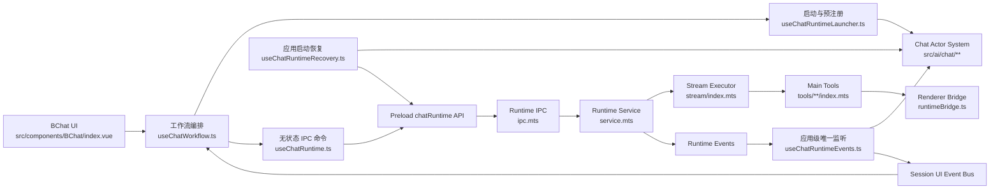
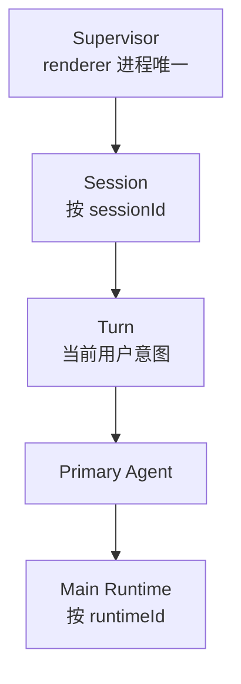

# ChatRuntime 架构图

## 一句话模型

主进程拥有聊天 Runtime 的执行、消息持久化、工具执行、确认等待、上下文用量和压缩；渲染进程拥有 Actor 流程状态、UI 输入、用户决策，以及只能从界面取得的 bridge 快照。

Runtime 命令由 `BChat` 发起，但 Runtime 事件在应用根级统一监听。组件挂载、卸载或切换会话不会改变主进程任务的生命周期。

## 核心链路



## Actor 层级与地址



当前一个 Session 同时只持有一个活动 Turn，一个 Turn 只持有一个 Primary Agent。Supervisor 的 `runtimeRoutes` 保存：

```ts
{
  sessionId: string;
  turnId: string;
  agentId: string;
  runtimeId: string;
}
```

全局事件监听根据 `runtimeId` 查找地址，再把事件发送给正确的 Session、Turn 和 Agent。它不能根据当前打开的会话推断归属。

## 所有权规则

| 关注点                 | 所有者                      | 说明                                                             |
| ---------------------- | --------------------------- | ---------------------------------------------------------------- |
| Runtime user 消息      | 主进程                      | `send` 创建并持久化 user 消息，再发送 `message-created`。        |
| Runtime assistant 消息 | 主进程                      | `send` 创建首个 assistant 占位；需要时 `continue` 在主进程创建。 |
| Runtime 消息更新       | 主进程                      | 流式文本、工具 part、中断、usage 和终态都由主进程写入。          |
| Renderer 消息视图      | `useChatWorkflow.ts`        | 消费 Session UI 事件并更新当前会话视图，不拥有主进程生命周期。   |
| Actor 流程状态         | `src/ai/chat/**`            | 表达 Session、Turn、Agent 的准备、运行、等待、取消和终态。       |
| Runtime 事件监听       | `useChatRuntimeEvents.ts`   | 应用级唯一入口，负责路由、renderer 请求和 Session UI 事件发布。  |
| Runtime 恢复           | `useChatRuntimeRecovery.ts` | 从主进程快照恢复 Actor 路由、降级 capability 和待处理请求。      |
| Runtime capability     | `runtimeCapabilities.ts`    | 按 `runtimeId` 保存冻结的工具、文档和 bridge 能力。              |
| 确认策略               | `runtimeConfirmation.ts`    | 应用记忆授权；未命中授权时交给 Session UI。                      |
| 确认 UI                | Renderer                    | 主进程请求确认，Renderer 排队展示并提交用户决策。                |
| 工具语义               | 主进程中的已迁移工具        | 解析路径、权限、确认并返回结构化结果。                           |
| UI 专属快照            | Renderer bridge             | 当前编辑器、绘图、WebView、设置应用和打开 Tab 保留在 bridge 后。 |
| Context usage          | 主进程                      | 主进程估算并发出用量快照，Renderer 只显示结果。                  |
| Compression 消息       | 主进程                      | 保持 `role: 'compression'`，状态写在消息中。                     |

## 文件职责

| 文件                                                    | 负责                                                                                    | 不负责                                    |
| ------------------------------------------------------- | --------------------------------------------------------------------------------------- | ----------------------------------------- |
| `src/components/BChat/index.vue`                        | 组合输入、消息、面板和工作流 hooks。                                                    | Runtime 事件全局监听或策略判断。          |
| `src/components/BChat/hooks/useChatWorkflow.ts`         | 编排发送、续跑、回滚、取消和 Session UI 事件。                                          | 直接管理主进程 Runtime 或全局路由。       |
| `src/components/BChat/hooks/useChatRuntimeLauncher.ts`  | 准备请求、分配 Runtime ID、在 IPC 前注册 Actor 地址和 capability、升级恢复 capability。 | 监听 Runtime 事件或执行 IPC 命令。        |
| `src/components/BChat/hooks/useChatRuntime.ts`          | 把 `send`、`continue`、`abort` 等操作转换为无状态 IPC 命令。                            | 订阅事件、保存消息镜像或拥有 Actor 状态。 |
| `src/hooks/useChatActorSystem.ts`                       | 在应用根级创建、provide 和销毁唯一 Chat Actor system，并挂载事件监听与恢复。            | 具体 Session UI。                         |
| `src/hooks/useChatRuntimeEvents.ts`                     | 监听所有 Runtime 事件，按地址分发 Actor 事件，执行 renderer tool、确认和 bridge 请求。  | 消息持久化或组件本地状态。                |
| `src/hooks/useChatRuntimeRecovery.ts`                   | 查询活动 Runtime，恢复路由与待处理 renderer 请求。                                      | 恢复完整消息历史或猜测原始 UI。           |
| `src/ai/chat/actorSystem.ts`                            | 提供 Supervisor、Runtime 路由、capability registry 和 Session UI event bus 外观。       | 执行模型流或持久化消息。                  |
| `src/ai/chat/machine/supervisorMachine.ts`              | 持有 Session actor 与 Runtime 地址路由。                                                | Session 内工作流细节。                    |
| `src/ai/chat/machine/sessionMachine.ts`                 | 管理当前 Turn、输入门禁、等待、取消和回滚状态。                                         | Runtime 工具执行。                        |
| `src/ai/chat/machine/turnMachine.ts`                    | 管理一个用户意图和 Primary Agent。                                                      | 多 Agent 调度。                           |
| `src/ai/chat/machine/agentMachine.ts`                   | 管理一个 Agent 关联 Runtime 的生命周期。                                                | 创建主进程 Runtime。                      |
| `src/ai/chat/runtimeCapabilities.ts`                    | 按 Runtime 冻结并查询 renderer 能力。                                                   | 动态读取当前 BChat 工具作为兜底。         |
| `src/ai/chat/policies/runtimeConfirmation.ts`           | 判断记忆授权并持久化用户授权范围。                                                      | 展示确认组件。                            |
| `electron/main/modules/chat/runtime/service.mts`        | Runtime 生命周期、Session 写锁、消息持久化编排、取消、续跑、用户选择、压缩及终态事件。  | Renderer UI 和组件状态。                  |
| `electron/main/modules/chat/runtime/controllers/**.mts` | 保存等待中的 renderer tool、确认和 bridge RPC 请求。                                    | 模型流、消息持久化或压缩决策。            |
| `electron/main/modules/chat/runtime/runners/**.mts`     | 创建 send、continue、user choice 和 compact 的活动 Runtime 状态。                       | Runtime 生命周期编排。                    |
| `electron/main/modules/chat/runtime/messages/**.mts`    | 创建、转换和终结 Runtime 消息。                                                         | Renderer UI 更新。                        |
| `electron/main/modules/chat/runtime/context/**.mts`     | 模型消息转换、token 估算、预算、溢出降级和旧工具输出裁剪。                              | Runtime 生命周期。                        |
| `electron/main/modules/chat/runtime/stream/index.mts`   | 消费模型流、更新 assistant 草稿、执行工具轮次。                                         | 绕过 updater 直接维护 Renderer 状态。     |
| `electron/main/modules/chat/runtime/tools/**/index.mts` | 已迁移工具的验证、确认、bridge 调用和结构化结果。                                       | 组件或 store 访问。                       |
| `electron/main/modules/chat/runtime/ipc.mts`            | 注册 IPC handler，并把异常封装成稳定结果。                                              | Runtime 业务逻辑。                        |
| `types/chat-runtime.d.ts`                               | 跨进程命令、事件、恢复和请求 DTO。                                                      | 主进程内部服务类型。                      |

## 启动时序

```mermaid
sequenceDiagram
  participant UI as BChat Workflow
  participant Launcher as Runtime Launcher
  participant Actor as Actor System
  participant Main as Main Runtime
  participant Events as Global Event Listener

  UI->>Launcher: prepare
  Launcher->>Launcher: 分配 runtimeId
  Launcher->>Actor: 注册地址和 capability
  Launcher->>Actor: runtime.started
  UI->>Main: IPC send/continue
  Main-->>Events: message-created / updated
  Events->>Actor: 按 runtimeId 路由
  Events-->>UI: 发布 Session UI 事件
```

预注册是硬性顺序。若 IPC 先于地址注册，主进程立即发出的首批事件可能无法路由。

IPC 启动失败时，工作流负责把 Session 和 Turn 标记为失败，并注销该 Runtime 的路由与 capability。主进程返回的 `runtimeId` 必须与 Renderer 预分配值一致。

## 消息生命周期

### 普通发送

1. `useChatWorkflow.ts` 准备请求并让 Session 进入 preparing。
2. `useChatRuntimeLauncher.ts` 预注册 Runtime。
3. `useChatRuntime.ts` 发送 IPC 命令。
4. 主进程创建并持久化 user 消息和 assistant 占位。
5. 应用级监听器收到事件，按 Runtime 地址发布到 Session UI。
6. `useChatWorkflow.ts` 更新当前会话的消息视图。

Renderer 不应在主进程事件到达前自行追加另一条 Runtime user 消息。

### 重新生成与续跑

1. Renderer 计算截断后的消息快照。
2. 新 Runtime 仍按“预注册后 IPC”的顺序启动。
3. 若快照没有 assistant 占位，主进程创建并发送 `message-created`。
4. Stream executor 更新该 assistant 消息。

### 工具确认

1. 主进程工具发出 `confirmation-requested`。
2. 全局监听器根据 `runtimeId` 读取 capability 和 Actor 地址。
3. `runtimeConfirmation.ts` 先检查记忆授权；命中时直接提交同意。
4. 未命中时，监听器发布 Session UI 确认事件并将 Agent 标记为等待。
5. 用户决策返回原 Runtime；授权范围按策略持久化。
6. 主进程恢复等待中的工具 Promise。

确认 UI 可以排队，但请求归属必须保留 `runtimeId`，不能跟随当前可见会话变化。

### 用户选择

1. 模型产生等待用户选择的工具结果。
2. 主进程持久化等待状态并停止工具续轮。
3. Renderer 从消息 part 展示选择 UI。
4. 用户通过 `submitUserChoice` 提交答案。
5. 新 Runtime 从持久化消息续跑，仍走完整的准备和预注册流程。

### 取消

1. Renderer 对活动 `runtimeId` 调用 `abort`。
2. 主进程中止流、拒绝等待中的请求并释放 Session 写锁。
3. 有 assistant 内容时，主进程终结当前草稿。
4. 无 assistant 内容时，主进程删除空草稿并创建 `role: 'interrupt'` 消息。

切换或卸载 `BChat` 不会触发以上流程。

### 压缩

1. Renderer 通过 `useRuntimeCompactContext.ts` 发起 compact。
2. 主进程创建或更新 `role: 'compression'` 消息。
3. `compression.status` 表达 `pending`、`success`、`failed` 或 `cancelled`。
4. Renderer 从 Runtime 消息事件更新显示。

压缩不以 toast 作为主要状态，也不创建普通聊天中断消息。

## 恢复流程

应用根级的 `useChatRuntimeRecovery.ts` 在 Renderer 启动后：

1. 调用主进程查询活动 Runtime 和待处理请求。
2. 按快照恢复 Session、Turn、Primary Agent 和 Runtime 路由。
3. 根据 capability 描述创建降级能力，避免错误使用当前编辑器。
4. 重放待处理 renderer tool、确认和 bridge 请求。
5. 再次查询活动 Runtime，清理恢复期间已经结束的路由。
6. 当对应 `BChat` 挂载时，用匹配的当前能力升级该 Runtime capability。

当前恢复快照没有持久化原 `turnId` 和完整 Agent 层级，因此恢复会创建一个新的 Turn，并将活动 Agent 视为 `primary`。多 Agent 接入前必须扩展该协议，详见 [Chat 多会话与多 Agent 接入指南](chat-multi-session-and-multi-agent-extension.md)。

## 工具执行边界

| 类别                 | 示例                                                    | 执行路径                                                                                       |
| -------------------- | ------------------------------------------------------- | ---------------------------------------------------------------------------------------------- |
| 主进程已迁移工具     | 文档、文件、绘图、设置、MCP、日志、资源、网页、当前时间 | Schema 由 Renderer 暴露，语义在 `electron/main/modules/chat/runtime/tools/**/index.mts` 执行。 |
| Renderer 本地工具    | Question、Todo、Memory、Shell、Skill                    | 保留在 `src/ai/tools/builtin/**`，通过按 Runtime 冻结的 capability 执行。                      |
| SDK 或 Provider 工具 | Tavily 和 Provider MCP 工具                             | 由 AI SDK 或 Provider 集成路径执行。                                                           |

Renderer bridge 不是第二套工具 Runtime。它只提供主进程无法直接拥有的 UI 状态，例如当前编辑器内容、未保存草稿、绘图、WebView 和打开资源操作。

## 当前非目标

- 尚未实现多 Agent 调度和结果聚合。
- `agentId` 与 `parentRuntimeId` 已为未来层级保留，但不足以恢复完整 Agent 树。
- 当前同一 Session 的 send、continue 和用户选择续跑受单写锁保护；手动 compact 尚未复用该锁。
- 当前 Turn 只持有 Primary Agent，不提前维护动态 Agent 集合。
- 多会话底层 Actor 隔离已经存在，但完整的会话列表后台状态体验仍需接入。

## 排查入口

| 现象                          | 首先检查                                                                              |
| ----------------------------- | ------------------------------------------------------------------------------------- |
| 首批事件丢失或 Agent 状态不动 | `useChatRuntimeLauncher.ts` 是否在 IPC 前完成 Runtime 注册。                          |
| 事件进入错误会话              | `supervisorMachine.ts` 的 `runtimeRoutes` 和 `useChatRuntimeEvents.ts` 路由。         |
| user 或 assistant 重复        | 主进程消息创建分支和 `useChatWorkflow.ts` 的 Session UI 事件消费。                    |
| 切换会话后任务停止            | 是否错误地在组件卸载时调用 abort 或销毁应用级监听。                                   |
| 恢复后工具能力错误            | `useChatRuntimeRecovery.ts` 降级 capability 与 `useChatRuntimeLauncher.ts` 升级条件。 |
| 确认出现在错误页面            | 确认事件是否保留 Runtime 地址，以及 Session UI 订阅是否按 `sessionId` 隔离。          |
| 取消后 Session 仍被锁定       | `service.mts` 终态清理与 `infrastructure/locks.mts`。                                 |
| 压缩状态错误                  | `useRuntimeCompactContext.ts`、主进程 compaction 模块和消息事件。                     |
| 主进程构建产物落到 `src/`     | Main 文件是否直接导入 Renderer `src/` 模块。                                          |
