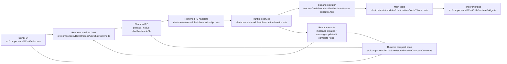

# ChatRuntime Architecture Map

## One-Line Model

ChatRuntime main process owns chat task execution, message persistence, tool execution, confirmation waits, context usage, and compaction. The renderer owns UI input, local visual state, user decisions, and bridge snapshots.

In day-to-day terms: main creates or updates runtime messages; renderer mirrors runtime events and sends user actions back through IPC.

## Core Flow

## Ownership Rules

| Concern | Owner | Notes |
| --- | --- | --- |
| Runtime user messages | Main process | `send` creates and persists the user message, then emits `message-created`. |
| Runtime assistant messages | Main process | `send` creates the first assistant placeholder. `continue` creates one if the renderer only sends a user snapshot. |
| Runtime message updates | Main process | Stream chunks, tool parts, interrupt state, usage, and final status are written in main. |
| Renderer message list | Renderer | `useChatRuntime.ts` and `useRuntimeCompactContext.ts` keep a UI mirror from runtime events. |
| Confirmation UI | Renderer | Main requests confirmation; renderer shows the sheet and submits the decision. |
| Tool semantics | Main process when migrated | Main tools resolve paths, permissions, confirmation, and results. |
| UI-only state snapshots | Renderer bridge | Current editor, drawing, WebView, settings application, and tab opening stay behind bridge calls. |
| Context usage | Main process | Main estimates and emits runtime context usage snapshots. Renderer displays the latest snapshot. |
| Compression messages | Main process for runtime compaction | Compression remains `role: 'compression'`; status is shown in the message, not as toast or interrupt. |

## File Responsibility Table

| File | Does | Does Not Do |
| --- | --- | --- |
| `electron/main/modules/chat/runtime/README.md` | Local directory guide for main runtime modules, common change entry points, and runtime boundaries. | Runtime implementation logic. |
| `electron/main/modules/chat/runtime/service.mts` | Runtime lifecycle, session locks, message creation/update/delete, abort, continue, user choice resume, compaction orchestration, complete/error events. | Tool-specific business logic after migration; renderer UI updates; pending renderer request storage. |
| `electron/main/modules/chat/runtime/controllers/**.mts` | Pending runtime request controllers for renderer tools, confirmations, and bridge RPC. | Model streaming, message persistence, or compaction decisions. |
| `electron/main/modules/chat/runtime/stream-executor.mts` | Consumes model stream chunks, updates assistant draft, executes tool rounds, decides whether to continue after tool results. | Persists session history directly outside the updater contract; owns no renderer UI state. |
| `electron/main/modules/chat/runtime/tools/index.mts` | Main-process tool dispatcher. Routes a tool call to a grouped tool module. | Runtime lifecycle or model stream handling. |
| `shared/ai/tools/toolRegistry.ts` | Single metadata source for migrated tool names, runtime owner, group, exposure, and schema definitions. | Runtime execution of migrated tools. |
| `electron/main/modules/chat/runtime/tools/constants.mts` | Main-process runtime constants and grouped tool-name Sets derived from `shared/ai/tools/toolRegistry.ts`. | Tool schema definitions or duplicated tool-name literals. |
| `electron/main/modules/chat/runtime/tools/**/index.mts` | Tool-specific main-process semantics, validation, confirmation, bridge calls, and structured tool results. | Renderer component or store access. |
| `electron/main/modules/chat/runtime/tools/README.md` | Main-process tool directory guide: group ownership, adding-tool steps, schema/runtime split. | Runtime implementation logic. |
| `electron/main/modules/chat/runtime/types.mts` | Internal runtime service, stream executor, message writer/reader, and tool executor contracts. | Cross-process IPC DTO definitions. Those live under `types/chat-runtime`. |
| `electron/main/modules/chat/runtime/ipc.mts` | Registers Electron IPC handlers and wraps runtime errors into stable handler results. | Runtime business logic. |
| `electron/main/modules/chat/runtime/model-message-context.mts` | Converts persisted chat messages and compression boundaries into model messages. | UI message rendering. |
| `electron/main/modules/chat/runtime/compaction.mts` | Runtime compression message creation/update and compaction service boundary. | Renderer slash-command UI handling. |
| `src/components/BChat/index.vue` | Wires UI events to runtime commands, input state, task state, confirmation controller, bridge dependencies, and panels. | Creates runtime user/assistant messages locally. |
| `src/components/BChat/hooks/useChatRuntime.ts` | Sends runtime commands, subscribes to runtime events, keeps the local message mirror sorted, handles renderer tool requests, confirmations, bridge requests, completion and errors. | Owns main process lifecycle or persistence. |
| `src/components/BChat/hooks/useRuntimeCompactContext.ts` | Starts manual/auto runtime compaction and mirrors compression runtime events for the active client/session. | Shows compression toast or creates interrupt messages. |
| `src/components/BChat/utils/runtimeBridge.ts` | Handles main-to-renderer bridge requests: editor/drawing/WebView snapshots, unsaved/open file content, settings application, resource opening, draft creation. | Tool policy or model stream execution. |
| `src/components/BChat/utils/confirmationController.ts` | Serializes confirmation requests so only one sheet is active while later requests wait. | Decides tool permissions itself. |
| `src/ai/tools/catalog/runtimeTools.ts` | Schema-only factory wrapper with a registry-derived `RUNTIME_TOOL_FACTORIES` map and compatibility named factories. | Owns duplicated schema literals or a registry wrapper. |
| `src/ai/tools/builtin/index.ts` | Builds the renderer-visible tool catalog and keeps local renderer tools registered. | Executes migrated main-process tools locally. |
| `src/ai/tools/builtin/**` | Renderer-local tools that still need renderer state or local app affordances: Question, Todo, Memory, Shell, Skill. | Migrated document/file/drawing/settings/MCP/log/resource/webpage tools. |

## Message Lifecycles

### Normal Send

1. `src/components/BChat/index.vue` resolves config, creates a user message id/time for continuity, and calls `useChatRuntime.send`.
2. `service.mts` creates and persists the user message and assistant placeholder.
3. Main emits `message-created` for both messages.
4. `useChatRuntime.ts` mirrors those events into the renderer message list.
5. `stream-executor.mts` updates the assistant message as text, reasoning, tool parts, usage, and final status arrive.

Renderer should not locally append the runtime user message. It waits for the main event.

### Regenerate

1. Renderer finds the previous user message, truncates the UI mirror to that point, and persists the truncated history.
2. Renderer calls `continue` with the remaining message snapshot.
3. If the snapshot has no assistant placeholder, `service.mts` creates one in main and emits `message-created`.
4. The stream executor fills that assistant message.

Renderer should not create or persist a local assistant placeholder for runtime regeneration.

### Tool Confirmation

1. A main tool asks `service.mts` for confirmation.
2. Main emits a confirmation request to the matching client/session.
3. `useChatRuntime.ts` hands it to `confirmationController.ts`.
4. The renderer submits approve/cancel back through `submit-confirmation`.
5. Main resolves the pending confirmation promise and the tool either executes or returns a cancelled result.

Confirmation requests are queued in the renderer so a new request does not cancel the active one.

### User Choice Tool

1. The model emits an ask-user-choice style tool call.
2. Main records the tool result as awaiting user input and stops continuing tool rounds.
3. Renderer shows the choice UI from the message part.
4. User answer is submitted through `submitUserChoice`.
5. Main updates the persisted tool result and resumes the runtime from persisted messages.

The renderer no longer sends the whole message snapshot for user choice resume.

### Abort

1. Renderer calls `abort` for the active chat runtime.
2. Main aborts the runtime controller and releases the session lock.
3. If there is assistant content, main finalizes the assistant draft.
4. If there is no assistant content, main removes the empty draft and creates a separate `role: 'interrupt'` message.

Compression abort is different: it updates the existing compression message state instead of creating an interrupt message.

### Compression

1. Renderer starts compact through `useRuntimeCompactContext.ts`.
2. Main creates/updates a `role: 'compression'` message.
3. Compression result is represented by `compression.status`: `pending`, `success`, `failed`, or `cancelled`.
4. Renderer mirrors compression message events.

Compression does not use toast as the primary status channel and does not create chat interrupt messages.

## Tool Execution Model

### Tool Categories

| Category | Examples | Execution Path |
| --- | --- | --- |
| Main-process migrated tools | Document, file, drawing, settings, MCP, logs, resource, webpage, current time | Schema is exposed by `runtimeTools.ts`; actual execution happens in `electron/main/modules/chat/runtime/tools/**/index.mts`. |
| Renderer-local tools | Question, Todo, Memory, Shell, Skill | Built and executed from `src/ai/tools/builtin/**` because they depend on local UI/session behavior or intentionally remain renderer managed. |
| SDK-managed tools | Tavily and `mcp_*` provider tools | Executed by the AI SDK or provider integration path, not renderer local executors. |

### Main Tool Boundary

Main tools receive:

- runtime metadata from `ActiveChatRuntime`
- tool call id and tool name
- unknown tool input that each tool module validates
- dependencies for bridge, confirmation, settings files, workspace paths, and MCP discovery

Main tools return structured `AIToolExecutionResult` values. Cancelled confirmation returns a cancelled result and does not trigger another tool continuation round.

### Renderer Bridge Boundary

The bridge is not a second tool runtime. It is a controlled RPC layer for state main cannot own:

- current editor content and selection
- open unsaved draft content
- current drawing data and apply-drawing-data
- current WebView page snapshot
- settings snapshot/application when the UI store must apply the value
- opening files, WebViews, external URLs, or drafts in the UI

Bridge failures keep stable error codes where possible so tool results do not collapse into generic execution failures.

## Context Usage And Compaction

Context usage is estimated in main from model messages, not from renderer-only UI state. The renderer displays the latest runtime snapshot in `InputToolbar/ContextUsage.vue` and `UsagePanel.vue`.

Compaction has two roles:

- before send or after overflow: main may compact automatically based on context budget
- manual `/compact`: renderer starts a runtime compact command, but main owns the compression message and record update

The compression data model intentionally remains `role: 'compression'`. A cancelled compression updates that message to cancelled; it does not create `role: 'interrupt'`.

## Current Non-Goals

- Multi-agent and multi-chat scheduling is not implemented yet.
- `agentId` and `parentRuntimeId` are already present so future scheduling can attach hierarchy and ownership.
- There is no scheduler that arbitrates multiple active runtimes across agents/chats.
- The current lock model still protects one writing runtime per session.

## Practical Debugging Guide

| Symptom | First Place To Check |
| --- | --- |
| User/assistant duplicated or reversed | `useChatRuntime.ts` event mirroring and `service.mts` message creation branch. |
| Regenerate creates empty assistant artifacts | `index.vue` regenerate path and `service.mts` `continue` placeholder branch. |
| Tool continues after user cancel | `stream-executor.mts` tool-result continuation decision. |
| Confirmation disappears or is overwritten | `confirmationController.ts` queue behavior and `service.mts` pending confirmation map. |
| Compression shows wrong status | `useRuntimeCompactContext.ts`, `compaction.mts`, and compression message event payloads. |
| `/usage` shows no data | Main completion usage writeback in `service.mts`, context usage snapshot events, and `UsagePanel.vue` refresh session id. |
| Main build emits files under `src/` | Runtime main files importing renderer `src/` modules directly. |

## Cleanup Backlog For Lower Mental Load

These are small cleanup candidates, not required feature work:

1. Split `service.mts` by lifecycle helper groups if it grows further: runtime start/continue, abort/complete, bridge/confirmation, compaction.
2. Split `runtimeBridge.ts` into domain files only if section comments are no longer enough: editor, file, drawing, settings, resource.
3. Keep changelog entries historically useful, but prefer this architecture map as the current source of truth.
4. Extend `test/components/BChat/runtime-event-test-utils.ts` if more BChat runtime tests need shared IPC event listener helpers.
