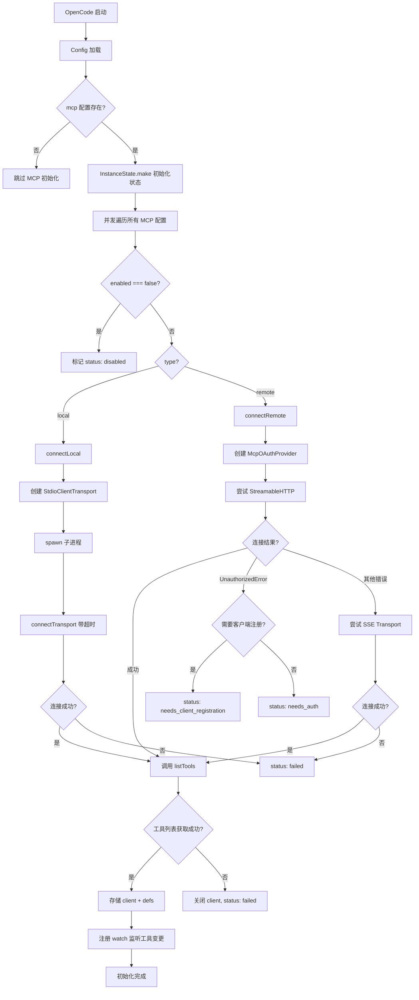
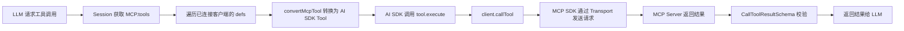
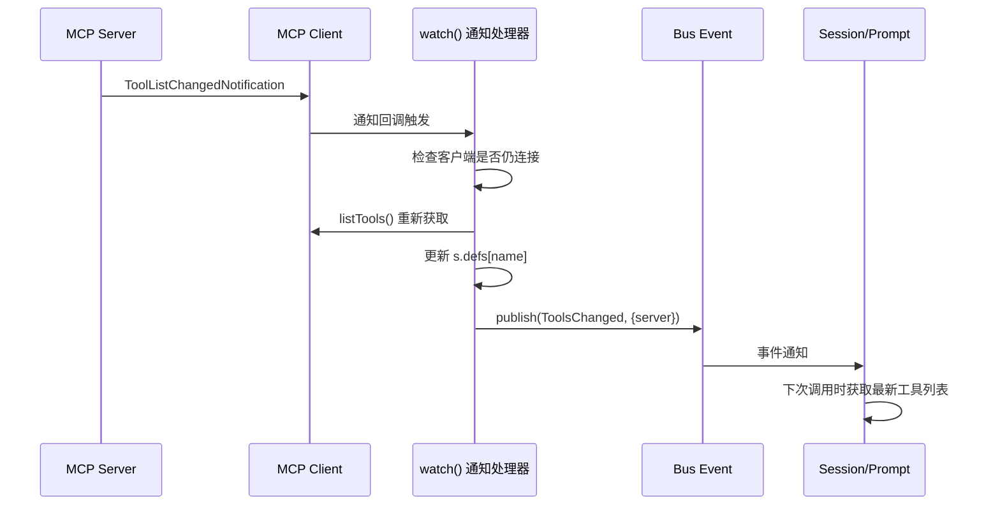
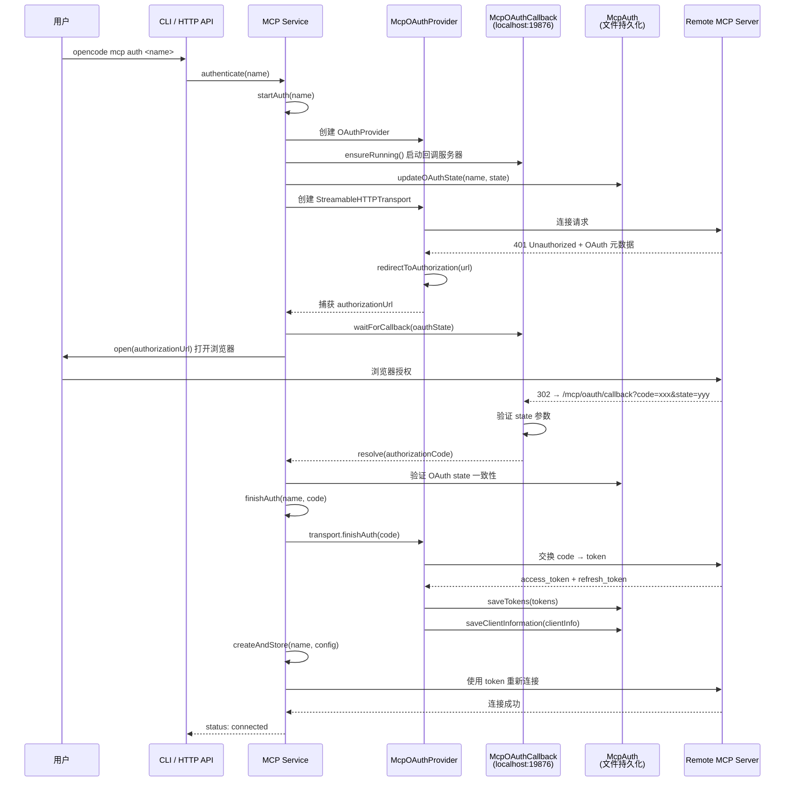
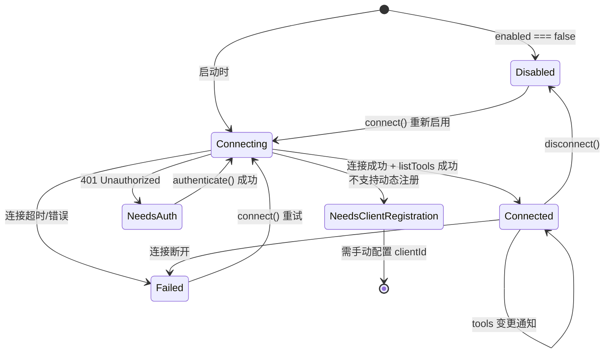
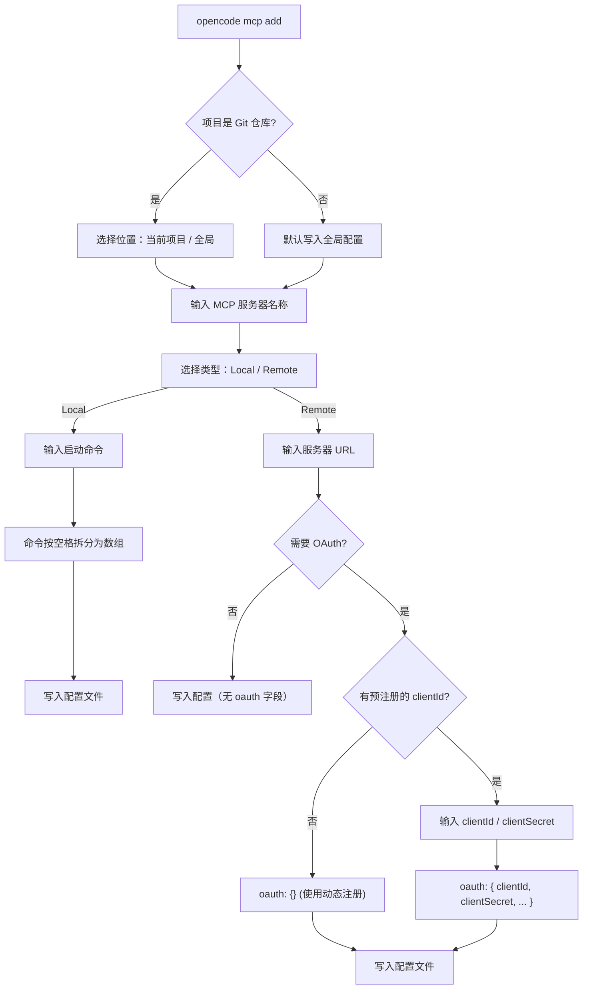
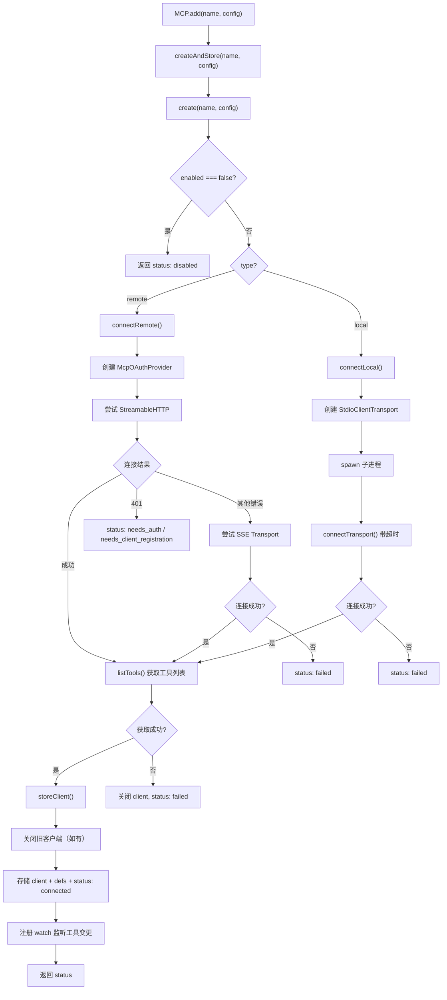

# OpenCode MCP (Model Context Protocol) 实现文档

## 1. 架构总览

OpenCode 的 MCP 实现遵循 Effect 框架的服务化架构，支持本地（Stdio）和远程（HTTP/SSE）两种传输方式，并内置 OAuth 2.0 认证流程。

```
┌─────────────────────────────────────────────────────────────────────┐
│                         OpenCode Application                        │
├─────────┬──────────┬──────────────┬───────────────┬────────────────┤
│  CLI    │  HTTP API│   Session    │    Config     │    Bus Event   │
│  mcp.ts │  mcp.ts  │   prompt.ts  │    mcp.ts     │  ToolsChanged  │
├─────────┴──────────┴──────────────┴───────────────┴────────────────┤
│                        MCP Service (Effect)                         │
│  ┌────────────┐  ┌──────────────┐  ┌────────────┐  ┌───────────┐  │
│  │  status()  │  │   tools()    │  │  connect()  │  │   add()   │  │
│  │  clients() │  │  prompts()   │  │ disconnect()│  │  auth()   │  │
│  │  resources │  │  getPrompt() │  │  startAuth()│  │finishAuth │  │
│  └────────────┘  └──────────────┘  └────────────┘  └───────────┘  │
├────────────────────────────────────────────────────────────────────┤
│  ┌──────────────────┐  ┌──────────────────┐  ┌─────────────────┐  │
│  │  McpAuth Service │  │ McpOAuthProvider │  │McpOAuthCallback │  │
│  │  (Token 持久化)   │  │ (OAuth 客户端)    │  │ (回调服务器)     │  │
│  └──────────────────┘  └──────────────────┘  └─────────────────┘  │
├────────────────────────────────────────────────────────────────────┤
│                    MCP SDK Client Transports                        │
│  ┌──────────────────┐  ┌────────────────────┐  ┌───────────────┐  │
│  │ StdioTransport   │  │ StreamableHTTP     │  │ SSE Transport │  │
│  │ (本地进程)        │  │ Transport (远程)    │  │  (远程备选)    │  │
│  └──────────────────┘  └────────────────────┘  └───────────────┘  │
├────────────────────────────────────────────────────────────────────┤
│  ┌──────────────────┐  ┌──────────────────────────────────────┐   │
│  │ Local MCP Server │  │       Remote MCP Server              │   │
│  │ (子进程 stdin/stdout)│    (HTTP/SSE + OAuth 2.0)            │   │
│  └──────────────────┘  └──────────────────────────────────────┘   │
└────────────────────────────────────────────────────────────────────┘
```

## 2. 模块职责

| 模块 | 文件 | 职责 |
|------|------|------|
| **MCP Service** | `src/mcp/index.ts` | 核心服务，管理客户端生命周期、工具发现、状态管理 |
| **McpAuth** | `src/mcp/auth.ts` | OAuth 凭据持久化（tokens、clientInfo、codeVerifier） |
| **McpOAuthProvider** | `src/mcp/oauth-provider.ts` | 实现 MCP SDK 的 `OAuthClientProvider` 接口 |
| **McpOAuthCallback** | `src/mcp/oauth-callback.ts` | 本地 HTTP 回调服务器，接收 OAuth 授权码 |
| **ConfigMCP** | `src/config/mcp.ts` | MCP 配置 Schema 定义（Local/Remote） |
| **MCP WebSearch** | `src/tool/mcp-websearch.ts` | 直接 HTTP 调用远程 MCP（不走完整客户端流程） |
| **CLI** | `src/cli/cmd/mcp.ts` | 命令行管理：add/list/auth/logout/debug |
| **HTTP API** | `src/server/.../mcp.ts` | RESTful API：status/add/auth/connect/disconnect |

## 3. 核心流程图

### 3.1 启动初始化流程



### 3.2 工具调用流程



### 3.3 工具热更新流程



### 3.4 OAuth 认证流程



### 3.5 状态机



## 4. 添加 MCP 服务器

添加 MCP 服务器有三种途径：CLI 交互式添加、HTTP API 动态添加、手动编辑配置文件。三者最终都通过 MCP Service 的 `add()` 方法完成实际连接。

### 4.1 CLI 交互式添加（`opencode mcp add`）

用户运行 `opencode mcp add` 后，进入交互式流程：



**配置文件写入逻辑**（[mcp.ts](file:///Users/zhangbin/code/source/opencode/packages/opencode/src/cli/cmd/mcp.ts)）：

1. **定位配置文件** — 按优先级查找 `opencode.json` / `opencode.jsonc`（项目级还检查 `.opencode/` 子目录）
2. **使用 `jsonc-parser` 修改** — 调用 `modify(text, ["mcp", name], config)` 生成编辑操作，再 `applyEdits()` 应用，保留文件中的注释
3. **写入磁盘** — 将修改后的内容写回配置文件

```typescript
// CLI 中的配置写入核心逻辑
async function addMcpToConfig(name: string, mcpConfig: ConfigMCP.Info, configPath: string) {
  let text = "{}"
  if (await Filesystem.exists(configPath)) {
    text = await Filesystem.readText(configPath)
  }
  const edits = modify(text, ["mcp", name], mcpConfig, {
    formattingOptions: { tabSize: 2, insertSpaces: true },
  })
  const result = applyEdits(text, edits)
  await Filesystem.write(configPath, result)
}
```

### 4.2 HTTP API 动态添加

通过 `POST /mcp` 端点动态添加，不需要修改配置文件，服务器立即连接：

```json
POST /mcp
{
  "name": "my-server",
  "config": {
    "type": "remote",
    "url": "https://example.com/mcp"
  }
}
```

**请求处理流程**（[handlers/mcp.ts](file:///Users/zhangbin/code/source/opencode/packages/opencode/src/server/routes/instance/httpapi/handlers/mcp.ts)）：

```
HTTP Request → AddPayload 校验 (name + ConfigMCP.Info)
    → MCP.Service.add(name, config)
    → 返回状态 Map
```

与 CLI 不同，HTTP API 的 `add` 不会持久化到配置文件——它只在运行时内存中创建客户端连接。重启后需要重新添加。

### 4.3 手动编辑配置文件

直接编辑 `opencode.jsonc`，在 `mcp` 字段下添加条目：

```jsonc
{
  "mcp": {
    "my-local": {
      "type": "local",
      "command": ["npx", "-y", "@modelcontextprotocol/server-everything"],
      "environment": { "MY_VAR": "value" },
      "enabled": true,
      "timeout": 30000
    },
    "my-remote": {
      "type": "remote",
      "url": "https://example.com/mcp",
      "headers": { "Authorization": "Bearer xxx" },
      "enabled": true,
      "timeout": 30000,
      "oauth": {
        "clientId": "pre-registered-id",
        "clientSecret": "secret",
        "scope": "read write",
        "redirectUri": "http://127.0.0.1:19876/mcp/oauth/callback"
      }
    }
  }
}
```

### 4.4 MCP Service `add()` 内部流程

无论通过哪种途径添加，最终都调用 MCP Service 的 `add()` 方法（[mcp/index.ts](file:///Users/zhangbin/code/source/opencode/packages/opencode/src/mcp/index.ts)）：



**关键步骤说明**：

| 步骤 | 说明 |
|------|------|
| `create()` | 根据 type 走 local/remote 分支，创建 Transport 并连接 |
| `connectLocal()` | 将 command 数组拆分为 `[cmd, ...args]`，通过 `StdioClientTransport` spawn 子进程 |
| `connectRemote()` | 优先尝试 `StreamableHTTPClientTransport`，失败后回退 `SSEClientTransport`；遇到 `UnauthorizedError` 立即停止并进入认证流程 |
| `connectTransport()` | 使用 `Effect.acquireUseRelease` 保证资源安全——连接失败时自动关闭 Transport |
| `listTools()` | 连接成功后获取工具列表；如果 `outputSchema` 校验失败，使用 `TolerantListToolsResultSchema` 降级重试 |
| `storeClient()` | 关闭同名旧客户端，存储新客户端、工具定义，注册 `ToolListChangedNotification` 监听 |

### 4.5 配置 Schema 详解

MCP 配置定义在 [config/mcp.ts](file:///Users/zhangbin/code/source/opencode/packages/opencode/src/config/mcp.ts)，使用 Effect Schema：

```
ConfigMCP.Info = Union[Local, Remote]  (discriminator: "type")

Local:
  type: "local"
  command: string[]          // 启动命令，如 ["npx", "-y", "server-filesystem"]
  environment?: Record<string, string>  // 环境变量
  enabled?: boolean          // 默认 true
  timeout?: PositiveInt      // 请求超时(ms)，默认 30000

Remote:
  type: "remote"
  url: string                // 远程服务器 URL
  enabled?: boolean
  headers?: Record<string, string>      // 自定义请求头
  oauth?: OAuth | false      // OAuth 配置，false 表示禁用自动检测
  timeout?: PositiveInt

OAuth:
  clientId?: string          // 预注册的 client ID（不提供则尝试动态注册 RFC 7591）
  clientSecret?: string
  scope?: string             // 授权范围
  redirectUri?: string       // 默认 http://127.0.0.1:19876/mcp/oauth/callback
```

**`oauth` 字段的三种用法**：

| 配置 | 行为 |
|------|------|
| 不设置 `oauth` | 远程服务器默认启用 OAuth 自动检测 |
| `oauth: false` | 禁用 OAuth，即使服务器返回 401 也不进入认证流程 |
| `oauth: { clientId, ... }` | 使用预注册凭据，跳过动态客户端注册 |

## 5. 代码设计

### 5.1 Effect 服务模式

MCP Service 遵循项目的 Effect 服务模式：

```
Interface (接口定义)
    ↓
Service extends Context.Service (服务标识 + 依赖注入)
    ↓
Layer.effect(Service, ...) (服务实现 + 依赖图)
    ↓
defaultLayer (预组装的依赖层)
    ↓
export * as MCP from "." (命名空间导出)
```

关键设计点：
- **InstanceState** — 按项目目录隔离状态，每个打开的项目拥有独立的 MCP 客户端集合
- **EffectBridge** — 在 MCP SDK 的回调边界（如 `ToolListChangedNotification`）和 Effect 世界之间桥接
- **Effect.acquireUseRelease** — Transport 连接的资源安全保证，失败时自动关闭

### 5.2 状态管理

```typescript
// 每个实例独立的状态
interface State {
  status: Record<string, Status>      // 每个 MCP 服务器的状态
  clients: Record<string, MCPClient>  // 活跃的 MCP 客户端
  defs: Record<string, MCPToolDef[]>  // 每个服务器的工具定义
}
```

5 种状态枚举：

| 状态 | 含义 | 触发条件 |
|------|------|----------|
| `connected` | 正常连接 | 连接 + listTools 成功 |
| `disabled` | 已禁用 | `enabled: false` 或 `disconnect()` |
| `failed` | 连接失败 | 超时、进程退出、URL 无效等 |
| `needs_auth` | 需要认证 | 服务器返回 401 |
| `needs_client_registration` | 需要预注册 | 服务器不支持动态客户端注册 |

### 5.3 工具转换

MCP 工具定义 → AI SDK Tool 的转换逻辑：

```
MCP Tool Definition                    AI SDK Tool
┌─────────────────────┐     ┌──────────────────────────┐
│ name: string        │     │ description: string       │
│ description: string │ --> │ inputSchema: JSONSchema7  │
│ inputSchema: object │     │   (强制 type: "object",   │
│ outputSchema: object│     │    additionalProperties:  │
└─────────────────────┘     │    false)                 │
                            │ execute: (args) =>        │
                            │   client.callTool(...)    │
                            └──────────────────────────┘
```

关键处理：
- `inputSchema` 强制设为 `type: "object"`，`additionalProperties: false`
- `outputSchema` 校验失败时降级重试（`TolerantListToolsResultSchema`）
- 工具名格式：`{sanitizedClientName}_{sanitizedToolName}`
- `callTool` 支持 `resetTimeoutOnProgress` 和自定义 `timeout`

### 5.4 远程连接策略

连接远程 MCP 服务器时，按优先级尝试两种传输：

```
1. StreamableHTTPClientTransport  (首选)
   ↓ 失败
2. SSEClientTransport             (备选)
   ↓ 失败
   返回最后一个错误状态
```

如果遇到认证错误（`UnauthorizedError`），立即停止尝试后续传输，进入认证流程。

### 5.5 进程生命周期管理

本地 MCP 服务器作为子进程运行，清理时需要递归终止所有后代进程：

```
主进程 (opencode)
  └── MCP 子进程 (pid)
        └── 子进程的后代 (递归 pgrep -P)
              └── ...
```

通过 `Effect.addFinalizer` 注册清理回调，在实例销毁时：
1. 递归查找所有后代 PID（`pgrep -P`）
2. 发送 `SIGTERM` 信号
3. 关闭 MCP 客户端连接

## 6. OAuth 实现细节

### 6.1 McpOAuthProvider

实现 `OAuthClientProvider` 接口，核心方法：

| 方法 | 说明 |
|------|------|
| `clientInformation()` | 优先使用配置的 clientId，其次使用存储的动态注册信息 |
| `saveClientInformation()` | 保存动态注册的客户端信息 |
| `tokens()` | 从持久化存储读取 token |
| `saveTokens()` | 保存 token（含过期时间计算） |
| `redirectToAuthorization()` | 捕获授权 URL 供后续打开浏览器 |
| `codeVerifier()` / `saveCodeVerifier()` | PKCE code verifier 持久化 |
| `state()` / `saveState()` | OAuth state 参数管理（含自动生成） |
| `invalidateCredentials()` | 清除凭据（all/client/tokens） |

### 6.2 McpOAuthCallback

本地回调服务器，监听 `http://127.0.0.1:19876/mcp/oauth/callback`：

- **CSRF 防护** — 强制校验 `state` 参数
- **超时机制** — 5 分钟等待超时
- **多服务器支持** — 通过 `mcpNameToState` 反向索引支持多个并发 OAuth 流程
- **自定义 redirectUri** — 支持解析自定义回调地址的端口和路径
- **友好 UI** — 返回 HTML 成功/失败页面

### 6.3 McpAuth 持久化

存储路径：`~/.local/share/opencode/mcp-auth.json`（权限 0600）

```typescript
// 每个 MCP 服务器的存储结构
Entry {
  tokens?: {
    accessToken: string
    refreshToken?: string
    expiresAt?: number      // Unix 时间戳（秒）
    scope?: string
  }
  clientInfo?: {
    clientId: string
    clientSecret?: string
    clientIdIssuedAt?: number
    clientSecretExpiresAt?: number
  }
  codeVerifier?: string     // PKCE
  oauthState?: string       // CSRF 防护
  serverUrl?: string        // 绑定服务器 URL，防止凭据混用
}
```

关键安全设计：
- `getForUrl()` 验证凭据与当前服务器 URL 匹配
- 客户端密钥过期检查（`clientSecretExpiresAt`）
- Token 过期检查（`isTokenExpired`）

## 7. 配置 Schema

```jsonc
// opencode.jsonc
{
  "mcp": {
    "my-local": {
      "type": "local",
      "command": ["npx", "-y", "@modelcontextprotocol/server-everything"],
      "environment": { "MY_VAR": "value" },
      "enabled": true,
      "timeout": 30000
    },
    "my-remote": {
      "type": "remote",
      "url": "https://example.com/mcp",
      "headers": { "Authorization": "Bearer xxx" },
      "enabled": true,
      "timeout": 30000,
      "oauth": {
        "clientId": "pre-registered-id",
        "clientSecret": "secret",
        "scope": "read write",
        "redirectUri": "http://127.0.0.1:19876/mcp/oauth/callback"
      }
    },
    "no-oauth-remote": {
      "type": "remote",
      "url": "https://example.com/mcp",
      "oauth": false  // 禁用 OAuth 自动检测
    }
  }
}
```

## 8. 外部接口

### 8.1 CLI 命令

| 命令 | 说明 |
|------|------|
| `opencode mcp list` | 列出所有 MCP 服务器及状态 |
| `opencode mcp add` | 交互式添加 MCP 服务器 |
| `opencode mcp auth [name]` | 发起 OAuth 认证 |
| `opencode mcp auth list` | 列出 OAuth 状态 |
| `opencode mcp logout [name]` | 移除 OAuth 凭据 |
| `opencode mcp debug <name>` | 调试 OAuth 连接 |

### 8.2 HTTP API

| 方法 | 路径 | 说明 |
|------|------|------|
| GET | `/mcp` | 获取所有服务器状态 |
| POST | `/mcp` | 动态添加 MCP 服务器 |
| POST | `/mcp/:name/auth` | 启动 OAuth 流程 |
| POST | `/mcp/:name/auth/callback` | OAuth 回调（授权码） |
| POST | `/mcp/:name/auth/authenticate` | 完整认证流程（打开浏览器） |
| DELETE | `/mcp/:name/auth` | 移除 OAuth 凭据 |
| POST | `/mcp/:name/connect` | 连接服务器 |
| POST | `/mcp/:name/disconnect` | 断开服务器 |

## 9. 关键依赖

| 依赖 | 用途 |
|------|------|
| `@modelcontextprotocol/sdk` | MCP 协议客户端（Client、Transport、Types） |
| `ai` (AI SDK) | `dynamicTool` / `jsonSchema` 工具转换 |
| `effect` | 服务架构、依赖注入、资源管理 |
| `open` | 打开浏览器进行 OAuth 授权 |
| `jsonc-parser` | 修改配置文件时保留注释 |
