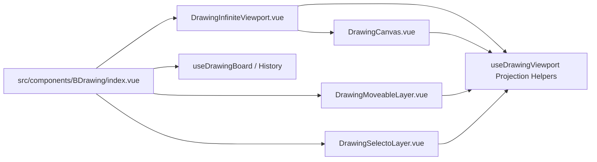

# BDrawing Infinite Viewer Design

## Background

`BDrawing` currently renders the workbench through `src/components/BDrawing/renderers/DrawingCanvas.vue`. The visible area is derived from a fixed SVG viewBox base size of `1200 x 720`, and `src/components/BDrawing/hooks/useDrawingViewport.ts` stores only `center` and `zoom`.

This is enough for a bounded canvas, but it makes an infinite canvas hard to maintain because panning, wheel zoom, pointer projection, `Moveable`, and `Selecto` each need to understand the same viewport math. The next iteration should introduce a dedicated infinite viewer layer while keeping `BDrawing` in control of element data, history, selection, and rendering.

## Dependency Direction

Use `vue3-infinite-viewer` as the viewport foundation.

The npm package is available as `vue3-infinite-viewer` and exposes TypeScript declarations through `declaration/index.d.ts`. Its repository points to Daybrush infinite-viewer, the same ecosystem family as `Moveable` and `Selecto`.

The implementation must verify the actual export shape after installation. If the installed package exports `VueInfiniteViewer`, the wrapper component should import that named component. If it exports a default component, the wrapper should normalize it locally so the rest of `BDrawing` does not care about package export details.

## Goals

- Support an infinite canvas feel: users can pan freely without a visible page boundary.
- Preserve zoom behavior where the mouse position remains the zoom anchor.
- Keep `Moveable` drag and resize working for single and multi-selection.
- Keep `Selecto` area selection working without accidentally starting during Moveable control drags.
- Keep `BDrawing` data model independent from InfiniteViewer internals.
- Keep existing toolbar zoom controls, undo and redo behavior, creation tools, and connector rendering stable.

## Non-Goals

- Do not introduce a new drawing file format in this milestone.
- Do not migrate element data into InfiniteViewer state.
- Do not add minimap, page frames, collaborative cursors, virtualized element rendering, or persistence changes in the first InfiniteViewer milestone.
- Do not redesign the toolbar or shape renderers as part of this change.

## Recommended Architecture

Add a viewport shell around the existing SVG renderer:



`DrawingInfiniteViewport.vue` should be the only component that directly imports `vue3-infinite-viewer`. It owns the InfiniteViewer instance and emits normalized viewport updates back to `BDrawing/index.vue`.

`DrawingCanvas.vue` should remain a renderer. It should receive projected viewport state and render SVG content. It should not know which third-party viewer is used.

`useDrawingViewport.ts` should become the single place for coordinate projection:

- browser client point to board point
- board point to browser or viewer point when needed
- zoom clamping
- mouse anchored zoom
- viewport center and zoom normalization

## Viewport State

Keep the persisted `DrawingViewport` small:

```typescript
/**
 * 画板视口状态。
 */
interface DrawingViewport {
  /** 视口中心点 */
  center: DrawingPoint;
  /** 缩放比例 */
  zoom: number;
}
```

Do not store InfiniteViewer-specific scroll offsets in the document model. If InfiniteViewer reports scroll or camera values, adapt them into `center` and `zoom`.

During implementation, introduce an internal adapter type:

```typescript
/**
 * 无限画布视口适配状态。
 */
interface DrawingInfiniteViewportState {
  /** 画布中心点 */
  center: DrawingPoint;
  /** 缩放比例 */
  zoom: number;
  /** 可视区域像素宽度 */
  clientWidth: number;
  /** 可视区域像素高度 */
  clientHeight: number;
}
```

This adapter type should stay internal to `BDrawing` and should not be saved in history snapshots.

## Interaction Design

### Pan

The hand tool should become the primary explicit pan mode. Dragging the empty canvas while the hand tool is active should move the infinite viewport.

In select mode, empty canvas drag should continue to start `Selecto`; it should not pan by default. This keeps area selection predictable.

Trackpad two-finger scroll should pan when it is a normal wheel gesture. Ctrl or Command modified wheel should zoom.

### Zoom

Wheel zoom must continue to use the mouse position as the anchor. Toolbar zoom buttons can keep using the current viewport center as the anchor.

InfiniteViewer native zoom should not directly mutate board state without passing through `useDrawingViewport.ts`. All zoom changes should be normalized to the same min, max, and rounding rules.

### Create

Shape creation should keep using board coordinates. Pointer coordinates should be converted through the shared projection helper before calling `startCreateShapeDraft`, `updateDraftPoint`, and `commitCreateShapeDraft`.

### Moveable

`Moveable` should continue to receive actual rendered element targets through `data-drawing-element-id`.

The adapter must verify whether InfiniteViewer applies CSS transforms to the content layer. If it does, Moveable target sync must run after viewport changes so handles stay aligned. The existing `Moveable` layer should not calculate viewport math by itself; it should consume normalized `viewport.zoom` when converting pixel deltas to board deltas.

### Selecto

`Selecto` should keep using the BDrawing root as the drag container unless InfiniteViewer requires a more specific content element. Its drag condition must continue blocking starts from Moveable controls, selected elements, toolbar controls, and existing SVG elements.

Selecto hit testing should still identify targets by `.b-drawing-element` and `data-drawing-element-id`.

## Visual Design

The first milestone should keep the current clean workbench styling:

- no visible page boundary
- background uses `var(--bg-primary)`
- optional grid can be deferred
- toolbar remains floating above the canvas
- Moveable and Selecto keep the theme-color styling already added

If a grid is added later, it should be rendered as a separate background layer and should use project theme variables directly, not component-local theme aliases.

## Testing Strategy

Add or update component tests around behavior, not third-party internals:

- mounting BDrawing renders the InfiniteViewer wrapper and existing SVG content
- modified wheel zoom updates the toolbar percentage
- modified wheel zoom keeps the mouse board point anchored
- normal wheel or hand-drag pans the viewport without changing element geometry
- select-mode empty drag still starts Selecto and does not pan
- selected elements still support Moveable drag and resize after a viewport pan
- coordinate projection creates shapes at the expected board position after pan and zoom

The tests should mock `vue3-infinite-viewer` similarly to the existing `Moveable` and `Selecto` mocks. Tests should not depend on InfiniteViewer private DOM structure.

## Implementation Order

1. Add `vue3-infinite-viewer` and verify its export shape.
2. Create `DrawingInfiniteViewport.vue` as the only direct package adapter.
3. Move fixed viewBox constants into shared viewport helpers.
4. Route pointer and wheel projection through `useDrawingViewport.ts`.
5. Wrap `DrawingCanvas.vue` with the InfiniteViewer adapter.
6. Reconnect hand tool pan and modified wheel zoom.
7. Verify Moveable and Selecto after pan and zoom.
8. Add changelog entries and run targeted tests, type check, ESLint, Stylelint, and `git diff --check`.

## Risks

- InfiniteViewer may apply transforms in a way that changes Moveable handle alignment.
- Selecto may need a different drag container after the content layer is wrapped.
- SVG viewBox scaling and InfiniteViewer scaling can double-apply zoom if both remain active.
- The package README and npm package name are not identical, so the import path must be verified after installation.

## Open Decisions

No blocking product decisions remain for the first milestone. The implementation should use the conservative adapter approach above and keep all InfiniteViewer details behind `DrawingInfiniteViewport.vue`.
