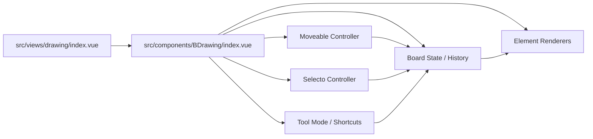
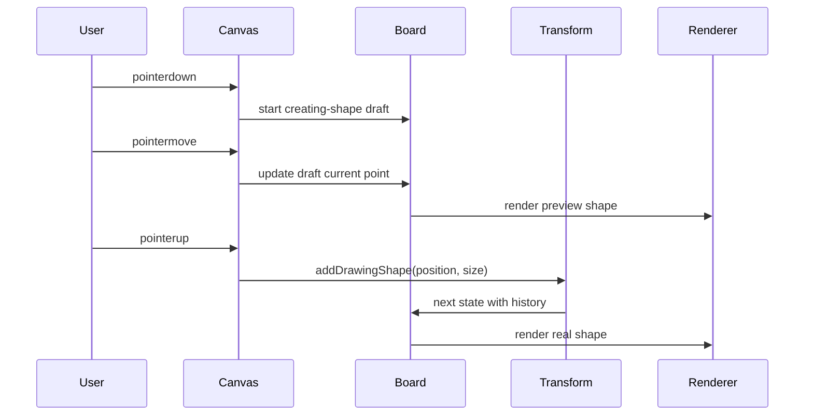
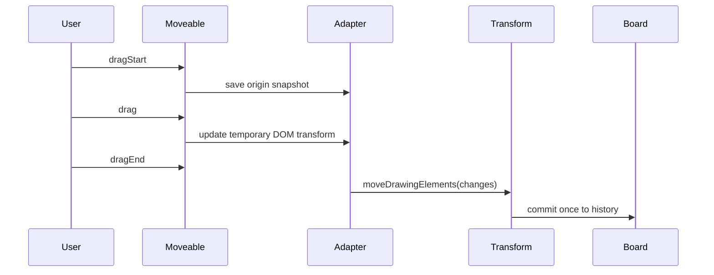
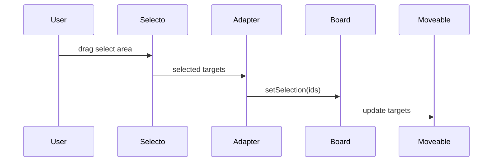

# BDrawing 技术路线与发展规划

## 背景

`BDrawing` 是 Tibis 的独立画图工具入口，当前代码位于 `src/components/BDrawing`，页面入口位于 `src/views/drawing/index.vue`。首版目标是提供独立画板、基础工具模式、节点创建、选择删除、撤销重做和缩放能力，不引入新的文件类型，也不接入 AI 画图。

经过重新评估，后续画图能力优先面向“稳定、可靠、可直接交互”的自由画板体验，而不是优先绑定 Plait Core。自由画板的核心需求是可拖拽、可缩放、可旋转、框选、多选和自定义尺寸创建，这些能力更适合由成熟交互库承担。

## 当前结论

短期自由画板路线采用 `Moveable + Selecto + 自有数据模型`：

- `Moveable` 负责 draggable、resizable、rotatable、groupable、snappable 等元素操作能力。
- `Selecto` 负责鼠标或触摸拖拽区域选择。
- `BDrawing` 自己负责元素数据、工具模式、历史记录、快捷键、主题样式、保存协议和业务扩展。
- 暂不继续扩大 `@plait/core` 的使用范围；后续可在实现 Moveable/Selecto 路线时移除 Plait Core 适配层。

参考：

- [Moveable](https://github.com/daybrush/moveable)：官方说明支持 draggable、resizable、rotatable、groupable、snappable，并支持 SVG 元素。
- [Selecto](https://github.com/daybrush/selecto)：官方说明用于通过鼠标或触摸拖拽区域选择元素。

## 设计原则

1. 交互稳定优先  
   直接复用成熟库处理拖拽、缩放、旋转和框选，不在首轮自研复杂控制点逻辑。

2. 数据模型自主  
   画板文档、元素结构、历史记录和未来保存格式都由 `BDrawing` 管理，不把业务模型绑定到某个交互库内部状态。

3. 自由画板和结构化图形并存  
   普通形状、文本、连线、脑图节点可以在同一画布中共存，但不同元素类型允许不同交互规则。

4. 渐进扩展  
   先完成稳定自由画板，再扩展脑图、流程图自动布局、连接线吸附、图层和分组。

5. 主题变量直用  
   组件样式直接使用项目主题变量，例如 `--bg-primary`、`--border-primary`、`--text-primary`、`--color-primary`，不在组件内再定义二次主题变量。

## 目标架构



### 模块职责

`src/components/BDrawing/types.ts`

- 定义画板元素类型、几何属性、样式属性、历史快照和工具模式。
- 未来应从 `DrawingNode` 逐步演进为更通用的 `DrawingElement`。

`src/components/BDrawing/utils/boardTransforms.ts`

- 负责不可变状态变换。
- 所有新增、移动、缩放、旋转、删除、成组和历史记录都应经过这里。
- Moveable 和 Selecto 事件只转换为 transform 输入，不直接修改业务状态。

`src/components/BDrawing/renderers`

- 只负责渲染元素，不持有业务状态。
- 每个可操作元素需要提供稳定 DOM 标识，例如 `data-drawing-element-id`，供 Moveable 和 Selecto 绑定。

`src/components/BDrawing/components`

- 工具栏、浮动操作条、属性面板、上下文菜单等 UI。
- 工具栏保持 Drawnix 风格：选择工具、手型工具、形状工具、文本工具、连接线工具分组。

`src/components/BDrawing/hooks`

- 画板状态、视口、交互控制器、快捷键、Moveable/Selecto 适配层。
- 建议新增 `useDrawingMoveable.ts` 和 `useDrawingSelecto.ts`，把第三方库事件隔离在 hook 内。

## 数据模型规划

### 第一阶段模型

先把当前节点模型扩展为通用元素模型：

```typescript
/**
 * 画板元素类型。
 */
type DrawingElementKind = 'shape' | 'text' | 'connector' | 'mindmap-node';

/**
 * 形状类型。
 */
type DrawingShapeType = 'rect' | 'ellipse' | 'diamond' | 'process';

/**
 * 画板元素基础字段。
 */
interface DrawingElementBase {
  /** 元素 ID */
  id: string;
  /** 元素类别 */
  kind: DrawingElementKind;
  /** 元素位置 */
  position: DrawingPoint;
  /** 元素尺寸 */
  size: DrawingSize;
  /** 旋转角度，单位为度 */
  rotation: number;
  /** 创建和更新时间 */
  metadata: DrawingElementMetadata;
}

/**
 * 自由形状元素。
 */
interface DrawingShapeElement extends DrawingElementBase {
  /** 元素类别 */
  kind: 'shape';
  /** 形状类型 */
  shape: DrawingShapeType;
  /** 主文本 */
  text?: string;
}
```

当前 `DrawingNode` 可以作为迁移前的兼容类型保留一段时间，但新增能力应面向 `DrawingElement` 设计。

### 脑图模型预留

脑图可以在当前画布里扩展，但不应被普通形状模型吞掉。建议作为 `mindmap-node` 元素存在：

```typescript
/**
 * 脑图节点元素。
 */
interface DrawingMindmapNodeElement extends DrawingElementBase {
  /** 元素类别 */
  kind: 'mindmap-node';
  /** 父节点 ID */
  parentId?: string;
  /** 子节点 ID 列表 */
  childrenIds: string[];
  /** 是否折叠子节点 */
  collapsed: boolean;
  /** 节点文本 */
  text: string;
}
```

脑图节点可以被选择和拖动，但默认不走普通自由形状的 resize/rotate 规则。脑图布局由树结构和自动布局控制，必要时允许局部手动偏移。

### 样式模型

元素样式不应写死在渲染组件里，建议成为数据模型的一部分。第一版可以只支持填充、边框、文字和透明度：

```typescript
/**
 * 画板元素样式。
 */
interface DrawingElementStyle {
  /** 填充色，默认使用主题变量 */
  fill?: string;
  /** 描边色，默认使用主题变量 */
  stroke?: string;
  /** 描边宽度 */
  strokeWidth?: number;
  /** 文字颜色，默认使用主题变量 */
  color?: string;
  /** 透明度 */
  opacity?: number;
}
```

样式字段允许保存用户选择的颜色，但组件默认值必须来自项目主题变量。对于主题色、语义色和自定义色，建议用统一格式区分：

```typescript
/**
 * 可持久化颜色值。
 */
type DrawingColorValue =
  | { kind: 'theme'; token: '--color-primary' | '--text-primary' | '--bg-primary' }
  | { kind: 'custom'; value: string };
```

第一版如果不做颜色面板，可以先让 `style` 可选。渲染层读取 `style`，没有值时直接使用 CSS 变量。

### 画板状态结构

为了同时支持自由画板和未来脑图，状态建议拆成元素、选择、视口、交互草稿和历史：

```typescript
/**
 * 画板运行状态。
 */
interface DrawingBoardState {
  /** 当前画板元素 */
  elements: DrawingElement[];
  /** 当前选中的元素 ID */
  selection: string[];
  /** 视口状态 */
  viewport: DrawingViewport;
  /** 当前工具模式 */
  activeTool: DrawingToolMode;
  /** 交互草稿，不进入历史 */
  draft?: DrawingInteractionDraft;
  /** 历史记录 */
  history: DrawingBoardHistory;
}
```

`draft` 用于拖拽创建、框选、拖动预览、缩放预览和旋转预览。它不进入持久化，也不进入历史记录。只有在 `pointerup` 或 Moveable 的结束事件中才提交真实 transform。

```typescript
/**
 * 画板交互草稿。
 */
type DrawingInteractionDraft =
  | { kind: 'creating-shape'; shape: DrawingShapeType; start: DrawingPoint; current: DrawingPoint }
  | { kind: 'selecting-area'; start: DrawingPoint; current: DrawingPoint }
  | { kind: 'moving-elements'; ids: string[]; originElements: DrawingElement[] }
  | { kind: 'resizing-elements'; ids: string[]; originElements: DrawingElement[] }
  | { kind: 'rotating-elements'; ids: string[]; originElements: DrawingElement[] };
```

### 坐标体系

推荐统一使用“画板世界坐标”保存元素数据：

- `position.x` / `position.y`：世界坐标。
- `size.width` / `size.height`：世界尺寸。
- `rotation`：世界坐标中的角度，单位为度。
- `viewport.center`：当前视口中心的世界坐标。
- `viewport.zoom`：屏幕像素到世界坐标的缩放比例。

交互库收到的是 DOM 坐标，因此需要一个单独的坐标适配层：

```typescript
/**
 * 坐标换算工具。
 */
interface DrawingCoordinateAdapter {
  /** DOM 坐标转换为画板世界坐标 */
  clientToWorld: (point: DrawingPoint) => DrawingPoint;
  /** 画板世界坐标转换为 DOM 坐标 */
  worldToClient: (point: DrawingPoint) => DrawingPoint;
  /** DOM 尺寸转换为世界尺寸 */
  clientSizeToWorld: (size: DrawingSize) => DrawingSize;
}
```

这个适配层应集中在 hook 或工具文件中，避免 Moveable、Selecto、SVG 渲染各自手写坐标换算。

## 渲染策略

自由画板有两种可选渲染路线。

### 方案 A：SVG 元素渲染

优点：

- 当前实现已经是 SVG，迁移成本低。
- 连线、箭头、菱形、椭圆等图形语义自然。
- 导出 SVG 或图片更直接。

风险：

- Moveable 控制框以 DOM 坐标为基础，遇到 SVG viewBox 和 zoom 时需要适配。
- 复杂文本编辑、富文本、内嵌组件会更麻烦。

适用阶段：

- 当前首版形状、连线、基础交互。
- 保持现状并小步接入 Moveable。

### 方案 B：HTML absolute 元素渲染，SVG 只渲染网格和连线

优点：

- Moveable 和 Selecto 的 DOM 命中更直接。
- 文本编辑、输入框、富内容、属性面板更容易。
- 元素控制框和 DOM 布局更一致。

风险：

- 形状需要 CSS 或内嵌 SVG 实现。
- 连线需要在 HTML 元素和 SVG 之间同步坐标。

适用阶段：

- Moveable/Selecto 接入后，如果 SVG viewBox 适配成本高，可以切换到这一方案。

推荐决策：

- Milestone 1 和 Milestone 2 继续使用 SVG。
- Milestone 3 接 Moveable 时做 spike：如果 SVG target 控制框表现稳定，继续 SVG；如果 viewBox/zoom 适配成本过高，切换为 HTML absolute 元素。

## 交互规划

### 工具模式

基础工具模式：

- `select`：选择、移动、框选、多选。
- `hand`：拖动画布。
- `rect`：拖拽创建矩形。
- `ellipse`：拖拽创建椭圆。
- `diamond`：拖拽创建菱形。
- `text`：点击创建文本。
- `connector`：连接两个元素。
- `mindmap`：创建脑图根节点或进入脑图编辑模式。

快捷键建议：

- `V` / `Esc`：选择工具。
- `H`：手型工具。
- `R`：矩形。
- `O`：椭圆。
- `D`：菱形。
- `T`：文本。
- `C`：连接线。
- `M`：脑图。
- `Delete` / `Backspace`：删除选中元素。
- `Cmd/Ctrl+Z`：撤销。
- `Cmd/Ctrl+Shift+Z` 或 `Cmd/Ctrl+Y`：重做。

### 自定义尺寸创建

形状创建采用拖拽创建：

1. 选择形状工具。
2. 在画布 `pointerdown` 记录起点。
3. `pointermove` 显示预览框。
4. `pointerup` 根据起点和终点计算 `position + size`。
5. 尺寸小于阈值时使用默认尺寸，避免误点生成不可见元素。

### Moveable 适配

Moveable 只负责交互控制，不作为真实数据源：

- `drag` 过程中只更新临时 transform，保证交互顺滑。
- `dragEnd` 后提交 `moveElements` transform，写入历史。
- `resize` 过程中更新临时宽高和位置。
- `resizeEnd` 后提交 `resizeElements` transform。
- `rotate` 过程中更新临时角度。
- `rotateEnd` 后提交 `rotateElements` transform。
- 多选时使用 group 能力，结束时把每个元素的最终几何状态写回 board state。

建议新增适配 hook：

```typescript
/**
 * Moveable 适配层入参。
 */
interface UseDrawingMoveableOptions {
  /** 画板根节点 */
  rootRef: Ref<HTMLElement | null>;
  /** 当前元素列表 */
  elements: Ref<DrawingElement[]>;
  /** 当前选区 */
  selection: Ref<string[]>;
  /** 当前视口 */
  viewport: Ref<DrawingViewport>;
  /** 提交元素几何变更 */
  commitGeometry: (changes: DrawingGeometryChange[]) => void;
}
```

Moveable 事件处理规则：

1. `dragStart`  
   读取当前选区元素快照，写入 `draft`。

2. `drag`  
   只更新 DOM 临时样式，或更新 `draft` 中的预览值。不要写入 `elements`，避免每一帧触发历史。

3. `dragEnd`  
   根据 Moveable 返回的最终位置计算世界坐标，调用 `moveElements`。

4. `resizeStart`  
   保存元素原始 `position + size + rotation`。

5. `resize`  
   更新临时 DOM 尺寸，必要时同步预览。

6. `resizeEnd`  
   提交 `resizeElements`。如果尺寸小于最小阈值，进行 clamp。

7. `rotateStart`  
   保存原始角度。

8. `rotate`  
   更新临时 DOM transform。

9. `rotateEnd`  
   提交 `rotateElements`，角度统一归一化到 `0 <= rotation < 360`。

### 几何变更格式

Moveable 的输出最终应转换为统一几何变更：

```typescript
/**
 * 元素几何变更。
 */
interface DrawingGeometryChange {
  /** 元素 ID */
  id: string;
  /** 新位置 */
  position?: DrawingPoint;
  /** 新尺寸 */
  size?: DrawingSize;
  /** 新旋转角度 */
  rotation?: number;
}
```

这一层可以屏蔽 Moveable 事件字段差异，让 `boardTransforms.ts` 只关心业务数据。

### Selecto 适配

Selecto 负责框选命中，结果转换为 selection：

- 框选只在 `select` 工具下启用。
- 命中元素来自稳定 DOM 属性，例如 `data-drawing-element-id`。
- 按住 `Shift` 时追加选择，普通框选替换选择。
- 框选结束只更新 selection，不写入历史。

建议新增适配 hook：

```typescript
/**
 * Selecto 适配层入参。
 */
interface UseDrawingSelectoOptions {
  /** 画板根节点 */
  rootRef: Ref<HTMLElement | null>;
  /** 当前工具模式 */
  activeTool: Ref<DrawingToolMode>;
  /** 更新选区 */
  setSelection: (selection: string[]) => void;
  /** 读取当前选区 */
  getSelection: () => string[];
}
```

Selecto 事件处理规则：

1. 只在 `activeTool === 'select'` 时启用。
2. `dragStart` 时如果起点在 Moveable 控制框、工具栏、文本编辑器里，应取消框选。
3. `selectEnd` 时读取命中 DOM 的 `data-drawing-element-id`。
4. 按住 `Shift` 时合并选区；否则替换选区。
5. 选区变化不进入历史，和常见白板工具保持一致。

## Transform API 规划

所有状态变更都应通过 transform。建议按操作语义拆分：

```typescript
/**
 * 创建形状。
 */
function addDrawingShape(state: DrawingBoardState, options: AddDrawingShapeOptions): DrawingBoardState;

/**
 * 移动画板元素。
 */
function moveDrawingElements(state: DrawingBoardState, changes: DrawingGeometryChange[]): DrawingBoardState;

/**
 * 缩放画板元素。
 */
function resizeDrawingElements(state: DrawingBoardState, changes: DrawingGeometryChange[]): DrawingBoardState;

/**
 * 旋转画板元素。
 */
function rotateDrawingElements(state: DrawingBoardState, changes: DrawingGeometryChange[]): DrawingBoardState;

/**
 * 删除选中元素。
 */
function deleteDrawingSelection(state: DrawingBoardState): DrawingBoardState;
```

Transform 约束：

- 输入必须是不可变数据。
- 返回新状态，不修改旧状态。
- 会改变元素数据的操作必须入历史。
- 只改变 `selection`、`activeTool`、`draft` 的操作不入历史。
- 操作失败时返回带 `lastError` 的原状态副本，不做半成功写入。
- 多元素操作必须作为一次历史记录提交。

## 事件流

### 拖拽创建形状



### Moveable 拖动元素



### Selecto 框选



## 脑图发展规划

脑图可以在当前画图页面内扩展，推荐分阶段进行。

### 阶段 1：脑图元素类型预留

- 在数据模型里加入 `mindmap-node`。
- 在渲染层支持脑图节点样式。
- 暂不实现完整树编辑，只确保模型不会阻塞未来扩展。

### 阶段 2：基础脑图编辑

- 支持创建根节点。
- 支持新增子节点、同级节点。
- 支持折叠和展开。
- 支持键盘编辑：`Tab` 新增子节点，`Enter` 新增同级节点。
- 支持自动连线渲染。

### 阶段 3：自动布局

- 实现树布局算法，按方向生成节点位置。
- 支持横向、纵向、左右平衡布局。
- 用户拖动节点后记录局部偏移，不破坏树关系。

### 阶段 4：与自由画板混排

- 脑图整体可作为 group 移动。
- 脑图节点可与普通形状或文本共存。
- 支持把脑图节点连接到普通形状。
- 支持导出图片或复制为 Markdown 大纲。

## 依赖策略

短期建议新增：

- `moveable`
- `vue3-moveable`
- `selecto`
- 如 Vue 适配成熟度验证通过，再考虑 `vue3-selecto`

短期建议移除或停止扩展：

- `@plait/core`

移除 Plait Core 的前提：

1. `boardTransforms.ts` 不再调用 `createBoard`。
2. 测试覆盖新增、删除、移动、缩放、旋转和历史记录。
3. 构建产物确认没有 Plait 依赖残留。

### 依赖验证清单

引入 Moveable/Selecto 前，应先做一个最小 spike：

1. 在 `BDrawing` 的实验分支中渲染一个矩形元素。
2. 绑定 Moveable 到该元素。
3. 验证 drag、resize、rotate 在当前 zoom 下是否能正确换算为世界坐标。
4. 验证 Moveable 控制框不会被工具栏、画布遮挡。
5. 验证 Selecto 框选不会误选工具栏按钮。
6. 验证暗色和亮色主题下控制框可见。
7. 验证 `pnpm build` 不引入不可接受的体积增长。

通过 spike 后再正式替换当前手写交互。

## 实施路线

### Milestone 1：模型重构

目标：

- 将 `DrawingNode` 迁移为 `DrawingElement`。
- 增加 `kind`、`shape`、`rotation`、`style` 字段。
- 保持当前流程节点能力可用。
- 移除 Plait Core 适配层。

主要改动：

- 修改 `src/components/BDrawing/types.ts`，新增 `DrawingElement` 联合类型。
- 修改 `src/components/BDrawing/utils/boardTransforms.ts`，把 `nodes` 改为 `elements`。
- 修改 `src/components/BDrawing/renderers`，按 `kind` 分发渲染。
- 修改 `src/components/BDrawing/hooks/useDrawingBoard.ts`，暴露元素级命令。
- 更新 `test/components/BDrawing/board-transforms.test.ts`。
- 更新 `test/components/BDrawing/drawing-canvas.component.test.ts`。

验收：

- 当前流程节点仍可创建、选择、删除、撤销和重做。
- `rg -n "@plait/core|createBoard" src/components/BDrawing package.json` 无结果。
- BDrawing 相关测试通过。

### Milestone 2：形状创建

目标：

- 工具栏新增矩形、椭圆、菱形、文本。
- 支持拖拽创建自定义尺寸。
- 支持小尺寸兜底为默认尺寸。
- 增加创建预览层。

主要改动：

- `DrawingToolMode` 增加 `rect`、`ellipse`、`diamond`、`text`。
- `DrawingCanvas.vue` 增加 `pointermove` 和 `pointerup` 事件。
- 新增 `DrawingCreatePreview.vue`，根据 `draft` 渲染预览形状。
- `boardTransforms.ts` 增加 `addDrawingShape`。
- 工具栏按形状工具分组，保持图标按钮和 active 状态。

交互细节：

- 拖拽方向可以是任意方向，提交前统一归一化为左上角 `position` 和正数 `size`。
- 按住 `Shift` 时保持宽高等比，矩形变正方形，椭圆变圆。
- 单击不拖动时使用默认尺寸，并以点击点为中心创建。
- 创建完成后保持当前形状工具激活，便于连续创建。

验收：

- 拖拽可以创建不同尺寸的矩形、椭圆、菱形。
- 单击可以创建默认尺寸形状。
- 形状创建只产生一条历史记录。
- 快捷键 `R`、`O`、`D`、`T` 能切换对应工具。

### Milestone 3：Moveable 集成

目标：

- 引入 Moveable。
- 单选支持拖拽、缩放、旋转。
- 多选支持 group drag。
- 操作结束后统一写入历史。

主要改动：

- 新增 `src/components/BDrawing/hooks/useDrawingMoveable.ts`。
- 新增 `DrawingMoveableLayer.vue` 或在 `BDrawing/index.vue` 中挂载 Moveable 控制器。
- 渲染元素增加 `data-drawing-element-id`。
- `boardTransforms.ts` 增加 `moveDrawingElements`、`resizeDrawingElements`、`rotateDrawingElements`。

交互细节：

- 单选时显示 resize handles 和 rotate handle。
- 多选时先只启用 group drag，resize/rotate 多选后置。
- Moveable 过程中的 DOM transform 不直接作为持久状态。
- `dragEnd`、`resizeEnd`、`rotateEnd` 后提交最终状态。
- 最小尺寸限制建议为 `16 x 16` 世界单位。
- rotation 保留一位小数或整数，避免历史中出现过多浮点噪声。

验收：

- 单个元素可以拖拽、缩放、旋转。
- 撤销可以回到操作前几何状态。
- 重做可以恢复操作后几何状态。
- 多选元素可以整体拖动。
- zoom 不为 1 时拖拽结果仍正确。

### Milestone 4：Selecto 集成

目标：

- 引入 Selecto。
- 支持框选和追加选择。
- 多选后 Moveable 目标同步更新。
- 删除、撤销、重做覆盖多选场景。

主要改动：

- 新增 `src/components/BDrawing/hooks/useDrawingSelecto.ts`。
- 画板元素 DOM 增加 `.b-drawing-element` 类名和 `data-drawing-element-id`。
- `BDrawing/index.vue` 协调 Selecto 和 Moveable target。

交互细节：

- 普通框选替换当前 selection。
- `Shift` 框选追加 selection。
- 点击空白画布清空 selection。
- 点击已选中元素时不触发框选。
- 框选矩形样式使用主题变量。

验收：

- 可以框选多个元素。
- Shift 框选可以追加选区。
- 删除可以删除多个选中元素。
- 选区变化不进入撤销栈。

### Milestone 5：连接线和吸附

目标：

- 支持连接两个元素。
- 元素移动、缩放、旋转后连接线自动跟随。
- 评估 Moveable snappable，用于对齐线和边缘吸附。

主要改动：

- 新增 `DrawingConnectorElement`。
- 连接线保存 source/target 元素 ID 和锚点信息。
- 渲染层根据元素当前几何信息计算路径。
- Moveable drag/resize/rotate 后触发连接线重算。

交互细节：

- 连接线工具下，从元素锚点拖到另一个元素锚点创建连接。
- 元素四边中点作为第一版锚点。
- 未连接到目标时取消创建。
- 连接线默认不支持 resize/rotate，只支持选择和删除。

验收：

- 可以连接两个形状。
- 形状移动后连接线跟随。
- 删除形状会删除关联连接线。
- 撤销删除形状能恢复形状和连接线。

### Milestone 6：脑图 MVP

目标：

- 新增脑图根节点工具。
- 支持新增子节点、同级节点、折叠展开。
- 实现基础自动布局。
- 脑图和自由元素可以共存。

主要改动：

- 新增 `DrawingMindmapNodeElement`。
- 新增脑图 transform：`addMindmapRoot`、`addMindmapChild`、`addMindmapSibling`、`toggleMindmapCollapse`。
- 新增 `src/components/BDrawing/utils/mindmapLayout.ts`。
- 新增脑图节点 renderer 和脑图连线 renderer。

交互细节：

- `M` 切换脑图工具。
- 点击画布创建脑图根节点。
- 选中脑图节点后，`Tab` 新增子节点，`Enter` 新增同级节点。
- `Space` 或工具栏按钮折叠/展开。
- 脑图节点默认不显示 resize/rotate 控制点。
- 拖动脑图根节点移动整棵脑图。

验收：

- 可以创建脑图根节点。
- 可以新增子节点和同级节点。
- 折叠后子树隐藏，展开后恢复。
- 自动布局不会覆盖自由画板元素。
- 脑图节点和普通形状可以共存。

## 测试策略

### 单元测试

覆盖 `boardTransforms.ts`：

- 创建形状并归一化尺寸。
- 小尺寸创建时回落到默认尺寸。
- 移动单个和多个元素。
- 缩放元素并应用最小尺寸。
- 旋转元素并归一化角度。
- 删除元素时清理相关连接线。
- 撤销和重做多元素操作。
- 脑图新增子节点、同级节点、折叠展开。

覆盖坐标工具：

- `clientToWorld` 在 zoom 为 1、0.5、2 时正确。
- `worldToClient` 与 `clientToWorld` 可逆。
- viewBox 或容器尺寸变化时换算仍正确。

### 组件测试

覆盖 `BDrawing`：

- 工具栏切换工具 active 状态。
- 拖拽创建形状预览和提交。
- 点击创建默认尺寸形状。
- 选择、框选、追加选择。
- Delete 删除选中元素。
- 快捷键切换工具、撤销、重做。
- Moveable 事件结束后更新元素几何。
- Selecto 事件结束后更新 selection。

### 集成验证

每个里程碑完成后运行：

```bash
pnpm test test/components/BDrawing/board-transforms.test.ts test/components/BDrawing/drawing-canvas.component.test.ts
pnpm lint
pnpm lint:style
pnpm exec tsc --noEmit
pnpm build
```

涉及依赖变更时额外检查：

```bash
rg -n "@plait/core|createBoard" src/components/BDrawing package.json pnpm-lock.yaml
```

期望在移除 Plait Core 后无业务引用。

## 迁移策略

### 数据迁移

当前运行期还没有正式画图文件类型，因此迁移主要发生在代码结构中：

1. 保留当前测试行为，先把 `nodes` 字段迁移为 `elements`。
2. 为旧流程节点生成等价元素：

```typescript
/**
 * 兼容旧节点到新元素。
 */
function migrateNodeToElement(node: DrawingNode): DrawingShapeElement {
  return {
    id: node.id,
    kind: 'shape',
    shape: node.type === 'decision' ? 'diamond' : 'process',
    text: node.text,
    position: node.position,
    size: node.size,
    rotation: 0,
    metadata: node.metadata
  };
}
```

3. 新 transform 只写入 `elements`。
4. 旧 `DrawingNode` 类型在迁移完成后删除。

### 代码迁移顺序

推荐顺序：

1. 新增 `DrawingElement` 类型，不删除旧类型。
2. 新增 element transform 测试。
3. 新增 element transform 实现。
4. 渲染层改为读取 `elements`。
5. 删除旧 node transform。
6. 移除 Plait Core 引用和依赖。
7. 引入 Moveable/Selecto spike。

这样每一步都有测试兜底，避免一次性大改导致回归难定位。

## 文件拆分建议

随着功能增长，建议把 `src/components/BDrawing` 拆成更清晰的目录：

```text
src/components/BDrawing/
├── components/
│   ├── DrawingToolbar.vue
│   ├── DrawingMoveableLayer.vue
│   ├── DrawingSelectoLayer.vue
│   └── DrawingCreatePreview.vue
├── hooks/
│   ├── useDrawingBoard.ts
│   ├── useDrawingInteraction.ts
│   ├── useDrawingKeyboard.ts
│   ├── useDrawingMoveable.ts
│   ├── useDrawingSelecto.ts
│   └── useDrawingViewport.ts
├── renderers/
│   ├── DrawingCanvas.vue
│   ├── DrawingConnector.vue
│   ├── DrawingMindmapNode.vue
│   ├── DrawingShape.vue
│   └── DrawingText.vue
├── utils/
│   ├── boardTransforms.ts
│   ├── coordinate.ts
│   ├── geometry.ts
│   └── mindmapLayout.ts
├── constants/
│   └── defaults.ts
├── index.vue
└── types.ts
```

拆分原则：

- renderer 不直接调用 transform。
- hook 负责连接 DOM 事件、第三方库和 board 命令。
- utils 只处理纯数据和算法，方便测试。
- components 负责 UI 控件和交互浮层。

## 风险和约束

1. SVG 与 DOM 坐标同步  
   如果继续用 SVG 渲染，Moveable 控制框可能需要额外适配 viewBox 和缩放。可评估改为 HTML absolute 元素承载形状，SVG 只渲染网格和连接线。

2. 历史记录粒度  
   拖动过程中不能每帧入栈，必须在交互结束时提交一次历史。

3. 多选变换  
   多选 resize/rotate 比单选复杂，应在 group drag 稳定后再做。

4. 脑图布局和自由拖动冲突  
   脑图节点默认由布局控制，用户拖动应记录偏移而不是直接断开树结构。

5. 保存协议  
   虽然当前不新增文件类型，但数据模型应避免和 UI 组件内部状态耦合，方便未来持久化。

6. 第三方库事件与 Vue 响应式同步  
   Moveable/Selecto 会直接读取 DOM，Vue 更新可能导致 target 引用失效。适配层需要在元素列表或选区变化后重新同步 target。

7. 文本编辑与快捷键冲突  
   文本元素进入编辑态后，应暂停画板级快捷键，避免输入 `T`、`R`、`Delete` 时触发工具切换或删除元素。

8. 多端输入  
   触控板、鼠标和触摸屏事件细节不同，首版以鼠标和触控板为主，触摸屏作为后续增强。

## 验收标准

自由画板阶段：

- 可以拖拽创建不同形状并自定义尺寸。
- 选中元素后可以拖拽、缩放、旋转。
- 可以框选多个元素。
- 删除、撤销、重做行为稳定。
- 样式完全使用项目主题变量，不写死颜色。
- 不依赖 Plait Core 完成自由画板交互。

脑图阶段：

- 可以在当前画布创建脑图根节点。
- 可以新增子节点和同级节点。
- 可以折叠和展开。
- 自动布局稳定，连线随布局更新。
- 脑图节点可以和普通画板元素共存。

## 质量门禁

每个里程碑完成前必须满足：

- `src/components/BDrawing` 内不出现硬编码颜色，样式使用项目主题变量。
- TypeScript 不使用 `any`。
- 新增接口、函数和复杂逻辑包含注释。
- 新增交互有组件测试或 transform 单元测试。
- 撤销重做覆盖新增的状态变更。
- 不提交实验性依赖或未使用依赖。

## 下一步建议

下一轮实现建议从 Milestone 1 开始：先完成数据模型重构和 Plait Core 移除，再引入 Moveable/Selecto。这样后续交互库接入时不会继续依赖旧的 `DrawingNode` 结构，也能避免在同一轮里同时处理模型迁移、依赖变更和复杂交互。
