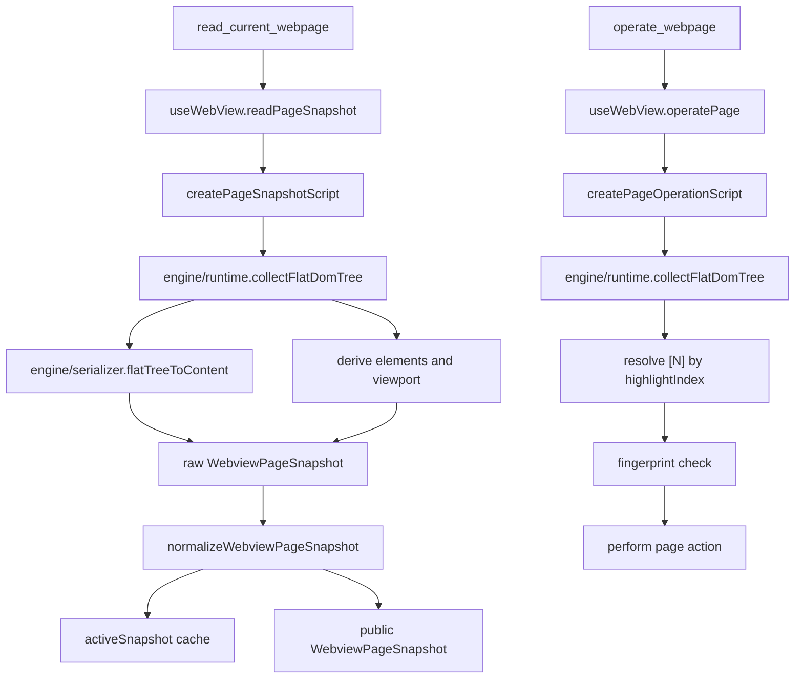

# WebView Page-Agent DOM Snapshot Design

## Goal

Refactor `read_current_webpage` so the WebView agent reads pages through a page-agent style flat DOM tree: collect the page once, assign stable per-snapshot indexes to actionable nodes, serialize that tree into an LLM-readable BrowserState summary, and reuse the same indexing rules for `operate_webpage`.

## Current Context

The current WebView tool path is split across these files:

- `src/views/webview/web/hooks/useWebView.ts` executes snapshot and operation scripts, validates results, caches the active snapshot, and exposes `readPageSnapshot()` and `operatePage()`.
- `src/views/webview/web/automation/snapshotScript.ts` performs DOM traversal, action inference, simplified DOM serialization, viewport metadata, top-layer detection, and snapshot assembly inside one generated script.
- `src/views/webview/web/automation/operationScript.ts` repeats much of the candidate-element logic from `snapshotScript.ts` before it executes click, input, select, press, or scroll.
- `src/views/webview/web/automation/normalize.ts` validates and truncates raw page snapshots before the data reaches the AI tool runtime.
- `src/ai/tools/context/webview.ts` defines the public `WebviewPageSnapshot`, `WebviewAgentElement`, and `WebviewOperateInput` contracts.
- `test/views/webview/web-use-webview.test.ts` covers the existing read/operate behavior.

The current main problem is duplication: the read path and operation path each reconstruct "what counts as actionable" independently. That makes `read_current_webpage` and `operate_webpage` easier to drift apart, especially for non-semantic clickable nodes, compact navigation text, shadow DOM, top-layer dialogs, scroll targets, and fingerprint validation.

## Approved Approach

Use the page-agent architecture as the model, not as a direct copy. The new design introduces an internal flat DOM tree pipeline:

1. Collect composed DOM into a flat tree.
2. Mark visible, top-layer, interactive, scrollable, and semantic nodes.
3. Assign `highlightIndex` values to nodes that the model can operate by `[N]`.
4. Serialize the tree into simplified BrowserState text.
5. Derive public `elements`, `viewport`, and active snapshot identities from the same indexed nodes.
6. Re-run the same collector in `operate_webpage` to resolve `[N]` and validate fingerprints before performing the action.

The public tool contract remains compatible: `read_current_webpage` still returns `summary`, `header`, `content`, `footer`, `text`, `selectedText`, `headings`, `links`, `scroll`, `viewport`, `selectedElement`, and `elements`. The specific `content` line format may change to the page-agent style, including `*[N]` for new interactive elements and `data-scrollable` for scroll targets.

## File Structure

### `src/views/webview/web/automation/engine/types.ts`

Defines internal page snapshot tree types:

- `EngineFlatTree`
- `EngineNode`
- `EngineTextNode`
- `EngineElementNode`
- `EngineNodeExtra`
- `EngineScrollData`

These types describe data returned from page scripts after JSON serialization. They must not contain live DOM references outside the page script.

### `src/views/webview/web/automation/engine/runtime.ts`

Owns the page-injected DOM collector source. It exports a script source builder that both `snapshotScript.ts` and `operationScript.ts` can embed.

Responsibilities:

- Traverse `document.body`, open shadow roots, and accessible iframe documents.
- Skip script/style/template/noscript, hidden nodes, ignored nodes, and empty text.
- Read safe attributes from interactive candidates.
- Detect visible elements through geometry and computed styles.
- Detect top elements with `elementsFromPoint` where possible.
- Detect interactive elements using native tags, ARIA roles, contenteditable, pointer cursor, action data attributes, click handlers, compact navigation text, compact topbar text, and scrollability.
- Detect scroll containers and expose remaining scroll distance by direction.
- Assign `highlightIndex` to actionable nodes.
- Produce fingerprints from tag, attributes, label, href, role, value preview, and short text.
- Preserve the current snapshot behavior for open shadow DOM and top-layer-relevant elements.

The runtime source should be centralized so read and operate scripts cannot drift.

### `src/views/webview/web/automation/engine/serializer.ts`

Builds TypeScript-side string helpers that are embedded into page scripts for converting a flat tree into BrowserState-like text.

Responsibilities:

- Convert `EngineFlatTree` to simplified DOM content.
- Preserve semantic containers such as `main`, `nav`, `menu`, `header`, `footer`, `section`, `article`, `aside`, `form`, `label`, list/table tags, headings, and shadow-root markers where useful.
- Emit indexed interactive lines in the page-agent style: `[N]<tag attr=value>text />`.
- Emit new interactive lines as `*[N]`.
- Include `data-scrollable` when a node can be scrolled.
- Limit attribute values and text to bounded lengths before normalizer truncation.
- Avoid merging sibling tab/navigation labels into one misleading parent line.

### `src/views/webview/web/automation/snapshotScript.ts`

Becomes a thin snapshot assembler:

- Embed the shared page DOM runtime and serializer.
- Collect the flat tree.
- Build `header`, `content`, and `footer`.
- Build `text`, `selectedText`, `headings`, `links`, and `scroll`.
- Build `elements` from the indexed nodes.
- Build `viewport` and top-layer metadata from the same indexed nodes.
- Return the raw `WebviewPageSnapshot` shape for `normalize.ts`.

### `src/views/webview/web/automation/operationScript.ts`

Uses the same page DOM runtime:

- Recollect the current flat tree at operation time.
- Resolve `input.action.index` through `highlightIndex`.
- Compare the current node fingerprint with the cached snapshot fingerprint.
- Execute click, input, select, press, or scroll.
- Keep the existing error codes: `PAGE_LOADING`, `ELEMENT_NOT_FOUND`, `STALE_SNAPSHOT`, `ACTION_NOT_SUPPORTED`, `OPTION_AMBIGUOUS`, `INVALID_INPUT`, and `EXECUTION_FAILED`.

### `src/views/webview/web/hooks/useWebView.ts`

Stays mostly orchestration-focused:

- Continue executing `createPageSnapshotScript()`.
- Continue applying `normalizeWebviewPageSnapshot`.
- Continue merging manually selected element data.
- Continue caching `activeSnapshot` for operation validation.
- Only update `ActiveWebviewSnapshotElement` fields if the new collector adds a more precise tree identity.

### `src/views/webview/web/automation/normalize.ts`

Keeps the public contract stable:

- Continue validating raw snapshots.
- Continue truncating public fields.
- Continue removing internal fingerprints from public `elements`.
- Accept any additional internal fields only if they are stripped before public return.

## Data Flow

## Behavior Details

### Indexing

Indexes are per snapshot, start at 1 for public WebView tools, and are not stable across reads. The collector stores them internally as `highlightIndex` so the serializer and operation resolver use the same source.

### New Elements

The collector should support `isNew` markers for nodes that appear after prior reads in the same page context. Because injected scripts cannot safely persist live renderer state across reloads, the first implementation can use a page-global lightweight fingerprint set such as `window.__tibisWebviewSeenElementFingerprints`. A new node is emitted as `*[N]` in `content` and `isNew: true` in `elements`.

### Scroll Targets

Scrollable containers become actionable nodes when they can scroll in at least one direction. `content` includes `data-scrollable`, and `elements.actions` includes `scroll`. `operate_webpage` should first scroll a resolved indexed element when it is scrollable itself, then fall back to a scrollable ancestor, and finally to window scrolling when no indexed target is provided.

### Top Layer

Top-layer detection remains compatible with current behavior:

- Dialog-like elements use `role="dialog"`, `role="alertdialog"`, `aria-modal="true"`, or open native dialog state.
- Candidate panels need visible area, positioning/background/z-index signals, and contained indexed elements.
- Background elements behind dimmed or overlapping layers are marked `layer: "background"` and `covered: true`.
- The last clickable element inside a top layer remains the primary action when no better semantic signal is available.

### Shadow DOM And Iframes

Open shadow roots are traversed and represented with `#shadow-root` in simplified content. Accessible iframes may be traversed when same-origin access succeeds. Inaccessible iframes remain represented as iframe elements without descending into their content.

### Public Compatibility

The public `WebviewPageSnapshot` fields remain stable. The implementation may improve `content` structure and element metadata, but downstream code should not need to change outside WebView automation and tests.

## Error Handling

- Reading while the WebView is loading still throws "当前页面正在导航，请稍后重试".
- Missing or invalid WebView script results still normalize to page-read errors.
- Operation errors continue to use the existing stable error codes.
- A fingerprint mismatch remains `STALE_SNAPSHOT`.
- Cross-origin iframe access failures are swallowed inside the page script and do not fail the whole snapshot.

## Testing Plan

Use TDD for implementation. Existing tests in `test/views/webview/web-use-webview.test.ts` remain the main suite and will be extended before production changes.

Add or update tests for:

- Flat tree output includes non-semantic clickable elements with `[N]`.
- Scrollable containers receive an index, `actions: ["scroll"]`, and `data-scrollable` content.
- New elements can appear as `*[N]` without breaking downstream summary parsing.
- Open shadow DOM elements are readable and operable by index.
- Dialog top-layer metadata still marks `top`, `background`, `covered`, and `primary`.
- `operate_webpage` resolves indexes through the same flat tree collector used by `read_current_webpage`.
- Fingerprint mismatch still rejects with `STALE_SNAPSHOT`.
- Compact navigation and topbar text candidates are preserved.
- Sibling tab labels are not merged into one misleading parent summary line.

Run verification with:

- `pnpm test test/views/webview/web-use-webview.test.ts`
- `pnpm exec tsc --noEmit`
- `pnpm exec eslint src --ext .vue,.ts,.tsx,.js,.jsx`

## Risks And Mitigations

- Risk: page-agent style indexing may change existing snapshot text expectations.
  Mitigation: keep public fields stable, update only tests that assert implementation-specific line formatting, and preserve the "Use [N]" rule.

- Risk: embedding a larger runtime script could become hard to maintain.
  Mitigation: keep the generated script split into focused source builders with tests around behavior, not raw string snapshots.

- Risk: read and operate still drift if operation code adds local candidate rules.
  Mitigation: operation code must resolve elements only through the shared flat DOM runtime output.

- Risk: top-layer detection is heuristic.
  Mitigation: preserve current test cases and keep dialog detection separated from general panel detection.

## Non-Goals

- Do not add a new public AI tool.
- Do not expose CSS selectors to the model as the primary operation handle.
- Do not change `operate_webpage` input schema.
- Do not import the external page-agent package into the app.
- Do not change WebView navigation, address bar, device mode, or element picker behavior except where snapshot matching needs compatibility.
