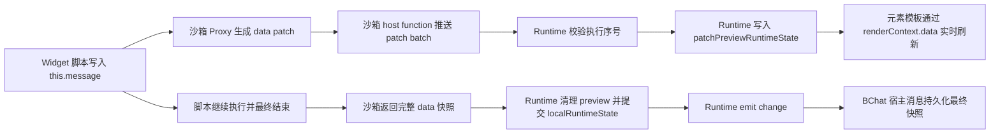

# Widget 运行态实时 Patch 流设计

## 背景

当前 Widget 运行态已经支持脚本用 `this.message = '完成'`、`this.weather.temperature = 28` 直接写入运行态数据。沙箱 Proxy 会记录数据是否变化，并在脚本执行结束后返回完整 `renderContext.data` 快照。`BWidgetRuntime` 再把快照提交到本地运行态，并通过 `change` 事件交给 BChat 宿主消息持久化。

这条快照闭环解决了脚本结束后的刷新和持久化，但还不能表达脚本执行过程中的中间状态。例如：

```ts
Widget({
  async mounted() {
    this.message = '正在加载'
    const response = await this.$http.get('https://example.com/weather')
    this.weather = response.body
    this.message = '加载完成'
  }
})
```

用户期望在 HTTP 请求等待期间先看到“正在加载”，而不是等整个 `mounted` 结束后才一次性看到“加载完成”。

## 目标

- Widget 脚本写入 `this.xxx` 时，可以在脚本尚未结束前刷新当前 Widget 视图。
- Patch 流保持 Worker 兼容，不依赖把 Vue reactive 对象传进沙箱。
- Patch 只作为当前 `BWidgetRuntime` 的本地预览态，不逐条写回 BChat 消息。
- 脚本结束后仍用完整快照作为唯一持久化事实。
- 脚本失败、超时或被后续执行覆盖时，预览 patch 不污染宿主消息。
- 保持现有 Widget 脚本 API，不新增公开的 `this.$patch` 或手动状态提交方法。

## 非目标

- 不实现沙箱与 Vue reactive 对象之间的真实双向绑定。
- 不让沙箱直接修改聊天 `message` 对象。
- 不把每个 patch 都提交给 BChat `updateMessage`。
- 不实现跨设备或远端协同 patch 同步。
- 不保证 CPU 密集型同步循环中的每一次写入都能逐帧渲染；浏览器只有在脚本让出执行权后才能重绘。

## 核心模型

实时 patch 流是在现有快照闭环旁边增加一条“运行中 UI 预览通道”。



这条链路有两个状态来源：

- `patchPreviewRuntimeState`：脚本执行中的本地预览，只服务当前视图刷新，不进入 pending 持久化队列。
- `localRuntimeState`：脚本结束后的本地最终快照，等待宿主 props 回写确认。

Runtime 的读取优先级应调整为：

```ts
const runtimeState = computed<WidgetRuntimeState>(
  () => patchPreviewRuntimeState.value ?? localRuntimeState.value ?? propsRuntimeState.value
)
```

## Patch 协议

新增 Widget 运行态数据 patch 类型：

```ts
export type WidgetRuntimeDataPathSegment = string | number;

export type WidgetRuntimeDataPatch =
  | {
      op: 'set';
      path: WidgetRuntimeDataPathSegment[];
      value: unknown;
    }
  | {
      op: 'delete';
      path: WidgetRuntimeDataPathSegment[];
    };
```

路径从 `renderContext.data` 根开始：

- `this.message = '正在加载'` 对应 `{ op: 'set', path: ['message'], value: '正在加载' }`。
- `this.weather.temperature = 28` 对应 `{ op: 'set', path: ['weather', 'temperature'], value: 28 }`。
- `delete this.message` 对应 `{ op: 'delete', path: ['message'] }`。
- `this.items[0].name = '拿铁'` 对应 `{ op: 'set', path: ['items', 0, 'name'], value: '拿铁' }`。
- `this.message = undefined` 对象字段写入对应 `{ op: 'delete', path: ['message'] }`，避免 `undefined` 在 JSON 克隆中丢失 `value` 字段后变成非法 patch。
- `this.items[0] = undefined` 数组槽位写入对应 `{ op: 'set', path: ['items', 0], value: null }`，与最终 JSON 快照把数组 `undefined` / hole 转成 `null` 的语义保持一致。

Patch value 必须是结构化可克隆值。当前沙箱已有 `__clone(value)` 约束，最终快照也使用 JSON 可序列化数据；patch 应沿用同一约束。遇到 symbol key、不可序列化值或非普通对象上的特殊属性时，可以只标记 `dataChanged`，不产出实时 patch，最终快照仍会兜底。

Patch 是引用级变更信号，不是深度 diff。对象写入时只比较写入前的原始值和脚本传入的 `nextValue` 引用；实际落入 `__widgetData` 和 patch 的值是 `__clone(nextValue)`。因此两个内容完全相同但引用不同的对象仍会产出 patch。这个行为和当前快照闭环一致，优先保证脚本写入意图可见，不在沙箱热路径里做深度相等比较。

Patch 不能携带 `undefined` 作为 `set.value`。对象字段的 `undefined` 写入降级为 delete patch；数组数字下标的 `undefined` 写入降级为 `null` set patch。这个规则只影响实时预览通道，最终持久化仍以脚本结束后的完整 JSON 快照为准。

## 沙箱侧设计

`src/components/BWidget/utils/widgetRuntime/index.ts` 的 Proxy 需要从“只标记变化”升级为“标记变化并记录 path”。

### 执行选项

扩展生命周期执行选项：

```ts
interface WidgetLifecycleRunOptions {
  now?: () => Date;
  http?: WidgetHttpClient;
  useWorker?: boolean;
  timeoutMs?: number;
  onDataPatch?: (patches: WidgetRuntimeDataPatch[]) => void | Promise<void>;
}
```

`runPartSandbox(...)` 把 `onDataPatch` 继续传给 `runWidgetScriptSandbox(...)`。`runWidgetScriptSandbox(...)` 注册一个新的 host function，例如：

```ts
const SANDBOX_WIDGET_DATA_PATCH_HOST_FUNCTION_NAME = '__sandboxWidgetDataPatch';
```

这个 host function 只接收沙箱生成的 patch batch：

```ts
{
  [SANDBOX_WIDGET_DATA_PATCH_HOST_FUNCTION_NAME]: async (patches: unknown): Promise<void> => {
    if (!isWidgetRuntimeDataPatchArray(patches)) {
      throw new Error('小组件运行态 patch 参数无效');
    }

    await options.onDataPatch?.(patches);
  }
}
```

HTTP host function 仍使用现有 `createSandboxHttpHost(...)`，最终传给 `runSandboxCode(...)` 的 `hostFunctions` 是两者合并后的对象。

### Proxy path 追踪

`__createWidgetDataProxy` 增加 `path` 参数。读取子对象时把当前 property 追加到 path：

```ts
function __createWidgetDataProxy(value, executionState, proxyCache, path) {
  if (!__isObjectLike(value)) return value
  const cachedProxy = proxyCache.get(value)
  if (cachedProxy) return cachedProxy

  const proxy = new Proxy(value, {
    get(target, property, receiver) {
      const childValue = Reflect.get(target, property, receiver)
      const childPath = __appendPatchPath(path, target, property)
      return __createWidgetDataProxy(childValue, executionState, proxyCache, childPath)
    },
    set(target, property, nextValue, receiver) {
      const previousValue = Reflect.get(target, property, receiver)
      const clonedValue = __clone(nextValue)
      const didSet = Reflect.set(target, property, clonedValue, receiver)
      if (didSet && !Object.is(previousValue, nextValue)) {
        executionState.dataChanged = true
        __recordDataPatch(executionState, {
          op: 'set',
          path: __appendPatchPath(path, target, property),
          value: clonedValue
        })
      }
      return didSet
    },
    deleteProperty(target, property) {
      const hadProperty = Object.prototype.hasOwnProperty.call(target, property)
      const didDelete = Reflect.deleteProperty(target, property)
      if (didDelete && hadProperty) {
        executionState.dataChanged = true
        __recordDataPatch(executionState, {
          op: 'delete',
          path: __appendPatchPath(path, target, property)
        })
      }
      return didDelete
    }
  })

  proxyCache.set(value, proxy)
  return proxy
}
```

根访问器也要记录 path：

```ts
function __defineWidgetDataAccessor(target, key, executionState, proxyCache) {
  Object.defineProperty(target, key, {
    configurable: true,
    enumerable: true,
    get() {
      return __createWidgetDataProxy(__widgetData[key], executionState, proxyCache, [key])
    },
    set(value) {
      const clonedValue = __clone(value)
      __widgetData[key] = clonedValue
      executionState.dataChanged = true
      __recordDataPatch(executionState, {
        op: 'set',
        path: [key],
        value: clonedValue
      })
    }
  })
}
```

`this.xxx = value` 这类根级新增字段也同样记录 `{ op: 'set', path: [property], value }`。`delete this.xxx` 记录 `{ op: 'delete', path: [property] }`。如果 value 是 `undefined`，根级对象字段记录为 delete patch，而不是 set patch。

这里的 `Object.is(previousValue, nextValue)` 只是引用级短路：如果脚本把同一个对象引用重新赋回原字段，可以跳过 patch；如果脚本传入一个内容相同的新对象，会因为引用不同而产出 patch。根访问器 setter 可以沿用同样规则，也可以保持“显式赋值即 patch”的更保守语义，但必须在测试中固定行为，避免后续优化改变运行态可见性。

### Patch flush

Proxy trap 不能 `await`，所以 patch 记录和 patch 推送要拆开。

沙箱内部维护：

```ts
function __createExecutionState() {
  return {
    dataChanged: false,
    sendMessage: undefined,
    pendingMethodCalls: [],
    pendingDataPatches: [],
    pendingDataPatchFlushes: []
  }
}
```

`__recordDataPatch(...)` 负责追加 patch 并调度 flush：

```ts
function __recordDataPatch(executionState, patch) {
  if (!__isPatchablePath(patch.path)) return
  executionState.pendingDataPatches.push(__clone(patch))
  __scheduleDataPatchFlush(executionState)
}
```

`__scheduleDataPatchFlush(...)` 用 microtask 批量发送，避免同步连续写入时每个字段都跨线程通信一次：

```ts
function __scheduleDataPatchFlush(executionState) {
  if (executionState.pendingDataPatchFlushScheduled) return
  executionState.pendingDataPatchFlushScheduled = true

  const flushPromise = Promise.resolve().then(() => __flushDataPatches(executionState))
  executionState.pendingDataPatchFlushes.push(flushPromise)
}
```

在以下位置必须显式 `await __flushDataPatches(executionState)`：

- 调用 `$http` 前，让“加载中”这类状态先于网络等待刷新。
- `$sendMessage` 记录上行消息前，保证发送前 UI 已看到最后一次数据变化。
- lifecycle、interaction、pending method calls 全部结束后，return 最终快照前。

脚本完全同步且 CPU 占用很长时，patch 会被记录，但浏览器仍要等沙箱让出执行权后才能渲染。这不是协议缺陷，而是 JS 事件循环限制。

Worker 模式下，每次 patch batch 都会经过 `postMessage` 的结构化克隆。Microtask 批处理可以把同一段同步代码里的多次写入合并为一次跨线程消息；遇到 `await`、显式 `$http` 前 flush、`$sendMessage` 前 flush 或脚本结束 flush 时会形成新的 batch。因此第一版的传输频率上限应按“脚本让出执行权的段数”估算，而不是按单个字段写入次数估算。高频循环如果没有 `await`，通常只形成一个较大的 batch；高频循环如果每轮都 `await`，则可能形成接近循环次数的 batch，需要由测试和后续限流策略约束。

## Runtime 侧设计

`src/components/BWidget/Runtime.vue` 增加一个只服务实时预览的 ref：

```ts
const patchPreviewRuntimeState = shallowRef<WidgetRuntimeState | null>(null);
let runtimePatchExecutionSeq = 0;
let activePatchExecutionId: string | null = null;
```

每次执行 mounted、interaction、submit/unmounted 时创建新的执行 ID：

```ts
function createPatchExecutionId(): string {
  runtimePatchExecutionSeq += 1;
  return `widget-runtime-patch-${runtimePatchExecutionSeq}`;
}
```

执行脚本时把回调闭包传给 runtime utils：

```ts
const executionId = createPatchExecutionId();
activePatchExecutionId = executionId;

const result = await createWidgetRuntimeInstance(currentState, {
  http: widgetHttpClient,
  onDataPatch: (patches) => commitRuntimeDataPatches(executionId, patches)
}).runInteraction(interactionCode);
```

`commitRuntimeDataPatches(...)` 只接受当前执行的 patch：

```ts
function commitRuntimeDataPatches(executionId: string, patches: WidgetRuntimeDataPatch[]): void {
  if (executionId !== activePatchExecutionId) return;
  if (!patches.length) return;

  // 第一个 preview 从当前可见状态开始；后续 preview 在上一版 preview 上继续叠加。
  // runtimeState.value 在没有 preview 时只会回落到 localRuntimeState 或 propsRuntimeState，
  // 这里不会形成递归写入，只是复用当前视图已经读取的基线状态。
  const baseState = patchPreviewRuntimeState.value ?? runtimeState.value;
  patchPreviewRuntimeState.value = applyWidgetRuntimeDataPatchesToState(baseState, patches);
}
```

最终脚本结束时清理 preview，再走现有最终快照提交：

```ts
function emitRuntimeChange(reason: WidgetRuntimeChange['reason'], result: WidgetRuntimeFinishResult, output?: unknown): void {
  const change = createRuntimeChange(reason, result, output);

  patchPreviewRuntimeState.value = null;
  activePatchExecutionId = null;
  commitLocalRuntimeState(createStateFromRuntimeResult(result));
  emit('change', change);
}
```

如果脚本没有产生任何最终变化且没有 `sendMessage`，也要清理 preview：

```ts
function clearPatchPreview(executionId: string): void {
  if (executionId !== activePatchExecutionId) return;
  patchPreviewRuntimeState.value = null;
  activePatchExecutionId = null;
}
```

### Patch 应用规则

建议新增纯函数文件：

`src/components/BWidget/utils/widgetRuntime/dataPatch.ts`

职责：

- 校验 patch path。
- 用结构共享方式对 `renderContext.data` 应用 `set` 和 `delete`。
- 必要时创建中间 plain object。
- 路径穿过数组时支持数字下标。
- 不处理原型链、不调用用户对象 setter。
- 不对整棵 `WidgetRuntimeState` 或整棵 `renderContext.data` 做 `cloneDeep`。

应用规则：

```ts
export function applyWidgetRuntimeDataPatchesToState(state: WidgetRuntimeState, patches: WidgetRuntimeDataPatch[]): WidgetRuntimeState {
  const nextData = applyWidgetRuntimeDataPatches(state.renderContext.data, patches);
  if (nextData === state.renderContext.data) return state;

  return {
    ...state,
    renderContext: {
      ...state.renderContext,
      data: nextData
    }
  };
}

export function applyWidgetRuntimeDataPatches(data: Record<string, unknown>, patches: WidgetRuntimeDataPatch[]): Record<string, unknown> {
  let nextData = data;

  for (const patch of patches) {
    nextData = applyWidgetRuntimeDataPatch(nextData, patch);
  }

  return nextData;
}
```

每个 patch 只浅拷贝路径上的祖先节点。例如更新 `weather.temperature` 时，只替换 `data` 根对象和 `weather` 对象；其他大列表、大对象保持引用不变。这样可以触发 Vue 对 `patchPreviewRuntimeState.value` 的刷新，同时避免每个 batch 都复制整棵运行态数据。

如果 `set` 的父路径不存在，创建普通对象。例如 `{ op: 'set', path: ['weather', 'temperature'], value: 28 }` 会把空 data 变成：

```ts
{
  weather: {
    temperature: 28
  }
}
```

如果中间路径遇到非对象值，覆盖为普通对象。这个规则与最终快照一致：脚本已经把该路径写成了新结构，预览层应跟随脚本最后的写入意图。

数组路径也使用结构共享：更新 `items[0].name` 时浅拷贝 `data`、`items` 数组、`items[0]` 对象。不要原地修改数组元素，否则 `shallowRef` 包裹的 preview state 虽然会被重新赋值，但调试和后续 memo 优化很难判断哪些引用稳定。

数组 delete patch 不使用 sparse hole 作为预览结果，而是把对应槽位设为 `null`。这是为了匹配最终 JSON 快照：`JSON.stringify` 会把数组 hole 和数组元素 `undefined` 序列化为 `null`。

## 性能约束

- Runtime 不应在每个 patch batch 中 `cloneDeep(baseState)`。大列表、大表单或缓存数据会让高频 patch 变成 O(data size)。
- Patch 应用复杂度应接近 O(patch count * path depth)，而不是 O(total data size)。
- 沙箱侧不做对象深度相等比较。内容相同但引用不同的对象写入会产出 patch，这是为了避免在 Proxy trap 热路径里引入不可控开销。
- Worker 通信按 batch 计费。第一版依赖 microtask 合并同步写入；如果后续发现每轮 `await` 的脚本产生过多 batch，再增加节流，例如最多每 16ms 推送一次预览 patch，并在 `$http`、`$sendMessage`、脚本结束前强制 flush。
- BChat 不接收实时 patch，避免把高频预览状态扩散到消息持久化、rollback 和列表渲染链路。

## BChat 侧设计

BChat 不需要接收实时 patch。`BubblePartWidget` 继续只处理 `BWidgetRuntime` 的最终 `change` 事件。

这样可以避免高频 patch 触发：

- 消息对象深拷贝。
- 消息列表重渲染。
- 持久化写入。
- rollback 快照膨胀。

当脚本结束后，最终 `WidgetRuntimeChange` 仍由 `BubblePartWidget` 写回：

- 独立 `widget` part：替换当前 part。
- `open_widget` 工具片段：更新 `toolPart.widget`。
- `sendMessage`：转成统一 BChat submit action。
- `submit`：转成 `widget_result` 用户消息。

## 错误和一致性

- Patch preview 是乐观 UI，不是持久化事实。
- 脚本成功结束时，最终快照覆盖 preview。
- 脚本失败时，失败状态覆盖 preview，并通过最终 `change` 写回宿主。
- 脚本超时时，Runtime 清理 preview，使用失败态或原有错误处理返回的状态。
- 连续交互通过现有 `runtimeTaskQueue` 串行执行，后一轮执行开始后，前一轮迟到 patch 根据 execution ID 被丢弃。
- 宿主 props 回写只确认 `localRuntimeState`，不确认 `patchPreviewRuntimeState`。

`syncLocalRuntimeStateFromProps(...)` 需要保留这个边界：如果存在 `patchPreviewRuntimeState` 且当前仍有 `activePatchExecutionId`，props watcher 不应清理 preview。最终清理由当前执行的结束路径负责。

## 测试策略

### Patch 工具测试

新增 `test/components/BWidget/widget-runtime-data-patch.test.ts`：

- `set` 根路径：`message` 写入字符串。
- `set` 嵌套路径：`weather.temperature` 写入数字。
- `set` 缺失父路径：自动创建普通对象。
- `set` 数组下标：`items[0].name` 写入对象字段。
- `delete` 根路径：删除 `message`。
- `delete` 嵌套路径：删除 `weather.temperature`，保留 `weather` 对象。

### 沙箱 patch 测试

扩展现有 Widget runtime 测试：

- `this.message = '正在加载'` 会触发 `onDataPatch([{ op: 'set', path: ['message'], value: '正在加载' }])`。
- `this.weather.temperature = 28` 会触发嵌套 path patch。
- `delete this.message` 会触发 delete patch。
- `this.message = '正在加载'; await this.$http.get(...)` 的 patch callback 发生在 HTTP request callback 之前。
- 脚本结束后仍返回完整 `renderContext.data` 快照。

### Runtime 组件测试

扩展 `test/components/BWidget/widget-runtime-view.component.test.ts`：

- interaction 执行中收到 patch 后，模板 `{{ message }}` 先显示“正在加载”。
- interaction 完成后，最终 `change.renderContext.data.message` 是“加载完成”。
- 连续两次 interaction 时，第一轮迟到 patch 不覆盖第二轮状态。
- 脚本失败时，preview 被清理，组件进入 failure 状态。

### BChat 回归测试

已有 open_widget 运行态回写测试继续覆盖最终快照持久化。实时 patch 不新增 BChat message update 测试，因为设计上不让 BChat 处理 patch。

## 实施顺序

1. 新增 `WidgetRuntimeDataPatch` 类型和 patch 应用纯函数。
2. 为 patch 应用函数补齐单元测试。
3. 在沙箱 Proxy 中引入 path 追踪和 patch 记录。
4. 增加 `__sandboxWidgetDataPatch` host function，并把 `onDataPatch` 贯穿 `runWidgetScriptSandbox -> runPartSandbox -> lifecycle/interaction`。
5. 在 `$http` 前、`$sendMessage` 前、脚本 return 前 flush pending patches。
6. 在 `Runtime.vue` 增加 `patchPreviewRuntimeState`、execution ID 和 `commitRuntimeDataPatches(...)`。
7. 调整 Runtime 脚本执行路径，传入 `onDataPatch` 并在成功、无变化、失败路径清理 preview。
8. 补沙箱和 Runtime 组件测试。
9. 运行定向 Vitest、TypeScript 检查和触达文件 ESLint。

## 验收标准

- `this.message = '正在加载'; await this.$http.get(...)` 在网络等待期间刷新 Widget 文本。
- 脚本结束后 BChat 消息只持久化最终完整快照。
- `open_widget` 工具片段和独立 `widget` part 都保持现有最终回写行为。
- Worker 模式和测试环境本地 fallback 都能收到 patch。
- 脚本失败不会把中间 preview 数据持久化到聊天消息。
- 高频同步写入不会导致 BChat 高频 `updateMessage`。

## 后续扩展

如果以后需要调试面板展示运行态事件，可以在 Runtime 内部记录 patch batch 日志。但这仍应是调试数据，不应替代最终快照持久化模型。

如果以后需要跨设备同步实时 Widget 视图，可以把 patch batch 提升到宿主事件层并带上 session ID、execution ID、seq。但在当前本地聊天消息模型下，这会明显增加复杂度，暂不纳入第一版。
