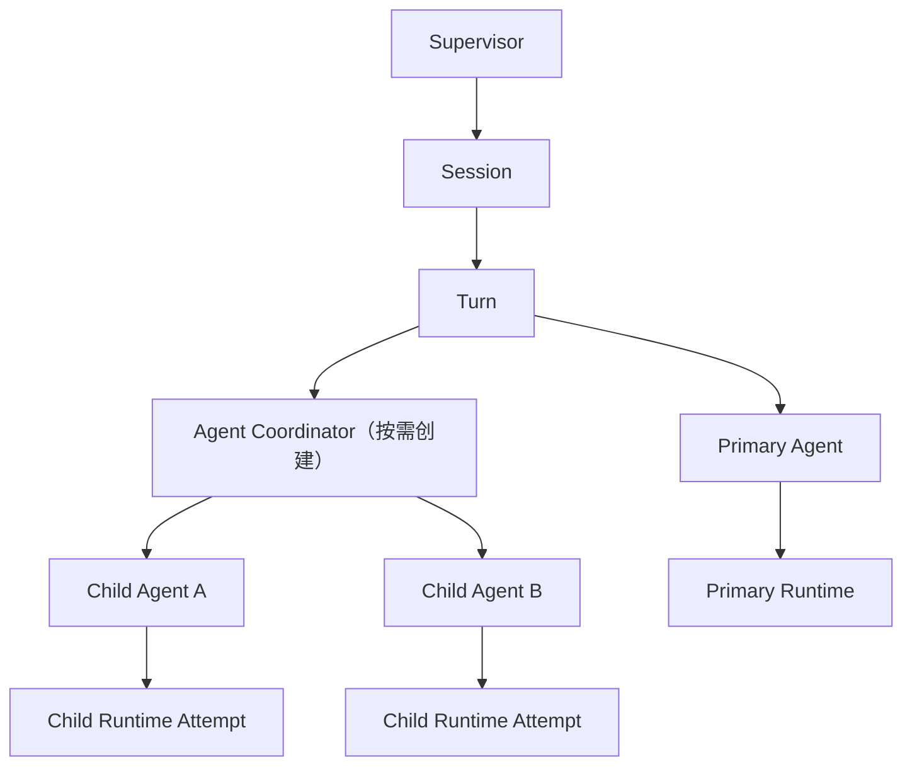
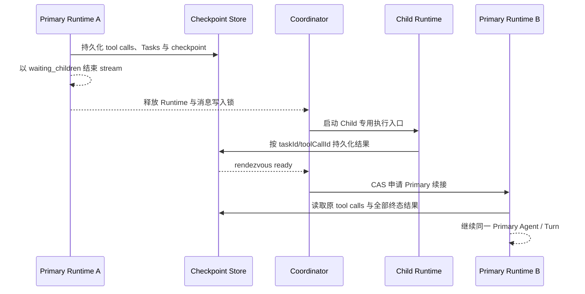

# Primary 自动委派 Child Agent 设计

## 背景

Tibis 已具备应用级 Chat Actor System、主进程 ChatRuntime、稳定的 `runtimeId` 路由、`agentId` 与 `parentRuntimeId` 字段、renderer capability registry，以及确认、Bridge、renderer-tool 请求和 Runtime 恢复能力。现有 `docs/development/chat-multi-session-and-multi-agent-extension.md` 进一步规定了未来多 Agent 的 Actor 层级、不变量、地址协议、结果归属和取消语义。

本设计以该文档为硬基线，为第一版 Primary 自动委派 Child Agent 补齐可直接实施的产品契约和技术协议。它不改变以下边界：

- 主进程拥有 Runtime 执行、工具调用、任务持久化、安全校验和外部副作用的事实来源。
- Renderer 拥有 Actor 状态、应用级事件路由、用户决策、界面能力和 UI 状态投影。
- Runtime 启动前必须先创建 Actor、注册稳定地址和冻结 capability。
- BChat 挂载、卸载或会话切换不决定后台 Task 生命周期。
- Child 不能直接修改 Primary 正在生成的 assistant 消息。

## 产品目标

Primary 通过显式 `delegate_task` 工具，把边界明确的子任务自动委派给临时 Child Agent。Child 使用与 Primary 相同的模型，但只接收不可变最小任务包和收缩后的能力。相容的只读 Child 可以并行；写 Child 必须经过资源级调度、changeset、diff integrity、用户确认和 commit boundary。Child 结果通过持久化汇合点返回新的 Primary Runtime，由同一 Primary Agent 形成唯一用户可见回复。

第一版约束：

- 只有 Primary 可以委派，Child 不允许继续创建 Child。
- 不增加每轮强制规划调用，Primary 必须显式调用 `delegate_task`。
- Child 始终继承当前会话模型快照，不能切换模型。
- Child 使用最小任务包，不继承完整会话历史或 Primary 未完成草稿。
- Child 可以受控写入；第一版只允许可暂存、可校验和可恢复的文件 changeset 经任务级 commit boundary 生效。
- 用户通过轻量任务卡片查看状态、事件、产物、变更和错误。
- 普通未委派聊天不创建 Coordinator，也不承担多 Agent 额外成本。

## 非目标

- 不支持 Child 递归委派、独立选择模型或用户直接进入 Child 对话。
- 不把 Child transcript 混入普通 `chat_messages` 或 Primary 上下文。
- 不支持缺少冲突检测和 commit boundary 的直接并行写入。
- 不把不可暂存、不可恢复的设置、MCP、shell、WebView 或外部 HTTP 副作用伪装成原子 changeset。
- 不允许恢复时根据当前环境猜测扩大既有 Task capability。
- 不把 Renderer 变成第二个 Runtime 执行事实来源。

## 术语与核心原则

```text
Task 是身份
Attempt 是执行
Event 是历史
Runtime 是可替换实例
```

- `taskId`：一次不可变委派任务。
- `agentId`：稳定 Child Actor，可经历多个 Attempt。
- `attemptId`：一次执行尝试的持久化身份。
- `runtimeId`：一次主进程模型执行实例。
- `parentAgentId`：稳定 Actor 父子关系。
- `parentRuntimeId`：本次执行由哪个 Runtime 发起。
- `rootRuntimeId`：同一 Turn Runtime 树的根。
- `continuationOfRuntimeId`：同一 Agent 因挂起与恢复更换 Runtime 时，指向被续接的 Runtime。

`parentAgentId`、`parentRuntimeId` 与 `continuationOfRuntimeId` 不能互相替代。Primary 恢复后的 Runtime 不是自己的 Child，不能通过滥用 `parentRuntimeId` 表达续接关系。恢复时必须根据持久化 Task、Attempt 与 Delegation Checkpoint 重建层级。

本设计的委派语义是：

> Primary 提交受限任务契约，Coordinator 根据冻结能力、安全策略和资源状态生成 Child Runtime Execution Plan；Child 在该计划内执行，写任务只能通过明确的 Commit Boundary 产生外部变更。

## Actor 与 Runtime 架构

Primary 第一次委派时按需创建 Coordinator：



### 职责

- **Primary Agent**：判断是否委派、提交任务契约、跨 Runtime 挂起与续接、消费结果并形成唯一用户可见回复。
- **Agent Coordinator**：验证调用者、创建 Task 与 Child Actor、编译候选计划、维护队列、注册 Runtime 地址、聚合主进程已持久化的结果并请求 Primary 续接。
- **Child Agent**：执行一个不可变 Task Contract；可以重试，但不能委派、切换模型、管理会话或修改计划。
- **ChatRuntime 主进程**：执行模型与工具，创建委派 checkpoint，结束和续接 Primary Runtime，重新校验并冻结计划，强制调度许可，持久化 Task、Attempt、Event、changeset 与 journal。
- **BChat**：只按 `taskId/toolCallId` 渲染任务卡片，不创建、持有或恢复 Child Runtime。

## Delegate Task Contract

Primary 通过显式 `delegate_task` 提交：

```ts
interface DelegateTaskInput {
  task: string;
  acceptanceCriteria: string[];
  mode: 'read' | 'write';
  resources: AgentResourceReference[];
  requestedTools: string[];
  required: boolean;
  priority: 'low' | 'normal' | 'high';
  deadlineAt?: string;
}
```

约束：

- `task` 必须是边界明确的单一子任务。
- `acceptanceCriteria` 必须可以逐项判断 satisfied、unsatisfied 或 unknown。
- read Task 永远不能获得写工具。
- `resources` 必须显式声明；write Task 不允许以空范围表示整个工作区。
- `requestedTools` 只表达申请，不能扩大父 Runtime capability。
- `required` 决定失败是否必须由 Primary 明确处理。
- `priority` 只影响尚未运行任务的同类队列顺序，不能绕过锁、确认或策略。
- `deadlineAt` 覆盖排队、确认、执行和提交前等待。

同优先级保持 FIFO。有效 deadline 取请求 deadline、Turn 绝对 deadline 和系统 Child 最长执行时间中的最早值。

### 工具执行类别

`delegate_task` 可以通过现有工具注册表暴露给模型，但它不是普通 renderer-local 请求/响应工具。它属于 `deferred-coordination` 类别：

- 普通 renderer-local 工具必须在工具请求超时内返回最终 tool result。
- `delegate_task` 只在当前 Primary Runtime 内完成契约校验、Task 持久化与挂起准备。
- 内部返回的 `deferred` 控制结果用于结束当前工具循环，不能作为 Child 最终结果暴露给模型。
- Child 最终结果由后续 Primary Runtime 以原 `toolCallId` 注入。
- generic renderer-tool Promise、30 秒请求超时和当前 Provider stream 生命周期都不能覆盖 Child 整段执行。

工具注册元数据必须新增执行类别，主进程只对 `deferred-coordination` 开启挂起协议。checkpoint 提交后，主进程通过应用级 `delegation.created` 事件驱动 Renderer Coordinator 创建 Actor 和编译候选计划，不等待 Renderer 返回 Child 最终结果。任意 renderer-local 工具不能仅凭返回 pending Promise 获得该语义。

## 最小任务包

Coordinator 只为 Child 构造不可变最小任务包：

- Task 目标、验收标准与必要背景摘要。
- 显式文件、文档、WebView 或资源引用。
- 继承的模型快照。
- 收缩后的工具与 capability。
- 工作区、文档和资源边界。
- 权限、预算、deadline 与 commit policy。
- 单层委派、结构化结果和不直接回复用户等 Child 系统约束。

任务包不包含完整会话历史、Primary 未完成草稿、隐式当前文档或动态当前 WebView。文档能力必须绑定 `documentId`，WebView 能力必须绑定稳定页面描述符。

## Primary 挂起与结果汇合

Primary Runtime 持有同一 Session 的消息写入锁，Child 若直接复用普通 `ChatRuntime.send` 会与父 Runtime 竞争并得到 `SESSION_BUSY`。同时，renderer-tool 和 Provider stream 都有有界超时，不能等待一个可能运行数分钟的 Child。委派因此必须切断 Runtime 生命周期，而不是让原工具调用长期 pending。



### 挂起协议

1. Primary Runtime A 在同一模型步骤中收集一个或多个 `delegate_task` tool call。
2. 主进程在一个持久化事务中写入 Task Contract、tool-call 占位、Delegation Checkpoint、continuation context reference 和 `delegation.created` outbox event。
3. 持久化成功后，Runtime A 以内部完成原因 `waiting_children` 结束 Provider stream，释放 Runtime 资源和 Session 消息写入锁。
4. Turn 保持 `waiting_children`，同一 Session 保留逻辑 `turnContinuationFence`；新用户 Turn、compact、rollback 和历史修改不能越过该栅栏。
5. Coordinator 独立调度 Child；Child executor 请求主进程按 `taskId + toolCallId` 持久化结构化结果，Coordinator 只消费事实事件。
6. 同一 checkpoint 的所有 tool call 必须先进入终态；失败、取消和超时也必须产生稳定结果信封。第一版不支持收到部分结果就提前续接。
7. Coordinator 通过 compare-and-swap 把 checkpoint 从 `ready_to_resume` 改为 `resuming`，只允许创建一个 Primary Runtime B。
8. Runtime B 继承同一 `sessionId`、`turnId`、`primaryAgentId` 和 `rootRuntimeId`，使用新的 `runtimeId`，并记录 `continuationOfRuntimeId=Runtime A`。
9. Runtime B 按原 `toolCallId` 重建 assistant tool call 与 tool result，结果顺序由原调用顺序决定，不由 Child 完成顺序决定。
10. Primary 完成或确定无法续接后释放 `turnContinuationFence`，后续 Session Turn 才能执行。

Primary Agent 与 Turn 跨 checkpoint 存活，Runtime A 不存活。`parentRuntimeId` 继续表示委派执行关系，不能用于表示 Runtime B 是 Runtime A 的 Child。

### 等待、deadline 与预算

- Runtime A 的 Provider 调用与 renderer-tool 计时在挂起时结束。
- Turn 的绝对 deadline、Session/Turn 总预算和 Child deadline 在等待期间继续计算。
- 授权 Child 前必须同时预留 Child 执行预算和一次 Primary 续接预算，不能把全部剩余额度分配给 Child。
- deadline 到期、预算不足或 Turn 被取消时，checkpoint 停止创建续接 Runtime；未完成 Child 进入 cooperative cancellation。
- 若全部结果已经终态但无法续接，Primary 消息以稳定的 interrupted 状态收敛，保留任务卡片和结果，不能伪造最终回答。

### Checkpoint 状态机

```text
preparing → waiting_children
waiting_children → ready_to_resume | cancelling | interrupted
ready_to_resume → resuming | cancelling | interrupted
resuming → completed | failed | interrupted
cancelling → cancelled | interrupted
```

`preparing → waiting_children` 必须与 Runtime A 可安全结束所需数据的持久化形成同一提交边界。终态无出边；重复 Child 结果、重复 ready 通知和重复恢复请求通过 checkpoint version 与 result identity 幂等消除。

普通消息、Task 与 checkpoint 必须位于同一主进程事务域。若底层存储暂时不能共享事务，必须使用 transactional outbox：先提交消息尾部、Task、checkpoint 和 outbox，再异步投递 `delegation.created`；在 outbox 未提交前不能释放 Runtime A。不能依赖 Renderer 已收到事件来证明委派已持久化。

## Execution Plan 编译

```text
DelegateTaskInput
        ↓
Coordinator 编译候选计划
        ↓
主进程重新校验与冻结
        ↓
ChildRuntimeExecutionPlan
```

Coordinator 是计划生成者，主进程是安全裁决者。最终计划包含 Task 与父级地址、Contract snapshot、模型、有效 capability、permission snapshot、resource scopes、工具副作用类别、预算、deadline、调度、commit policy、schema/policy version 和 plan hash。

### Capability Intersection

```text
有效工具 =
父 Runtime 冻结工具
∩ Primary 显式申请工具
∩ Child 角色允许工具
∩ read/write 模式允许工具
∩ 当前模型支持工具
∩ 资源范围适用工具
∩ 工具副作用类别允许工具
∩ 当前安全策略允许工具
```

同时应用以下收缩：

- 工作区不能超出父 Runtime 的真实路径边界。
- Child permission 不能比 Primary 更宽松。
- `delegate_task`、模型切换、会话管理和计划修改能力始终移除。
- 动态资源只能落入已声明 scope，不能运行时扩大。
- 文件真实路径、版本和符号链接在执行及提交前重新校验。

同一 Task 的恢复与所有 Attempt 必须满足：

```text
effectiveCapability(t+1)
⊆ effectiveCapability(t)
⊆ persistedCapability
```

Provider 恢复、MCP 重连、用户放宽全局权限或 Renderer 重新挂载，都不能扩大既有 Task capability。新增能力必须创建新 Task。

## Runtime 启动顺序

1. 创建 Task 记录与 Child Actor。
2. 编译并冻结 Execution Plan。
3. 请求资源级调度许可。
4. 分配 `attemptId` 与 `runtimeId`。
5. 注册完整 Runtime 地址与冻结 capability。
6. 向 Child Actor 发送 `runtime.startRequested`，Task 进入 `starting`。
7. 调用主进程 Runtime IPC。
8. 主进程确认创建后发送 `runtime.started`，Task 进入 `running`。
9. IPC 同步失败时记录失败、注销路由并释放许可。

不能先调用 IPC 再注册路由。

### Child 专用执行入口

Child 通过主进程 `ChildTaskRuntimeExecutor` 概念入口运行。它可以复用模型解析、Provider stream、工具分发、上下文预算、Bridge、confirmation 和 renderer capability 控制器，但不能复用普通聊天发送入口：

- 不调用 `ChatRuntime.send`、`continue` 或任何自动创建 user/assistant 消息的公开入口。
- 不获取 Session 消息写入锁，也不向普通 `chat_messages` 写入 Child prompt、assistant text 或 tool transcript。
- 输入只来自冻结的最小任务包；输出只写入 Task、Attempt、Event、Artifact 与 Result 存储。
- 每个 Runtime 仍使用完整应用级地址和 `runtimeId` 路由，Renderer 重载不改变其身份。
- 工具执行前仍由主进程校验 Execution Plan、effect metadata、resource scope、permission 与 deadline。
- Child 完成只更新 rendezvous 结果，不直接续写 Primary assistant 消息。

实现时应从普通 Chat Runtime 抽取共享的无消息持久化执行内核，再分别由 Primary chat adapter 与 Child task adapter 调用。不能通过给 `ChatRuntime.send` 增加 `skipMessages` 布尔参数来绕过它的会话锁和消息生命周期不变量。

第一版不允许 Child Runtime 在 Provider stream 中等待无界用户交互。需要用户确认的 write Task 必须先结束 Child 模型执行、持久化完整 changeset，再进入 `waiting_confirmation`；确认后由提交器执行 journal，不恢复已经结束的 Child stream。要求在工具中途提问、登录或逐步确认的能力不进入第一版 Child Execution Plan。这样 Renderer 重载恢复的是持久化确认请求，不是悬空的模型调用。

## 资源级调度

调度使用规范化 `resourceScope[]`：

```text
file:<realpath>
directory:<realpath>/**
document:<documentId>
settings:<domain>
webview:<partition>/<pageId>
session:<sessionId>/history
workspace:<realRoot>/**
```

动态目标无法提前确定时降级为较宽 workspace scope。相同资源、父子路径和匹配通配 scope 视为冲突。

许可类型：

- `shared-read`：相容 read Task 可以共享，首版最多三个并行。
- `write-intent`：冲突范围内只允许一个 write Task，但不阻止读取。
- `exclusive-commit`：提交 changeset 时独占，等待冲突 reader 退出。

write Child 只在生成 changeset 时保留 `write-intent`；进入 `waiting_confirmation` 前释放全部资源许可。确认后重新排队获取提交许可并验证版本。等待期间若其他任务改变基础 revision，旧确认失效并基于新版本重新生成 changeset。不同 scope 的写任务可以并行，冲突 scope 的运行与提交阶段严格串行。

公平性规则：

- 同优先级 FIFO，高优先级不能抢占已经运行的 Child。
- writer 排队后停止接纳同级或更低优先级的新冲突 reader。
- Primary 等待 Child 结果期间不占 Child 调度名额。
- compact、rollback 等修改历史或资源状态的操作必须声明相应写 scope。

## 副作用分类与第一版范围

`DelegateTaskInput.mode` 是 Primary 对任务意图的声明，不是安全事实。每个工具必须由主进程注册不可由 Renderer 覆盖的 effect metadata：

```ts
interface AgentToolEffectMetadata {
  effect: 'pure_read' | 'external_read' | 'staged_file_write' | 'transactional_write' | 'immediate_side_effect' | 'unknown';
  resourceScopeResolver: string;
  commitAdapter?: string;
  reversible: boolean;
}
```

| Effect                  | 含义                                               | 第一版 Child 策略                              |
| ----------------------- | -------------------------------------------------- | ---------------------------------------------- |
| `pure_read`             | 只读取已授权本地状态                               | read/write Task 均可申请                       |
| `external_read`         | 外部读取，可能产生计费或审计记录，但不修改业务状态 | 经过域名、权限、预算和敏感信息策略后允许       |
| `staged_file_write`     | 先写入 Task overlay，可计算 diff、校验和恢复       | 仅 write Task 允许，并进入文件 commit boundary |
| `transactional_write`   | 目标域提供 prepare/apply/finalize/recover adapter  | 第一版默认关闭，逐域实现后单独启用             |
| `immediate_side_effect` | 调用即发送、发布、删除或改变外部状态               | 第一版 Child 禁止                              |
| `unknown`               | 无法证明副作用性质                                 | 按最危险类别处理并禁止                         |

因此，第一版 write Child 只承诺文件 changeset 的受控写入。设置修改、MCP mutation、可写 shell、WebView 脚本和外部 HTTP mutation 在没有专用事务 adapter 前不能进入 Child Execution Plan。名称看似只读但 effect 为 `unknown` 的 shell 或脚本工具同样不能进入 read Task。

未来启用 `transactional_write` 时，每个 adapter 必须定义规范化 resource scope、prepare 产物、幂等键、确认摘要、apply 结果、finalize 条件、补偿或 roll-forward 恢复，以及不可逆点。不能用统一文件 journal 假设所有外部系统都支持原子替换。

## Primary Turn 委派状态

Turn 和 Primary Agent 必须增加 `waiting_children` 投影，它不同于 `waiting_confirmation` 和 `waiting_for_user`：

- `waiting_children` 表示当前 Provider Runtime 已结束，但同一 Turn 仍有可恢复 continuation。
- 它不占 Provider stream、renderer-tool 请求或 Child 资源许可。
- 它保留 `turnContinuationFence`，避免后续用户消息越过未完成 tool call。
- 用户取消当前 Turn 会同时取消 checkpoint、未终态 Child 与未决确认，不会启动 Runtime B。
- 用户希望立即发送新消息时，第一版必须先取消并收敛当前 Turn，不能隐式并行两个同 Session Primary Turn。

## Task 状态机

```ts
type AgentTaskStatus =
  | 'created'
  | 'planning'
  | 'authorized'
  | 'queued'
  | 'starting'
  | 'running'
  | 'waiting_confirmation'
  | 'committing'
  | 'cancelling'
  | 'completed'
  | 'failed'
  | 'cancelled'
  | 'deadline_exceeded'
  | 'commit_failed';
```

`authorized` 表示计划已通过主进程校验并冻结，不代表未来 changeset 无需确认。`starting` 表示 Actor、地址和 capability 已注册并等待 Runtime 启动确认。`queued` 携带 `queuePhase: start | commit`。

合法迁移：

```text
created → planning
planning → authorized | failed
authorized → queued
queued(start) → starting
starting → running | failed
running(read) → completed
running(write, auto-authorized changeset) → queued(commit)
running(write, confirmation required) → waiting_confirmation
running(write, no changeset) → completed
running → failed
waiting_confirmation → queued(commit) | queued(start) | failed
queued(commit) → committing | queued(start)
committing → completed | cancelled | commit_failed
任意非终态且非 committing → cancelling → cancelled | failed
任意非 committing 状态 → deadline_exceeded
```

Execution Plan 冻结后禁止 `queued → planning` 原地重编译。若 commit validation 只发现同一 scope 内的基础 revision 变化，则旧 changeset 与确认失效；预算和 retry policy 允许时创建新 Attempt 并进入 `queued(start)`，沿用原不可变计划重新生成 changeset。若资源 scope、capability、policy 或计划版本已不再适用，Task 以 `stale_context` 失败，Primary 必须创建新 Task。`committing` 收到取消或 deadline 时只记录请求，等 journal 达到 finalized、已回滚或人工恢复状态后再进入合法终态。终态没有执行状态出边。

## Cooperative Cancellation

取消分两阶段：

1. Coordinator 设置 `cancelRequested`，停止新工具、后续 Attempt 和提交入口，并传播 AbortSignal。
2. 给正在执行的工具有限宽限期；超时后主进程 hard abort，并清理子进程、Bridge、renderer-tool 和确认请求。

排队 Task 直接取消；等待确认 Task 撤销确认并取消；未提交 changeset 丢弃。进入 `committing` 后不能在文件提交中点硬中断，必须先完成提交或 journal 恢复。若提交已不可逆完成，Task 进入 `completed` 并记录 `cancelArrivedTooLate`。

Primary Turn 取消时并发通知全部 Child，执行有界等待并在超时后 hard abort。全部 Child 终态、Runtime 路由清理且 journal 稳定后 Turn 才进入 `cancelled`；整体超限时记录恢复标记，不能无限阻塞。

## 文件写入 Commit Boundary

获得 `staged_file_write` 的 write Child 不直接修改工作区，而是在 Task overlay 中构建 changeset：

```text
changeset prepared
        ↓
commit journal created
        ↓
external mutation applied
        ↓
commit finalized
```

### Changeset Prepared

固化每个操作的真实目标、基础 revision、基础内容 hash、目标内容 hash、候选内容或受保护引用、回滚信息，以及 `diffHash`、`operationSetHash` 和 `planHash`。

### Commit Journal Created

用户确认、资源复核和 `exclusive-commit` 获取完成后，先持久化 commit intent 与完整操作清单，再允许修改外部资源。

### External Mutation Applied

每个文件通过临时文件和原子替换应用，并逐项更新 journal 进度。Task 此时仍不能报告成功。

### Commit Finalized

验证所有目标 hash 后标记 journal committed，更新 Task result，再清理临时备份。

这一协议只证明文件 changeset 的提交完整性。没有 domain-specific transactional adapter 的外部副作用不允许借用该 journal，也不能因为用户确认过任务摘要就跳过逐次真实副作用确认。

### Journal 恢复

- 只有 prepared、没有 journal：丢弃 changeset。
- journal 已创建但未修改资源：安全取消或重新排队。
- 部分操作已应用：按持久化 commit intent 尝试 roll-forward。
- 所有目标已匹配目标 hash：直接 finalize。
- 目标既不匹配基础 hash，也不匹配目标 hash：进入 `commit_failed/manual_recovery_required`。
- journal 未 finalized 前，Task 不能进入 `completed`。

## Diff Integrity

changeset 必须包含：

```text
baseRevision
baseContentHashes
diffHash
operationSetHash
planHash
```

确认界面展示的 diff 与最终提交必须使用同一个 `diffHash`：

- diff 或基础 revision 改变时原确认失效，必须重新确认。
- Event 记录用户确认的 `diffHash`，不能只记录“已同意”。
- 二进制资源展示路径、大小和新旧内容 hash。
- commit validation 验证确认 hash、changeset hash 与 journal 操作一致。

## 持久化模型

Child 内部执行记录不写入普通 `chat_messages`。主进程增加独立 Agent Task 存储。

### `chat_agent_tasks`

不可变 identity：

```text
taskId
sessionId
turnId
agentId
parentAgentId
rootRuntimeId
createdAt
```

不可变 `contract_snapshot`：

```text
task
acceptanceCriteria
mode
resources
requestedTools
required
contractSchemaVersion
```

不可变 `execution_plan_snapshot`：

```text
planHash
planSchemaVersion
policyVersion
capabilitySet
modelSnapshot
permissionSnapshot
resourceScopes
toolEffectSet
commitPolicy
budget
```

可变投影：

```text
status
queuePhase
priority
deadlineAt
currentAttemptId
cancelRequestedAt
result
error
updatedAt
recordState
```

Contract 与 Execution Plan 写入后禁止修改。改变任务契约或扩大能力必须创建新 Task。

`recordState` 与执行状态正交：

```text
active | tombstoned
```

删除只设置 tombstone、记录原因并追加 Event。物理清理由保留策略异步执行，且必须确认没有活动 Attempt、未决 journal 或仍被引用的 artifact。

### `chat_agent_attempts`

不可变字段：

```text
attemptId
taskId
attemptNumber
parentRuntimeId
planHash
initialRuntimeId
createdAt
```

可变投影：

```text
currentRuntimeId
runtimeSequence
status
startedAt
finishedAt
error
```

重试创建新 Attempt 与 Runtime，不能覆盖历史 Attempt。若未来某个有界恢复点需要在同一 Attempt 更换 Runtime，则更新 `currentRuntimeId`、递增 `runtimeSequence` 并追加包含旧、新 Runtime ID 与 continuation reason 的 Event；不能覆盖 `initialRuntimeId` 或既有 Runtime Event。第一版 Task 级确认发生在模型执行结束之后，因此确认不会替换 Child Runtime。

### `chat_agent_delegation_checkpoints`

不可变 identity 与 source：

```text
checkpointId
sessionId
turnId
primaryAgentId
rootRuntimeId
sourceRuntimeId
assistantMessageId
createdAt
```

不可变 continuation snapshot：

```text
checkpointSchemaVersion
policyVersion
modelSnapshot
continuationContextReference
continuationContextHash
sourceMessageRevision
toolSchemaSnapshotHash
orderedToolCalls[{toolCallId, taskId, required, argumentsHash, providerMetadataHash}]
reservedResumeBudget
absoluteTurnDeadline
snapshotHash
```

可变投影：

```text
status
version
terminalResultsByToolCallId
resumeRuntimeId
error
updatedAt
recordState
```

identity、source 和 continuation snapshot 写入后禁止修改。Child 结果只允许按原 `toolCallId` 一次性从 absent 写为终态信封；重复写入必须内容 hash 相同，否则记录 `protocol_error`。`status + version` 用于 compare-and-swap，保证 Renderer 重载、重复 Event 或 Coordinator 重试不会创建多个 Runtime B。

Checkpoint 与 Task 分开持久化：一个 checkpoint 可以汇合多个 Task，一个 Task 只能属于一个 checkpoint。Task tombstone 不能删除仍被 checkpoint 或 Primary 消息引用的结果。

continuation context 使用规范化 source message、精确 tool-call ID、工具 schema snapshot 和经 allowlist 裁剪的 Provider metadata 重建。续接前必须验证 source message revision、context hash、tool schema hash 与模型快照；任何一项漂移都进入 interrupted，而不是切换模型、猜测参数或把结果附加到新的消息尾部。

### `chat_agent_events`

```ts
interface ChatAgentEvent<TType extends ChatAgentEventType> {
  eventId: string;
  aggregate: {
    kind: 'task' | 'checkpoint';
    id: string;
  };
  taskId?: string;
  checkpointId?: string;
  sequence: number;
  attemptId?: string;
  runtimeId?: string;
  type: TType;
  occurredAt: string;
  source: 'primary' | 'coordinator' | 'child' | 'runtime' | 'user' | 'system';
  schemaVersion: number;
  payload: ChatAgentEventPayloadMap[TType];
}
```

约束：

- `(aggregate.kind, aggregate.id, sequence)` 唯一，sequence 由主进程事务性递增。
- Task Event 必须带 `taskId`，Checkpoint Event 必须带 `checkpointId`；跨聚合关联只保存稳定 ID。
- Event 只能追加，禁止覆盖。
- payload 使用判别联合并保证可结构化克隆。
- Event 写入前执行 schema allowlist、敏感信息裁剪和大小限制。
- Task 表是当前状态投影，Event 是审计历史。

核心事件：

```text
task.created
plan.authorized
task.queued
delegation.checkpoint_created
primary.suspended
runtime.starting
runtime.started
runtime.replaced
confirmation.requested
confirmation.resolved
confirmation.invalidated
tool.started
tool.completed
changeset.prepared
commit.journal_created
commit.mutation_applied
commit.finalized
child.result_recorded
delegation.ready
primary.resume_started
delegation.completed
task.completed
task.failed
task.cancelled
task.tombstoned
```

## Plan Hash 与版本

`planHash` 对以下规范化序列化内容计算：

```text
planSchemaVersion
policyVersion
contract snapshot
capability set
model snapshot
permission snapshot
resource scopes
tool effect set
commit policy
budget
```

不支持的 schema 或 policy version 返回 `plan_version_unsupported`。恢复不能以新逻辑重新解释或覆盖旧 Execution Plan。

## Capability 恢复

恢复顺序固定为：

```text
persisted capability
        ∩
available capability
        ∩
current role/security policy
        ↓
effective capability
```

- persisted 中不存在的能力不能新增。
- available 中已消失的能力从 effective 中删除。
- required capability 缺失时恢复失败。
- permission 取持久化权限和当前策略中更严格的一方。
- resource scope 只能保持或缩小。
- 不使用“先降级、再根据当前环境猜测升级”的恢复方式。

## 恢复协议

### Renderer 重载

1. 主进程返回所有非终态 Task、Attempt、Delegation Checkpoint、Event cursor、活动 Runtime 和 pending request。
2. Renderer 按原 `sessionId/turnId` 重建 Session 与 Turn。
3. 按需创建 Coordinator，并根据 `agentId` 重建 Child Actor。
4. 使用原 `runtimeId` 恢复路由，不能把 Child 视为 Primary。
5. 按持久化 capability 与当前 available capability 取交集。
6. 验证 plan hash、schema version、policy version、deadline、模型和资源范围。
7. 重放确认、Bridge 和普通 renderer-tool 请求；`delegate_task` 只从 checkpoint 恢复，不能重建为等待中的 generic renderer-tool Promise。
8. Task Store 从 snapshot 与 Event sequence 恢复卡片；处于 `ready_to_resume` 的 checkpoint 重新执行 CAS 竞争。

### 主进程重启

- 运行中的 read Task 进入 `failed`，错误码为 `runtime_interrupted`，由 Primary 明确创建新 Task 重试。
- 未提交 write Task 丢弃 overlay，但保留 Task、Attempt、Event 与失败原因。
- 处于 commit journal 的 Task 先恢复 journal，再决定 `completed`、`commit_failed` 或 `manual_recovery_required`。
- 不自动重新执行 write Task，避免重复副作用。
- 未进入 `resuming` 且全部 Child 结果已持久化的 checkpoint 保留为可审计 interrupted；第一版不在进程重启后自动重新调用模型。
- 已进入 `resuming` 但没有完成标记的 checkpoint 也不能盲目创建第二个 Runtime B；先把 Primary 消息和 checkpoint 收敛为 terminal interrupted。
- 第一版用户选择“继续”时创建新的 Turn，并显式引用已有 Task result 与 artifact；不把 terminal checkpoint 改回 `resuming`。未来若支持原 Turn 恢复，也必须创建新的 recovery checkpoint 并重新验证 snapshot hash、消息尾部和预算。
- Primary Runtime 按现有中断协议收敛，不伪造 Child tool result，也不丢弃已经完成的任务卡片与 artifact。

## ChatAgentResult

执行状态与任务完成度正交：

```ts
interface ChatAgentResult {
  taskId: string;
  agentId: string;
  attemptId: string;
  executionStatus: 'completed' | 'failed' | 'cancelled' | 'deadline_exceeded' | 'commit_failed';
  completion: {
    level: 'full' | 'partial' | 'none';
    criteria: AgentCriteriaResult[];
  };
  summary: string;
  output?: unknown;
  warnings: AgentTaskWarning[];
  artifacts: AgentArtifactReference[];
  changeset?: AgentChangesetResult;
  usage: AgentUsageAccounting;
  error?: AgentTaskError;
}
```

```ts
interface AgentCriteriaResult {
  criterionIndex: number;
  claim: {
    status: 'satisfied' | 'unsatisfied' | 'unknown';
    summary: string;
    evidence: AgentEvidenceReference[];
  };
  verification: {
    status: 'verified' | 'unverified' | 'contradicted';
    verifier: 'tool' | 'coordinator' | 'primary' | 'policy';
    evidence: AgentEvidenceReference[];
  };
}

interface AgentEvidenceReference {
  kind: 'tool_event' | 'artifact' | 'resource_snapshot' | 'commit_journal' | 'task_result';
  referenceId: string;
  contentHash?: string;
}
```

Child 只能提交 claim 与证据引用，不能仅凭自己的自然语言结论把标准标记为 verified。工具可验证事实由 tool evidence 校验器确认；文件写入必须引用 finalized journal 和目标 hash；跨结果推理由 Coordinator 或 Primary 验证。无法客观验证的标准保留 `unverified`，不能伪装成通过。

`completion.level` 是 Coordinator 根据 criteria、Task required policy 与 commit 状态计算的有效完成度，不直接信任 Child 输出：

- `full`：所有必需标准 claim satisfied，且策略要求验证的标准全部 verified。
- `partial`：至少一个标准有效满足，但仍有 unsatisfied、unknown、unverified 或 warning。
- `none`：没有标准得到有效满足，或关键证据 contradicted。

允许 Runtime 正常结束但只完成部分标准，或 Runtime 失败但仍生成可用 artifact。`executionStatus` 只描述执行生命周期，partial 和 warning 由 `completion` 与 `warnings` 表达，机器逻辑不能把 `completed` 等价为业务完成。

Task 失败是 Runtime B 正常注入的结构化 tool result。只有 checkpoint 创建前发生协议损坏、路由不一致或契约无法序列化等基础设施错误，当前 `delegate_task` 才以普通工具错误结束；checkpoint 创建后的故障必须通过持久化结果或 interrupted continuation 收敛。

## Error Schema

```ts
interface AgentTaskError {
  code: AgentTaskErrorCode;
  phase:
    | 'contract_validation'
    | 'plan_validation'
    | 'resource_validation'
    | 'queue'
    | 'starting'
    | 'runtime'
    | 'result_validation'
    | 'confirmation'
    | 'commit_validation'
    | 'commit'
    | 'recovery';
  category: 'policy' | 'resource' | 'runtime' | 'protocol' | 'user' | 'integrity';
  retryable: boolean;
  details?: Record<string, string | number | boolean | null>;
  message?: string;
}
```

机器逻辑只读取 `code`、`phase`、`category`、`retryable` 和 details。`message` 只用于展示和日志。

稳定错误码至少包括：

```text
invalid_contract
capability_denied
resource_scope_invalid
plan_version_unsupported
deadline_exceeded
budget_exceeded
runtime_start_failed
runtime_failed
runtime_interrupted
result_evidence_invalid
confirmation_denied
stale_context
commit_failed
manual_recovery_required
cancelled
protocol_error
```

## Artifact 所有权与可见性

```ts
interface AgentArtifactReference {
  artifactId: string;
  kind: string;
  reference: string;
  contentHash?: string;
  owner: {
    taskId: string;
    agentId: string;
    attemptId: string;
  };
  visibility: 'internal' | 'primary' | 'user';
  createdAt: string;
}
```

- Child artifact 默认是 `primary`，Primary 明确引用后才能提升为 `user`。
- overlay、commit journal 和内部调试记录始终是 `internal`。
- 提交到工作区的文件仍保留来源 ownership，用于审计。

## Primary 结果处理

- `executionStatus=completed`、`completion.level=full` 且所有策略必需 criteria 已 verified，才能作为完整完成证据。
- `completion.level=partial` 必须说明未满足的验收条件。
- `verification.status=contradicted` 必须优先于 Child claim，并形成 warning 或失败结果。
- optional Task 失败时可以继续，但必须说明信息缺口。
- required Task 失败时必须重试、降级或明确说明无法完成。
- 未 finalized 的 changeset 不能描述为已修改文件。
- Primary 只能消费结果信封，不能自动注入完整 Child transcript。

## 敏感信息裁剪

裁剪分为六层：

1. 采集层：能不读取的秘密不读取。
2. 执行层：工具结果先经过 schema allowlist。
3. 持久化层：Event 与 result 只保存裁剪 payload；commit journal 单独保护。
4. Primary 层：只注入允许进入模型上下文的摘要和引用。
5. UI 层：按 artifact visibility 再次过滤。
6. 日志层：默认只记录 ID、hash、状态和稳定错误码。

密钥、Authorization header、环境变量和未经允许的文件内容不能因 Child 调试事件进入普通历史或日志。

## Budget Hierarchy 与成本核算

```text
Session Budget
└── Turn Budget
    ├── Primary Reservation
    └── Child Task Reservations
        └── Attempt Usage
```

每个 Task 在 `authorized` 前预留预算；checkpoint 还必须保留 Primary 续接额度。Attempt 完成后按实际消耗结算并归还未使用额度。并行 Child、Primary 初始调用和续接调用的总预留不能超过 Turn 剩余额度。Primary 不能通过拆分多个 Child 绕过 Turn 或 Session 预算。

核算输入与输出 Token、模型调用次数、工具轮次、排队和执行时长、外部请求次数，以及 Provider 可提供时的货币成本。货币成本记录 `currency`、`pricingVersion`、`estimated` 和可用时的 `actual`；没有可靠价格时标记 unknown，不能伪造为零。

首版默认每个 Turn 最多六个 Child Task、最多三个相容 read Task 并行。Child 使用独立 token、工具轮次、输出长度和 deadline 上限，但预算属于 Turn 子额度，不是新增额度。

## 轻量任务卡片

每个 `delegate_task` tool-call 对应一张卡片，固定在 Primary assistant 消息中的原工具调用位置。

收起状态展示读写类型、子任务标题、运行状态、已用时间、优先级和一句摘要。展开后展示：

- Task 目标与验收标准。
- mode、priority、deadline 和 resource scope。
- 当前 Attempt 与 Runtime 状态。
- 已裁剪的 Event 时间线和工具状态。
- artifact、变更文件和 changeset 摘要。
- completion criteria、warning 和结构化错误。

交互边界：

- 活动 Child 可以单独取消。
- waiting confirmation 提供定位统一 ConfirmationSheet 的入口。
- completed Task 可以打开 user-visible artifact。
- committing 阶段显示“请求取消”，并提示提交可能无法中断。
- 首版不支持直接与 Child 对话、修改 Contract、切换模型或强制重试。
- 策略允许的 stale changeset 自动重试在原 Task 下创建新 Attempt；用户手动重试或契约/计划变化由 Primary 创建新 Task，旧 Task 与 Attempt 保留。
- tombstoned Task 默认只显示记录已移除。

卡片位置来自 Primary tool part；实时状态来自应用级 Agent Task Store。BChat 不维护独立任务真相。默认不展示完整 Prompt、模型原始推理或未经裁剪的工具输出。

## 用户确认

确认界面必须展示 Child Task 与 Agent 来源、真实资源目标、风险级别、changeset 摘要、文本 diff、`baseRevision`、`diffHash`、关键内容 hash，以及当前 permission scope。确认记录必须绑定 Task、Attempt、Runtime、toolCall、resource scope 和 diff hash；任何相关内容变化都会使确认失效。

### 多 Child 确认调度

并行 Child 可能同时产生多个确认请求，单一 `currentConfirmationRequest` 不能作为事实来源。Renderer 需要应用级 `ConfirmationQueue`：

- 主键使用 `confirmationId`，并关联 `sessionId`、`turnId`、`taskId`、`attemptId`、`agentId`、`runtimeId` 和 `toolCallId`。
- 主进程持久化所有 pending request；Renderer 的“当前确认”只是队列的选中投影。
- 同一窗口默认按风险优先、再按请求时间 FIFO 展示；用户可从任务卡片定位指定请求，但不能覆盖或丢失其他请求。
- 确认等待不持有任何资源许可；用户同意后重新获取提交许可并验证 `baseRevision`、`diffHash`、`operationSetHash` 与 `planHash`。
- resolve 使用 confirmation version 和 compare-and-swap 保证幂等；重复点击、Renderer 重载和迟到响应不能执行两次。
- Task/Turn 取消会撤销相关 pending request。已进入不可逆提交点的请求按 journal 协议收敛，不回写成“取消成功”。
- Renderer 重载从主进程 snapshot 与 Event sequence 恢复完整队列，不能只恢复最后一个请求。

## 测试策略

### 单元测试

- Contract schema、priority、deadline 和资源范围。
- Contract 与 Execution Plan 不可修改。
- Task 状态机的所有合法与非法迁移。
- Checkpoint 状态机、version CAS、结果幂等与原 tool-call 顺序。
- Task、Agent、Attempt 和 Runtime 标识隔离，Runtime replacement 不覆盖 Attempt 历史。
- Capability intersection 与单调不变式。
- tool effect 分类缺失、unknown 或不受支持时默认拒绝。
- resource scope 的相等、父子、通配和无冲突判断。
- 调度优先级、FIFO、公平性和 deadline。
- Event sequence 单调、唯一和可重放。
- result、error、artifact 和 event 可序列化。

### Actor 与 Runtime 集成测试

- 只有 Primary 可以调用 `delegate_task`，首次委派才创建 Coordinator，Child 不能再次委派。
- Actor、地址和 capability 注册完成后才调用 Runtime IPC。
- Runtime A 在 checkpoint 持久化后结束并释放消息写入锁，Child 启动不产生 `SESSION_BUSY`。
- checkpoint/outbox 事务前后注入崩溃时，不出现消息有 tool call 但 Task 丢失，也不重复派发 Task。
- `delegate_task` 不占用 generic renderer-tool 30 秒超时，长任务不会因原 Provider stream 结束而丢失。
- Child 专用执行入口不调用 `ChatRuntime.send`，也不向普通 `chat_messages` 写入 transcript。
- 需要中途用户交互的工具不能进入第一版 Child 计划，任务级确认发生时 Child Provider stream 已结束。
- 多个 tool call 形成单一 rendezvous；Child 乱序完成后 Runtime B 只创建一次并按原 `toolCallId` 顺序续接。
- `turnContinuationFence` 阻止新用户 Turn、compact 与 rollback 越过 suspended Turn。
- 多 Child 乱序完成仍按 `taskId/toolCallId` 返回。
- Child 失败不会错误结束 Primary，required 与 optional 结果遵守不同策略。
- Turn 取消并发级联且有界等待，cooperative cancellation 超时后升级 hard abort。

### 调度与写入测试

- 相容 read Task 最多三个并行，冲突 resource scope 正确阻塞。
- 没有 transactional adapter 的设置、MCP、shell、WebView 与外部 HTTP mutation 不能进入第一版 Child 计划。
- waiting confirmation 的 write Task 不持有 write-intent 或 exclusive-commit lease。
- 冲突 write Task 串行，不冲突 write Task 可以并行，writer 不被持续 reader 饿死。
- commit 前资源变化使旧确认与旧 diff hash 失效。
- changeset 未 finalized 时 Task 不能成功。
- commit journal 每个阶段的崩溃注入覆盖 roll-forward、finalize 和人工恢复。
- 符号链接、路径逃逸、stale revision 和部分外部修改不能绕过校验。

### 恢复与 UI 测试

- Renderer 重载恢复原 Turn、Coordinator、Child Actor 与 Runtime 路由。
- Renderer 重载从 checkpoint 恢复 `waiting_children`，而不是重建 pending renderer-tool Promise。
- Capability 只按 persisted 与 available 交集恢复。
- 不支持的 plan schema 或 policy version 稳定失败。
- 多个 pending confirmation、Bridge 和普通 renderer-tool 请求正确重放，确认 resolve 幂等。
- 主进程重启不自动重放 write Task。
- 主进程在 `ready_to_resume` 或 `resuming` 崩溃后不重复创建 Runtime B。
- tombstoned Task 不进入默认查询，但审计关联完整。
- 卡片按 sequence 更新并忽略重复或旧 Event。
- BChat 卸载后 Task 继续，Child transcript 不进入普通消息列表。
- diff 展示 hash 与确认 Event 一致，状态不只依赖颜色或动画表达。
- Child 自报 satisfied 但缺少证据时保持 unverified；contradicted 证据不能得到 full completion。

## 验收标准

1. Primary 可以在一个 Turn 中显式委派多个 Child。
2. Primary Runtime A 能在 checkpoint 后释放消息写入锁，Child 不依赖 renderer-tool 超时运行。
3. Child 通过专用执行入口运行，不写普通聊天 transcript；Primary Runtime B 只续接一次。
4. 三个相容 read Child 可以并行并乱序返回。
5. 第一版 write Child 只能在冻结 Execution Plan 与文件 commit boundary 内产生外部变更。
6. 无事务 adapter 的即时外部副作用默认拒绝。
7. Capability、权限、资源和预算不能因委派扩大。
8. Renderer 重载后 Task、Attempt、Checkpoint、Event、确认队列和卡片均能恢复。
9. 取消不遗留 Runtime、锁、turn continuation fence、pending request 或未决 journal。
10. Child claim 与系统 verification 分离，未验证结果不能形成虚假的 full completion。
11. Primary 最终回复是唯一用户可见回答。
12. Token 与可用成本数据汇总回 Turn 和 Session，并包含 Primary 续接调用。

## 分阶段实施

### 阶段 A：协议与持久化

- 完整 Runtime 地址。
- 不可变 Task Contract 与 Execution Plan。
- Task、Attempt、Delegation Checkpoint、Event、tombstone 和版本协议。
- Task/Checkpoint 状态机、tool effect metadata 与恢复快照。

### 阶段 B：挂起续接与单个只读 Child

- `delegate_task` deferred-coordination 工具。
- Primary Runtime A 挂起、`turnContinuationFence`、rendezvous 与 Primary Runtime B 续接。
- 按需 Coordinator 与 Child Actor。
- 无聊天消息持久化的 Child 专用执行入口。
- 最小任务包、单个 Child Runtime、claim/verification 和结构化结果回传。

### 阶段 C：资源级调度与只读并行

- resource scope 规范化。
- read、write-intent 与 exclusive-commit 门禁。
- priority、deadline、公平性、预算预留和最多三个相容 read Child 并行。

### 阶段 D：受控写入

- Task overlay、changeset、diff integrity。
- commit journal、原子文件替换、commit validation 和恢复。
- 首版只启用 `staged_file_write`；其他 mutation 维持关闭。

### 阶段 E：UI、取消与 Renderer 恢复

- 应用级 Agent Task Store 和轻量任务卡片。
- 应用级 ConfirmationQueue、cooperative cancellation、Turn 级联和 pending request 恢复。

### 阶段 F：预算与故障审计

- Token、调用、时长和成本核算。
- 崩溃注入、并发压力、安全对抗、功能开关与灰度启用。

每个阶段保持功能开关关闭，直到对应恢复、安全和并发测试通过。

## 相关文件

- `docs/development/chat-multi-session-and-multi-agent-extension.md`
- `docs/development/chat-runtime-architecture-map.md`
- `src/ai/chat/actorSystem.ts`
- `src/ai/chat/machine/supervisorMachine.ts`
- `src/ai/chat/machine/sessionMachine.ts`
- `src/ai/chat/machine/turnMachine.ts`
- `src/ai/chat/machine/agentMachine.ts`
- `src/ai/chat/runtimeCapabilities.ts`
- `src/hooks/useChat/useRuntimeEvents.ts`
- `src/hooks/useChat/useRuntimeRecovery.ts`
- `src/components/BChat/index.vue`
- `src/components/BChat/hooks/useRuntimeTools.ts`
- `src/components/BChat/hooks/useChatRuntimeLauncher.ts`
- `electron/main/modules/chat/runtime/service.mts`
- `electron/main/modules/chat/runtime/infrastructure/locks.mts`
- `types/chat-runtime.d.ts`
