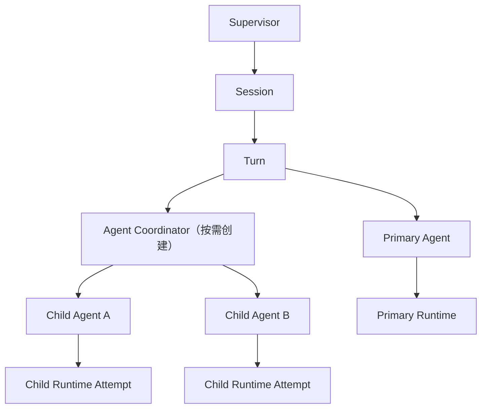

# Primary 自动委派 Child Agent 设计

## 背景

Tibis 已具备应用级 Chat Actor System、主进程 ChatRuntime、稳定的 `runtimeId` 路由、`agentId` 与 `parentRuntimeId` 字段、renderer capability registry，以及确认、Bridge、renderer-tool 请求和 Runtime 恢复能力。现有 `docs/development/chat-multi-session-and-multi-agent-extension.md` 进一步规定了未来多 Agent 的 Actor 层级、不变量、地址协议、结果归属和取消语义。

本设计以该文档为硬基线，为第一版 Primary 自动委派 Child Agent 补齐可直接实施的产品契约和技术协议。它不改变以下边界：

- 主进程拥有 Runtime 执行、工具调用、任务持久化、安全校验和外部副作用的事实来源。
- Renderer 拥有 Actor 状态、应用级事件路由、用户决策、界面能力和 UI 状态投影。
- Runtime 启动前必须先创建 Actor、注册稳定地址和冻结 capability。
- BChat 挂载、卸载或会话切换不决定后台 Task 生命周期。
- Child 不能直接修改 Primary 正在生成的 assistant 消息。

## 产品目标

Primary 通过显式 `delegate_task` 工具，把边界明确的子任务自动委派给临时 Child Agent。Child 使用与 Primary 相同的模型，但只接收不可变最小任务包和收缩后的能力。相容的只读 Child 可以并行；写 Child 必须经过资源级调度、changeset、diff integrity、用户确认和 commit boundary。Child 完成后返回结构化结果，由 Primary 形成唯一用户可见回复。

第一版约束：

- 只有 Primary 可以委派，Child 不允许继续创建 Child。
- 不增加每轮强制规划调用，Primary 必须显式调用 `delegate_task`。
- Child 始终继承当前会话模型快照，不能切换模型。
- Child 使用最小任务包，不继承完整会话历史或 Primary 未完成草稿。
- Child 可以受控写入，但外部修改只能经任务级 commit boundary 生效。
- 用户通过轻量任务卡片查看状态、事件、产物、变更和错误。
- 普通未委派聊天不创建 Coordinator，也不承担多 Agent 额外成本。

## 非目标

- 不支持 Child 递归委派、独立选择模型或用户直接进入 Child 对话。
- 不把 Child transcript 混入普通 `chat_messages` 或 Primary 上下文。
- 不支持缺少冲突检测和 commit boundary 的直接并行写入。
- 不允许恢复时根据当前环境猜测扩大既有 Task capability。
- 不把 Renderer 变成第二个 Runtime 执行事实来源。

## 术语与核心原则

```text
Task 是身份
Attempt 是执行
Event 是历史
Runtime 是可替换实例
```

- `taskId`：一次不可变委派任务。
- `agentId`：稳定 Child Actor，可经历多个 Attempt。
- `attemptId`：一次执行尝试的持久化身份。
- `runtimeId`：一次主进程模型执行实例。
- `parentAgentId`：稳定 Actor 父子关系。
- `parentRuntimeId`：本次执行由哪个 Runtime 发起。
- `rootRuntimeId`：同一 Turn Runtime 树的根。

`parentAgentId` 与 `parentRuntimeId` 不能互相替代。恢复时必须根据持久化 Task 与 Attempt 重建层级。

本设计的委派语义是：

> Primary 提交受限任务契约，Coordinator 根据冻结能力、安全策略和资源状态生成 Child Runtime Execution Plan；Child 在该计划内执行，写任务只能通过明确的 Commit Boundary 产生外部变更。

## Actor 与 Runtime 架构

Primary 第一次委派时按需创建 Coordinator：



### 职责

- **Primary Agent**：判断是否委派、提交任务契约、消费结果并形成唯一用户可见回复。
- **Agent Coordinator**：验证调用者、创建 Task 与 Child Actor、编译候选计划、维护队列、注册 Runtime 地址并聚合结果。
- **Child Agent**：执行一个不可变 Task Contract；可以重试，但不能委派、切换模型、管理会话或修改计划。
- **ChatRuntime 主进程**：执行模型与工具，重新校验并冻结计划，强制调度许可，持久化 Task、Attempt、Event、changeset 与 journal。
- **BChat**：只按 `taskId/toolCallId` 渲染任务卡片，不创建、持有或恢复 Child Runtime。

## Delegate Task Contract

Primary 通过 renderer-local `delegate_task` 提交：

```ts
interface DelegateTaskInput {
  task: string;
  acceptanceCriteria: string[];
  mode: 'read' | 'write';
  resources: AgentResourceReference[];
  requestedTools: string[];
  required: boolean;
  priority: 'low' | 'normal' | 'high';
  deadlineAt?: string;
}
```

约束：

- `task` 必须是边界明确的单一子任务。
- `acceptanceCriteria` 必须可以逐项判断 satisfied、unsatisfied 或 unknown。
- read Task 永远不能获得写工具。
- `resources` 必须显式声明；write Task 不允许以空范围表示整个工作区。
- `requestedTools` 只表达申请，不能扩大父 Runtime capability。
- `required` 决定失败是否必须由 Primary 明确处理。
- `priority` 只影响尚未运行任务的同类队列顺序，不能绕过锁、确认或策略。
- `deadlineAt` 覆盖排队、确认、执行和提交前等待。

同优先级保持 FIFO。有效 deadline 取请求 deadline、父 Runtime deadline 和系统 Child 最长执行时间中的最早值。

## 最小任务包

Coordinator 只为 Child 构造不可变最小任务包：

- Task 目标、验收标准与必要背景摘要。
- 显式文件、文档、WebView 或资源引用。
- 继承的模型快照。
- 收缩后的工具与 capability。
- 工作区、文档和资源边界。
- 权限、预算、deadline 与 commit policy。
- 单层委派、结构化结果和不直接回复用户等 Child 系统约束。

任务包不包含完整会话历史、Primary 未完成草稿、隐式当前文档或动态当前 WebView。文档能力必须绑定 `documentId`，WebView 能力必须绑定稳定页面描述符。

## Execution Plan 编译

```text
DelegateTaskInput
        ↓
Coordinator 编译候选计划
        ↓
主进程重新校验与冻结
        ↓
ChildRuntimeExecutionPlan
```

Coordinator 是计划生成者，主进程是安全裁决者。最终计划包含 Task 与父级地址、Contract snapshot、模型、有效 capability、permission snapshot、resource scopes、预算、deadline、调度、commit policy、schema/policy version 和 plan hash。

### Capability Intersection

```text
有效工具 =
父 Runtime 冻结工具
∩ Primary 显式申请工具
∩ Child 角色允许工具
∩ read/write 模式允许工具
∩ 当前模型支持工具
∩ 资源范围适用工具
∩ 当前安全策略允许工具
```

同时应用以下收缩：

- 工作区不能超出父 Runtime 的真实路径边界。
- Child permission 不能比 Primary 更宽松。
- `delegate_task`、模型切换、会话管理和计划修改能力始终移除。
- 动态资源只能落入已声明 scope，不能运行时扩大。
- 文件真实路径、版本和符号链接在执行及提交前重新校验。

同一 Task 的恢复与所有 Attempt 必须满足：

```text
effectiveCapability(t+1)
⊆ effectiveCapability(t)
⊆ persistedCapability
```

Provider 恢复、MCP 重连、用户放宽全局权限或 Renderer 重新挂载，都不能扩大既有 Task capability。新增能力必须创建新 Task。

## Runtime 启动顺序

1. 创建 Task 记录与 Child Actor。
2. 编译并冻结 Execution Plan。
3. 请求资源级调度许可。
4. 分配 `attemptId` 与 `runtimeId`。
5. 注册完整 Runtime 地址与冻结 capability。
6. 向 Child Actor 发送 `runtime.startRequested`，Task 进入 `starting`。
7. 调用主进程 Runtime IPC。
8. 主进程确认创建后发送 `runtime.started`，Task 进入 `running`。
9. IPC 同步失败时记录失败、注销路由并释放许可。

不能先调用 IPC 再注册路由。

## 资源级调度

调度使用规范化 `resourceScope[]`：

```text
file:<realpath>
directory:<realpath>/**
document:<documentId>
settings:<domain>
webview:<partition>/<pageId>
session:<sessionId>/history
workspace:<realRoot>/**
```

动态目标无法提前确定时降级为较宽 workspace scope。相同资源、父子路径和匹配通配 scope 视为冲突。

许可类型：

- `shared-read`：相容 read Task 可以共享，首版最多三个并行。
- `write-intent`：冲突范围内只允许一个 write Task，但不阻止读取。
- `exclusive-commit`：提交 changeset 时独占，等待冲突 reader 退出。

write Child 在运行和等待确认期间最多保留 `write-intent`，不持有 `exclusive-commit`。确认后重新排队获取提交许可并验证版本。不同 scope 的写任务可以并行，冲突 scope 严格串行。

公平性规则：

- 同优先级 FIFO，高优先级不能抢占已经运行的 Child。
- writer 排队后停止接纳同级或更低优先级的新冲突 reader。
- Primary 等待 Child 结果期间不占 Child 调度名额。
- compact、rollback 等修改历史或资源状态的操作必须声明相应写 scope。

## Task 状态机

```ts
type AgentTaskStatus =
  | 'created'
  | 'planning'
  | 'authorized'
  | 'queued'
  | 'starting'
  | 'running'
  | 'waiting_confirmation'
  | 'committing'
  | 'cancelling'
  | 'completed'
  | 'failed'
  | 'cancelled'
  | 'deadline_exceeded'
  | 'commit_failed';
```

`authorized` 表示计划已通过主进程校验并冻结，不代表未来工具调用无需确认。`starting` 表示 Actor、地址和 capability 已注册并等待 Runtime 启动确认。`queued` 携带 `queuePhase: start | resume | commit`。

合法迁移：

```text
created → planning
planning → authorized | failed
authorized → queued
queued(start) → starting
starting → running | failed
running(read) → completed
running(write) → queued(commit)
running(write, no changeset) → completed
running → waiting_confirmation | failed
waiting_confirmation → queued(resume|commit) | failed
queued(resume) → running
queued(commit) → committing
committing → completed | cancelled | commit_failed
任意非终态且非 committing → cancelling → cancelled | failed
任意非 committing 状态 → deadline_exceeded
```

资源快照失效时允许 `queued → planning` 重新编译一次；再次失效返回 `stale_context`。`committing` 收到取消或 deadline 时只记录请求，等 journal 达到 finalized、已回滚或人工恢复状态后再进入合法终态。终态没有执行状态出边。

## Cooperative Cancellation

取消分两阶段：

1. Coordinator 设置 `cancelRequested`，停止新工具、后续 Attempt 和提交入口，并传播 AbortSignal。
2. 给正在执行的工具有限宽限期；超时后主进程 hard abort，并清理子进程、Bridge、renderer-tool 和确认请求。

排队 Task 直接取消；等待确认 Task 撤销确认并取消；未提交 changeset 丢弃。进入 `committing` 后不能在文件提交中点硬中断，必须先完成提交或 journal 恢复。若提交已不可逆完成，Task 进入 `completed` 并记录 `cancelArrivedTooLate`。

Primary Turn 取消时并发通知全部 Child，执行有界等待并在超时后 hard abort。全部 Child 终态、Runtime 路由清理且 journal 稳定后 Turn 才进入 `cancelled`；整体超限时记录恢复标记，不能无限阻塞。

## 写入 Commit Boundary

write Child 不直接修改工作区，而是在 Task overlay 中构建 changeset：

```text
changeset prepared
        ↓
commit journal created
        ↓
external mutation applied
        ↓
commit finalized
```

### Changeset Prepared

固化每个操作的真实目标、基础 revision、基础内容 hash、目标内容 hash、候选内容或受保护引用、回滚信息，以及 `diffHash`、`operationSetHash` 和 `planHash`。

### Commit Journal Created

用户确认、资源复核和 `exclusive-commit` 获取完成后，先持久化 commit intent 与完整操作清单，再允许修改外部资源。

### External Mutation Applied

每个文件通过临时文件和原子替换应用，并逐项更新 journal 进度。Task 此时仍不能报告成功。

### Commit Finalized

验证所有目标 hash 后标记 journal committed，更新 Task result，再清理临时备份。

### Journal 恢复

- 只有 prepared、没有 journal：丢弃 changeset。
- journal 已创建但未修改资源：安全取消或重新排队。
- 部分操作已应用：按持久化 commit intent 尝试 roll-forward。
- 所有目标已匹配目标 hash：直接 finalize。
- 目标既不匹配基础 hash，也不匹配目标 hash：进入 `commit_failed/manual_recovery_required`。
- journal 未 finalized 前，Task 不能进入 `completed`。

## Diff Integrity

changeset 必须包含：

```text
baseRevision
baseContentHashes
diffHash
operationSetHash
planHash
```

确认界面展示的 diff 与最终提交必须使用同一个 `diffHash`：

- diff 或基础 revision 改变时原确认失效，必须重新确认。
- Event 记录用户确认的 `diffHash`，不能只记录“已同意”。
- 二进制资源展示路径、大小和新旧内容 hash。
- commit validation 验证确认 hash、changeset hash 与 journal 操作一致。

## 持久化模型

Child 内部执行记录不写入普通 `chat_messages`。主进程增加独立 Agent Task 存储。

### `chat_agent_tasks`

不可变 identity：

```text
taskId
sessionId
turnId
agentId
parentAgentId
rootRuntimeId
createdAt
```

不可变 `contract_snapshot`：

```text
task
acceptanceCriteria
mode
resources
requestedTools
required
contractSchemaVersion
```

不可变 `execution_plan_snapshot`：

```text
planHash
planSchemaVersion
policyVersion
capabilitySet
modelSnapshot
permissionSnapshot
resourceScopes
commitPolicy
budget
```

可变投影：

```text
status
queuePhase
priority
deadlineAt
currentAttemptId
cancelRequestedAt
result
error
updatedAt
recordState
```

Contract 与 Execution Plan 写入后禁止修改。改变任务契约或扩大能力必须创建新 Task。

`recordState` 与执行状态正交：

```text
active | tombstoned
```

删除只设置 tombstone、记录原因并追加 Event。物理清理由保留策略异步执行，且必须确认没有活动 Attempt、未决 journal 或仍被引用的 artifact。

### `chat_agent_attempts`

```text
attemptId
taskId
attemptNumber
runtimeId
parentRuntimeId
planHash
status
startedAt
finishedAt
error
```

重试创建新 Attempt 与 Runtime，不能覆盖历史 Attempt。

### `chat_agent_events`

```ts
interface ChatAgentEvent<TType extends ChatAgentEventType> {
  eventId: string;
  taskId: string;
  sequence: number;
  attemptId?: string;
  runtimeId?: string;
  type: TType;
  occurredAt: string;
  source: 'primary' | 'coordinator' | 'child' | 'runtime' | 'user' | 'system';
  schemaVersion: number;
  payload: ChatAgentEventPayloadMap[TType];
}
```

约束：

- `(taskId, sequence)` 唯一，sequence 由主进程事务性递增。
- Event 只能追加，禁止覆盖。
- payload 使用判别联合并保证可结构化克隆。
- Event 写入前执行 schema allowlist、敏感信息裁剪和大小限制。
- Task 表是当前状态投影，Event 是审计历史。

核心事件：

```text
task.created
plan.authorized
task.queued
runtime.starting
runtime.started
confirmation.requested
confirmation.resolved
tool.started
tool.completed
changeset.prepared
commit.journal_created
commit.mutation_applied
commit.finalized
task.completed
task.failed
task.cancelled
task.tombstoned
```

## Plan Hash 与版本

`planHash` 对以下规范化序列化内容计算：

```text
planSchemaVersion
policyVersion
contract snapshot
capability set
model snapshot
permission snapshot
resource scopes
commit policy
budget
```

不支持的 schema 或 policy version 返回 `plan_version_unsupported`。恢复不能以新逻辑重新解释或覆盖旧 Execution Plan。

## Capability 恢复

恢复顺序固定为：

```text
persisted capability
        ∩
available capability
        ∩
current role/security policy
        ↓
effective capability
```

- persisted 中不存在的能力不能新增。
- available 中已消失的能力从 effective 中删除。
- required capability 缺失时恢复失败。
- permission 取持久化权限和当前策略中更严格的一方。
- resource scope 只能保持或缩小。
- 不使用“先降级、再根据当前环境猜测升级”的恢复方式。

## 恢复协议

### Renderer 重载

1. 主进程返回所有非终态 Task、Attempt、Event cursor、活动 Runtime 和 pending request。
2. Renderer 按原 `sessionId/turnId` 重建 Session 与 Turn。
3. 按需创建 Coordinator，并根据 `agentId` 重建 Child Actor。
4. 使用原 `runtimeId` 恢复路由，不能把 Child 视为 Primary。
5. 按持久化 capability 与当前 available capability 取交集。
6. 验证 plan hash、schema version、policy version、deadline、模型和资源范围。
7. 重放确认、Bridge 和 renderer-tool 请求。
8. Task Store 从 snapshot 与 Event sequence 恢复卡片。

### 主进程重启

- 运行中的 read Task 进入 `failed`，错误码为 `runtime_interrupted`，由 Primary 明确创建新 Task 重试。
- 未提交 write Task 丢弃 overlay，但保留 Task、Attempt、Event 与失败原因。
- 处于 commit journal 的 Task 先恢复 journal，再决定 `completed`、`commit_failed` 或 `manual_recovery_required`。
- 不自动重新执行 write Task，避免重复副作用。
- Primary Runtime 按现有中断协议收敛，不伪造 Child tool result。

## ChatAgentResult

执行状态与任务完成度正交：

```ts
interface ChatAgentResult {
  taskId: string;
  agentId: string;
  attemptId: string;
  executionStatus: 'completed' | 'failed' | 'cancelled' | 'deadline_exceeded' | 'commit_failed';
  completion: {
    level: 'full' | 'partial' | 'none';
    criteria: AgentCriteriaResult[];
  };
  summary: string;
  output?: unknown;
  warnings: AgentTaskWarning[];
  artifacts: AgentArtifactReference[];
  changeset?: AgentChangesetResult;
  usage: AgentUsageAccounting;
  error?: AgentTaskError;
}
```

`criteria` 逐项记录 satisfied、unsatisfied 或 unknown 及证据引用。允许 Runtime 正常结束但只完成部分标准，或 Runtime 失败但仍生成可用 artifact。

任务失败是正常结构化 tool result。只有协议损坏、路由不一致或结果无法序列化等基础设施错误，才把 `delegate_task` 标记为工具执行失败。

## Error Schema

```ts
interface AgentTaskError {
  code: AgentTaskErrorCode;
  phase:
    | 'contract_validation'
    | 'plan_validation'
    | 'resource_validation'
    | 'queue'
    | 'starting'
    | 'runtime'
    | 'confirmation'
    | 'commit_validation'
    | 'commit'
    | 'recovery';
  category: 'policy' | 'resource' | 'runtime' | 'protocol' | 'user' | 'integrity';
  retryable: boolean;
  details?: Record<string, string | number | boolean | null>;
  message?: string;
}
```

机器逻辑只读取 `code`、`phase`、`category`、`retryable` 和 details。`message` 只用于展示和日志。

稳定错误码至少包括：

```text
invalid_contract
capability_denied
resource_scope_invalid
plan_version_unsupported
deadline_exceeded
budget_exceeded
runtime_start_failed
runtime_failed
runtime_interrupted
confirmation_denied
stale_context
commit_failed
manual_recovery_required
cancelled
protocol_error
```

## Artifact 所有权与可见性

```ts
interface AgentArtifactReference {
  artifactId: string;
  kind: string;
  reference: string;
  contentHash?: string;
  owner: {
    taskId: string;
    agentId: string;
    attemptId: string;
  };
  visibility: 'internal' | 'primary' | 'user';
  createdAt: string;
}
```

- Child artifact 默认是 `primary`，Primary 明确引用后才能提升为 `user`。
- overlay、commit journal 和内部调试记录始终是 `internal`。
- 提交到工作区的文件仍保留来源 ownership，用于审计。

## Primary 结果处理

- `executionStatus=completed` 且 `completion.level=full` 才能作为完整完成证据。
- `completion.level=partial` 必须说明未满足的验收条件。
- optional Task 失败时可以继续，但必须说明信息缺口。
- required Task 失败时必须重试、降级或明确说明无法完成。
- 未 finalized 的 changeset 不能描述为已修改文件。
- Primary 只能消费结果信封，不能自动注入完整 Child transcript。

## 敏感信息裁剪

裁剪分为六层：

1. 采集层：能不读取的秘密不读取。
2. 执行层：工具结果先经过 schema allowlist。
3. 持久化层：Event 与 result 只保存裁剪 payload；commit journal 单独保护。
4. Primary 层：只注入允许进入模型上下文的摘要和引用。
5. UI 层：按 artifact visibility 再次过滤。
6. 日志层：默认只记录 ID、hash、状态和稳定错误码。

密钥、Authorization header、环境变量和未经允许的文件内容不能因 Child 调试事件进入普通历史或日志。

## Budget Hierarchy 与成本核算

```text
Session Budget
└── Turn Budget
    ├── Primary Reservation
    └── Child Task Reservations
        └── Attempt Usage
```

每个 Task 在 `authorized` 前预留预算；Attempt 完成后按实际消耗结算并归还未使用额度。并行 Child 的总预留不能超过 Turn 剩余额度。Primary 不能通过拆分多个 Child 绕过 Turn 或 Session 预算。

核算输入与输出 Token、模型调用次数、工具轮次、排队和执行时长、外部请求次数，以及 Provider 可提供时的货币成本。货币成本记录 `currency`、`pricingVersion`、`estimated` 和可用时的 `actual`；没有可靠价格时标记 unknown，不能伪造为零。

首版默认每个 Turn 最多六个 Child Task、最多三个相容 read Task 并行。Child 使用独立 token、工具轮次、输出长度和 deadline 上限，但预算属于 Turn 子额度，不是新增额度。

## 轻量任务卡片

每个 `delegate_task` tool-call 对应一张卡片，固定在 Primary assistant 消息中的原工具调用位置。

收起状态展示读写类型、子任务标题、运行状态、已用时间、优先级和一句摘要。展开后展示：

- Task 目标与验收标准。
- mode、priority、deadline 和 resource scope。
- 当前 Attempt 与 Runtime 状态。
- 已裁剪的 Event 时间线和工具状态。
- artifact、变更文件和 changeset 摘要。
- completion criteria、warning 和结构化错误。

交互边界：

- 活动 Child 可以单独取消。
- waiting confirmation 提供定位统一 ConfirmationSheet 的入口。
- completed Task 可以打开 user-visible artifact。
- committing 阶段显示“请求取消”，并提示提交可能无法中断。
- 首版不支持直接与 Child 对话、修改 Contract、切换模型或强制重试。
- 重试由 Primary 创建新 Task，旧 Task 与 Attempt 保留。
- tombstoned Task 默认只显示记录已移除。

卡片位置来自 Primary tool part；实时状态来自应用级 Agent Task Store。BChat 不维护独立任务真相。默认不展示完整 Prompt、模型原始推理或未经裁剪的工具输出。

## 用户确认

确认界面必须展示 Child Task 与 Agent 来源、真实资源目标、风险级别、changeset 摘要、文本 diff、`baseRevision`、`diffHash`、关键内容 hash，以及当前 permission scope。确认记录必须绑定 Task、Attempt、Runtime、toolCall、resource scope 和 diff hash；任何相关内容变化都会使确认失效。

## 测试策略

### 单元测试

- Contract schema、priority、deadline 和资源范围。
- Contract 与 Execution Plan 不可修改。
- Task 状态机的所有合法与非法迁移。
- Task、Agent、Attempt 和 Runtime 标识隔离。
- Capability intersection 与单调不变式。
- resource scope 的相等、父子、通配和无冲突判断。
- 调度优先级、FIFO、公平性和 deadline。
- Event sequence 单调、唯一和可重放。
- result、error、artifact 和 event 可序列化。

### Actor 与 Runtime 集成测试

- 只有 Primary 可以调用 `delegate_task`，首次委派才创建 Coordinator，Child 不能再次委派。
- Actor、地址和 capability 注册完成后才调用 Runtime IPC。
- 多 Child 乱序完成仍按 `taskId/toolCallId` 返回。
- Child 失败不会错误结束 Primary，required 与 optional 结果遵守不同策略。
- Turn 取消并发级联且有界等待，cooperative cancellation 超时后升级 hard abort。

### 调度与写入测试

- 相容 read Task 最多三个并行，冲突 resource scope 正确阻塞。
- waiting confirmation 的 write Task 不持有 exclusive commit lease。
- 冲突 write Task 串行，不冲突 write Task 可以并行，writer 不被持续 reader 饿死。
- commit 前资源变化使旧确认与旧 diff hash 失效。
- changeset 未 finalized 时 Task 不能成功。
- commit journal 每个阶段的崩溃注入覆盖 roll-forward、finalize 和人工恢复。
- 符号链接、路径逃逸、stale revision 和部分外部修改不能绕过校验。

### 恢复与 UI 测试

- Renderer 重载恢复原 Turn、Coordinator、Child Actor 与 Runtime 路由。
- Capability 只按 persisted 与 available 交集恢复。
- 不支持的 plan schema 或 policy version 稳定失败。
- pending confirmation、Bridge 和 renderer-tool 请求正确重放。
- 主进程重启不自动重放 write Task。
- tombstoned Task 不进入默认查询，但审计关联完整。
- 卡片按 sequence 更新并忽略重复或旧 Event。
- BChat 卸载后 Task 继续，Child transcript 不进入普通消息列表。
- diff 展示 hash 与确认 Event 一致，状态不只依赖颜色或动画表达。

## 验收标准

1. Primary 可以在一个 Turn 中显式委派多个 Child。
2. 三个相容 read Child 可以并行并乱序返回。
3. write Child 只能在冻结 Execution Plan 与 commit boundary 内产生外部变更。
4. Capability、权限、资源和预算不能因委派扩大。
5. Renderer 重载后 Task、Attempt、Event、确认和卡片均能恢复。
6. 取消不遗留 Runtime、锁、pending request 或未决 journal。
7. Primary 最终回复是唯一用户可见回答。
8. Token 与可用成本数据汇总回 Turn 和 Session。

## 分阶段实施

### 阶段 A：协议与持久化

- 完整 Runtime 地址。
- 不可变 Task Contract 与 Execution Plan。
- Task、Attempt、Event、tombstone 和版本协议。
- Task 状态机与恢复快照。

### 阶段 B：单个只读 Child

- `delegate_task` renderer-local 工具。
- 按需 Coordinator 与 Child Actor。
- 最小任务包、单个 Child Runtime 和结构化结果回传。

### 阶段 C：资源级调度与只读并行

- resource scope 规范化。
- read、write-intent 与 exclusive-commit 门禁。
- priority、deadline、公平性、预算预留和最多三个相容 read Child 并行。

### 阶段 D：受控写入

- Task overlay、changeset、diff integrity。
- commit journal、原子文件替换、commit validation 和恢复。

### 阶段 E：UI、取消与 Renderer 恢复

- 应用级 Agent Task Store 和轻量任务卡片。
- cooperative cancellation、Turn 级联和 pending request 恢复。

### 阶段 F：预算与故障审计

- Token、调用、时长和成本核算。
- 崩溃注入、并发压力、安全对抗、功能开关与灰度启用。

每个阶段保持功能开关关闭，直到对应恢复、安全和并发测试通过。

## 相关文件

- `docs/development/chat-multi-session-and-multi-agent-extension.md`
- `docs/development/chat-runtime-architecture-map.md`
- `src/ai/chat/actorSystem.ts`
- `src/ai/chat/machine/supervisorMachine.ts`
- `src/ai/chat/machine/sessionMachine.ts`
- `src/ai/chat/machine/turnMachine.ts`
- `src/ai/chat/machine/agentMachine.ts`
- `src/ai/chat/runtimeCapabilities.ts`
- `src/hooks/useChat/useRuntimeEvents.ts`
- `src/hooks/useChat/useRuntimeRecovery.ts`
- `src/components/BChat/index.vue`
- `src/components/BChat/hooks/useRuntimeTools.ts`
- `src/components/BChat/hooks/useChatRuntimeLauncher.ts`
- `electron/main/modules/chat/runtime/service.mts`
- `electron/main/modules/chat/runtime/infrastructure/locks.mts`
- `types/chat-runtime.d.ts`
